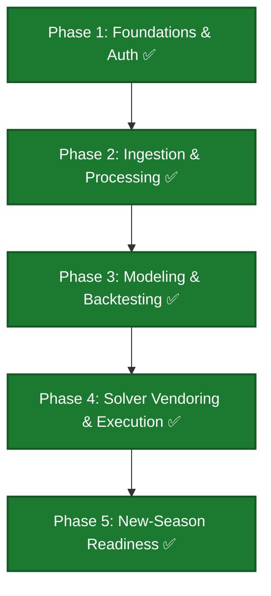

# FPL-Jubilee-Ascent - Project Roadmap

This roadmap tracks the development progress, target architecture, and phases for **FPL-Jubilee-Ascent**.

> **Agents:** read [`docs/agents/current-state.md`](docs/agents/current-state.md) first for what is built today vs this plan.

---

## Personas

| Persona | Goal | Primary surface |
|---------|------|-----------------|
| **User** | Run data refresh, backtest models, run solver to get optimal transfer plans | CLI |
| **Developer** | Plug in new score projection models | Python classes / CLI |

---

## Current Project Status: **Phases 1-5 complete**

Next work: wayfinder map [Challenger beats Champion (goals then CS)](https://github.com/JubileeZ/fpl-jubilee-ascent/issues/110). Frontier: [Run Comparison Slate admission race for defence_link_challenger](https://github.com/JubileeZ/fpl-jubilee-ascent/issues/119). Flip Candidate `defence_link_challenger` shipped (#118). Champion `hold_chase_challenger`, provisional.

```mermaid
flowchart TD
    P1["Phase 1: Foundations & Auth ✅"] --> P2["Phase 2: Ingestion & Processing ✅"]
    P2 --> P3["Phase 3: Modeling & Backtesting ✅"]
    P3 --> P4["Phase 4: Solver Vendoring & Execution ✅"]
    P4 --> P5["Phase 5: New-Season Readiness ✅"]
    style P1 fill:#1c7a30,stroke:#155724,stroke-width:2px,color:#fff
    style P2 fill:#1c7a30,stroke:#155724,stroke-width:2px,color:#fff
    style P3 fill:#1c7a30,stroke:#155724,stroke-width:2px,color:#fff
    style P4 fill:#1c7a30,stroke:#155724,stroke-width:2px,color:#fff
    style P5 fill:#1c7a30,stroke:#155724,stroke-width:2px,color:#fff
```

---

## Implementation Phases

### ✅ Phase 1: Repo Infrastructure, Foundations & Auth (Completed)
All repository scaffolding, tiered authentication (Playwright, direct HTTP, environment tokens), and developer checks (ruff, pytest) are fully implemented.

---

### ✅ Phase 2: Ingestion, Processing & Archiving (Completed)
Raw data refresh pipeline, historical season snapshot scripts, and raw-to-parquet processors are fully implemented.

---

### ✅ Phase 3: Pluggable Modeling & Backtesting (Completed)
Baseline models, feature and projection exporters, and historical backtesting evaluations are fully implemented.

---

### ✅ Phase 4: Solver Vendoring & Execution (Completed)
Vendored MILP solver, multi-period transfer optimization wrapper, and top-picks console/CSV rank reports are fully implemented.

---

### ✅ Phase 5: New-Season Readiness (Completed)

Prior-season seed component model, Cold-Start, long-format Feature Contract, Modified FDR, CLI reports, Champion/solver tuning. Issues #75–#87 closed. Design: `docs/adr/0003`. Vocabulary: `CONTEXT.md`.

---

> [!NOTE]
> **Pre-commit gate:** run all test and lint commands successfully before proposing commits.
