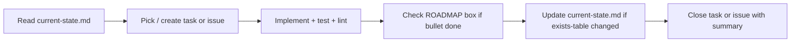

# Agent Progress Updates

How agents record progress so next agent/device continues without chat history.

---

## Three layers

| Layer | File | Update when | Purpose |
|-------|------|-------------|---------|
| **1 — Task** | GitHub Issue / `task.md` | Start / finish focused chunk | Scope, blockers, commit links |
| **2 — Phase checklist** | `ROADMAP.md` | Roadmapped bullet **done** | `- [ ]` → `- [x]` on matching line |
| **3 — Reality snapshot** | `docs/agents/current-state.md` | Moved planned → exists | Shows what exists on disk |

Do not use chat history as source of truth. Commit doc updates in same commit as the code.

---

## Workflow per work session

### 1. Start
1. Read `docs/agents/current-state.md` (what exists).
2. Read `ROADMAP.md` (find first unchecked item in active phase).
3. (Optional) Pick or create task/issue.

### 2. During work
- Comment on task/issue if blocked or scope changes.
- Do not check ROADMAP boxes for partial work.

### 3. Before finishing (pre-commit gate)
- Run `uv run ruff check .`, `uv run pytest`, and `bash tests/verify.sh`.
- Move no session artifacts into project documentation. Delete `.tmp/agent/` contents and legacy root-level `task.md`, `implementation_plan.md`, and `walkthrough.md` once milestone/task complete.

### 4. On completion — update docs
| If you… | Then update… |
|---------|----------------|
| Finished a `ROADMAP.md` bullet | `- [x]` that bullet only |
| Added file/dir listed in "does NOT exist" | Move row to **What exists**; remove from "does NOT exist" |
| Changed architecture (hard to reverse) | New ADR in `docs/adr/` |
| Resolved new domain term | `CONTEXT.md` glossary entry |
| Advanced to next phase | `current-state.md` **Active phase** + `ROADMAP.md` status line; collapse completed phase checklist in `ROADMAP.md` to single summary line (Active-Phase Compaction). |

---

## What NOT to update on every small change
| File | When to touch |
|------|----------------|
| `CONTEXT.md` | New/clarified domain terms only |
| `docs/deployment.md` | Production deployment guides only |
| `AGENTS.md` | New commands, safety rules, structure changes |

---

## Multi-device sync
- **Syncs via Git:** Code, docs (`ROADMAP.md`, `current-state.md`, ADRs), issues.
- **Does not sync:** `.tmp/agent/` session plans, handoffs, scratch artifacts, local build caches, local `.env`.

Pull before starting. Read `current-state.md` after pull — not previous chat.

---

## Checklist for agents (copy mentally)
- [ ] Read `current-state.md` at session start
- [ ] Task/issue created or referenced
- [ ] Tests + lint pass
- [ ] `ROADMAP.md` checkbox(es) updated
- [ ] `current-state.md` updated if existence table changed
- [ ] Task closed with summary
