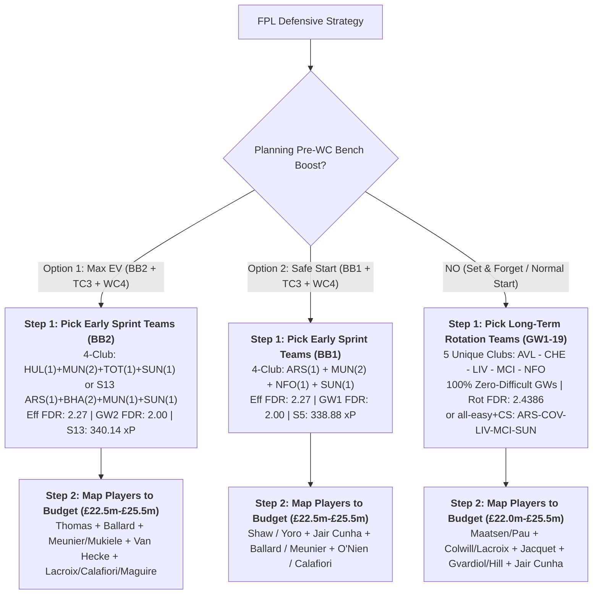

# 5-Defender Fixture Diversification & Multi-Club Partition Study (GW1–19, up to £26.0m)

**Updated**: 2026-08-16T11:26:41+07:00  
**Data stamp**: Stage 2 ADR-0014 rates 2026-08-14; GW4–19 ranking = correlation-first after min rot FDR + 100% zero-diff; zero-diff all-easy + CS-gate overlays GW1–19 / GW1–3 / BB2 / GW4–19 2026-08-16  
**Season**: 2026/27  
**Status**: Active  
**Purpose**: Determine optimal club and player combinations for 5-defender (5 DEF) units across **2, 3, 4, and 5 unique clubs** (at most £26.0m total budget). Focuses primarily on **team-level defensive strength, FDR schedules, and clean-sheet probability**, evaluating early sprint options (GW2 BB2 Max EV and GW1 BB1 Safe Start), post-Wildcard (GW4–19), and full first-half (GW1–19).  
**Related**: [First-Half Chip Strategy](../fpl-first-half-chip-strategy/fpl-first-half-chip-strategy.md) · [GKP rotation](../gkp-fixture-rotation/gkp-fixture-rotation.md) · [Expected Stats (Stage 2)](../gw1-6-preseason-pipeline/02-expected-stats-gw1-5/expected-stats-gw1-5.md)  
**Sources**: `data/processed/fixtures.parquet`, `data/processed/players.parquet`, `data/processed/clubs.parquet`, `data/research/gw1-6-preseason-pipeline/01-expected-role-gw1-5/expected-role-gw1-5.csv`, `data/research/gw1-6-preseason-pipeline/02-expected-stats-gw1-5/expected-stats-gw1-5.csv`  
**Artifacts**: `[def_club_5way_rotation_matrix.csv](../../../data/research/def-fixture-rotation/def_club_5way_rotation_matrix.csv)`, `[def_tier_player_rotations.csv](../../../data/research/def-fixture-rotation/def_tier_player_rotations.csv)`, `[def_bb1_wc4_club_matrix.csv](../../../data/research/def-fixture-rotation/def_bb1_wc4_club_matrix.csv)`, `[def_bb1_wc4_tier_lineups.csv](../../../data/research/def-fixture-rotation/def_bb1_wc4_tier_lineups.csv)`, `[def_bb2_wc4_club_matrix.csv](../../../data/research/def-fixture-rotation/def_bb2_wc4_club_matrix.csv)`, `[def_bb2_wc4_tier_lineups.csv](../../../data/research/def-fixture-rotation/def_bb2_wc4_tier_lineups.csv)`, `[def_performance_baseline.csv](../../../data/research/def-fixture-rotation/def_performance_baseline.csv)`, `[def_club_cs_priors.csv](../../../data/research/def-fixture-rotation/def_club_cs_priors.csv)`, `[def_gw1_19_zero_diff_cs_picks.csv](../../../data/research/def-fixture-rotation/def_gw1_19_zero_diff_cs_picks.csv)`, `[def_gw1_3_zero_diff_cs_picks.csv](../../../data/research/def-fixture-rotation/def_gw1_3_zero_diff_cs_picks.csv)`, `[def_bb2_zero_diff_cs_picks.csv](../../../data/research/def-fixture-rotation/def_bb2_zero_diff_cs_picks.csv)`, `[def_gw4_19_zero_diff_cs_picks.csv](../../../data/research/def-fixture-rotation/def_gw4_19_zero_diff_cs_picks.csv)`  
**Script**: `[run_def_rotation_analysis.py](run_def_rotation_analysis.py)` · `[build_zero_diff_cs_picks.py](build_zero_diff_cs_picks.py)`  
**Downstream**: `uv run python docs/research/gw1-6-preseason-pipeline/refresh_downstream.py` (full parent + both WC4 bridges)

## Agent Prompt

```text
After Stage 2 rate / new-player change:
  uv run python docs/research/gw1-6-preseason-pipeline/refresh_downstream.py
This topic only (slow full combinatorics):
  uv run python docs/research/def-fixture-rotation/run_def_rotation_analysis.py
Bridges only: --bridges-only / --sun-bridge-only / --overall-bridge-only
Update parent §1.3/§1.4 player maps, GW4-19 dest (corr-first), §1.9/§1.10/§2.4/§3.4 zero-diff all-easy + CS picks, and child bridge stamps from CSVs.
Ranking lenses: --print-ranks. More negative avg_fdr_corr wins after primary FDR keys.
Zero-diff all-easy + CS overlays (unordered 5-club; same gate n_cs_plus>=2 and n_prom<=1):
  uv run python docs/research/def-fixture-rotation/build_zero_diff_cs_picks.py
Writes def_gw1_3 / def_bb2 / def_gw4_19 pick CSVs. BB2 all-easy uses worst started FDR (GW2 = max of 5; GW1/GW3 = 3rd-easiest). Do not replace FDR-min canonical #1s.
```  

**Ranking lenses** (script constants; `--print-ranks` reprints Top-10s):

| Lens | Sort | Canonical #1 |
| --- | --- | --- |
| BB2 sprint | eff FDR → GW2 FDR → GW1+3 rot FDR → corr (asc) | `HUL-MUN-MUN-TOT-SUN` |
| BB1 sprint | eff FDR → GW1 FDR → GW2–3 rot FDR → corr (asc) | `ARS-MUN-MUN-NFO-SUN` |
| GW4–19 dest | rot FDR → zero-diff% → **corr (asc)** → easy% | `AVL-BOU-CHE-LIV-NFO` (r = −0.0994) |
| GW1–19 FDR-min | same as GW4–19 on `gw1_19` | `AVL-CHE-LIV-MCI-NFO` |
| GW1–19 zero-diff all-easy + CS | 100% zero-diff → all-easy desc → corr (asc) → CS gate (`n_cs_plus` ≥ 2, `n_prom` ≤ 1) | Start-here: `ARS-COV-LIV-MCI-SUN` / `AVL-CHE-LIV-MCI-NFO` / `BHA-COV-LIV-MCI-SUN` |
| GW1–3 3-start zero-diff all-easy + CS | same gate; max all-easy = 2/3 | Start-here: `ARS-HUL-MCI-MUN-SUN` / `ARS-HUL-LIV-MUN-SUN` / `MCI-MUN-NFO-SUN-TOT` |
| BB2 11-start zero-diff all-easy + CS | same gate; all-easy = worst started FDR (GW2 max-of-5; GW1/3 3rd-easiest); max = 1/3 | Start-here: `BRE-LIV-MCI-MUN-SUN` / `BRE-EVE-LIV-MCI-MUN` / `BRE-LIV-MCI-MUN-TOT` |
| GW4–19 zero-diff all-easy + CS | same gate; 16 GWs; dest FDR-min #1 stays §2.2 | Start-here: `ARS-COV-LIV-MCI-SUN` / `BHA-COV-LIV-MCI-SUN` / `AVL-CHE-LIV-MCI-NFO` |
| WC4 bridge | path FDR → GW1 → n_swaps → pre corr. Dest picker: zero-diff → path FDR → dest FDR → **dest corr** → easy% | Overall `LIV-MCI-MUN-MUN-NFO` |

More negative correlation is better: club FDR schedules diversify, so the three you start are less likely to hit FDR 4+ together.

---

## Method & Metric Definitions

1. **Unit Specification**: 5-defender allocations across 2, 3, 4, and 5 unique clubs with a total budget cap of $\le £26.0\text{m}$ (baseline floor $5 \times £4.0\text{m} = £20.0\text{m}$).
2. **Weekly Starting Decision**: Unconditional $\max(xP)$ for top 3 starting defenders per GW, with auto-sub expected value (+12% for 4th defender, +3% for 5th defender).
3. **Bench Boost Horizon Evaluation**: 11 total starting appearances in GW1–3 (GW1 or GW2 Bench Boost with 5 starters + two 3-defender rotation gameweeks).
4. **Post-Wildcard & Full-Season Horizons**: GW4–19 (16 GWs, 48 starts) and GW1–19 (19 GWs, 57 starts).

### Metric Definitions & Direction

| Metric | Symbol | Definition / Formula | Direction | Ideal / Benchmark | Description |
|---|---|---|---|---|---|
| **Opportunity-Cost Adjusted RQI** | `OC-RQI` | $\frac{\text{Rotated xP}}{N} - \gamma \times (\text{Total Spend} - £20.0\text{m})$ | Higher is better $\uparrow$ | **$> 13.50$** / GW | Net weekly expected points for the 5-DEF unit after deducting outfield shadow price ($\gamma \approx 0.25/\text{£1.0m/GW}$). |
| **Bench Boost OC-RQI** | `BB OC-RQI` | $\text{Effective xP} - \gamma \times (\text{Total Spend} - £20.0\text{m}) \times 3$ | Higher is better $\uparrow$ | **$> 42.0\text{ xP}$** | Net 3-GW sprint points under BB1/BB2 after deducting opportunity cost across the 3 gameweeks. |
| **Zero-Difficult Gameweeks** | `Zero-Diff %` | $\frac{\text{GWs with 0 starts facing FDR } \ge 4}{\text{Total GWs}} \times 100\%$ | Higher is better $\uparrow$ | **$100.0\%$** | Percentage of weeks where no started defender faces an FDR $\ge 4$ opponent (5-club setups achieve 100%). |
| **Rotated / Effective FDR** | `Rot FDR` | $\frac{1}{N_{\text{starts}}} \sum \text{FDR}(\text{Started DEF})$ | Lower is better $\downarrow$ | **$\le 2.27$** (Sprint) / **$\le 2.44$** (GW4–19) | Average fixture difficulty of the selected starting defenders. |
| **Average Schedule Correlation** | `avg_corr` ($r$) | $\frac{1}{\binom{K}{2}} \sum_{i < j} \text{Pearson } r(\text{FDR}_i, \text{FDR}_j)$ | Lower is better $\downarrow$ (Negative) | **$r \le -0.09$** | Mean pairwise FDR correlation across the clubs in the defensive unit. More negative guarantees staggered difficulty. |
| **Easy Gameweek Rate** | `Easy %` | $\frac{\text{Starts with FDR } \le 2}{\text{Total Starts}} \times 100\%$ | Higher is better $\uparrow$ | **$\ge 45.0\%$** | Proportion of starting appearances facing favorable FDR 2 fixtures. |
| **Mean Club xCS** | `mean_gkp_xcs` | $\frac{1}{5}\sum_{c} e^{-\lambda_c}$ from Stage 2 starting-GKP $\lambda$ | Higher is better $\uparrow$ | **$> 0.267$** (league median) | Average Poisson clean-sheet probability of the five clubs. Second source: DEF drafted median $\lambda$. |
| **Effective Lineup xP** | `Effective xP` | $\sum \text{Top3 } xP + 0.12 \cdot xP(\text{Def 4}) + 0.03 \cdot xP(\text{Def 5})$ | Higher is better $\uparrow$ | **$\ge 42.5\text{ xP}$** (Sprint) / **$\ge 225\text{ xP}$** (GW4–19) | Sum of started defender points plus empirical auto-sub expectation from the bench. |

---

## Executive Summary & Core Findings

```mermaid
flowchart TD
    Strategy["5-DEF Strategy Selection"] --> Early["Phase 1: GW1-3 Early Launch (Pre-WC Sprint)"]
    Strategy --> PostWC["Phase 2: GW4-19 Post-Wildcard"]
    Strategy --> Full["Phase 3: GW1-19 Set & Forget"]

    Early --> EarlyBB2["<b>Option 1: Max EV Sprint (BB2 + TC3 + WC4)</b><br>HUL(1)+MUN(2)+TOT(1)+SUN(1) or S13 ARS(1)+BHA(2)+MUN(1)+SUN(1)<br>Eff FDR: 2.27 | GW2: 2.00 FDR | S13: 340.14 xP"]
    Early --> EarlyBB1["<b>Option 2: Safe Start Sprint (BB1 + TC3 + WC4)</b><br>ARS(1) + MUN(2) + NFO(1) + SUN(1)<br>Eff FDR: 2.27 | GW1: 2.00 FDR | S5: 338.88 xP"]
    Early --> EarlyCs["<b>GW1-3 3-start all-easy + CS</b><br>ARS-HUL-MCI-MUN-SUN / ARS-HUL-LIV-MUN-SUN / MCI-MUN-NFO-SUN-TOT<br>Max 2/3 all-easy | rot FDR 2.2222"]
    Early --> Bb2Cs["<b>BB2 11-start all-easy + CS</b><br>BRE-LIV-MCI-MUN-SUN / BRE-EVE-LIV-MCI-MUN / BRE-LIV-MCI-MUN-TOT<br>Max 1/3 all-easy | mostly GW3 not GW2"]
    PostWC --> PostWCPick["<b>5 Unique Clubs (1+1+1+1+1)</b><br>AVL - BOU - CHE - LIV - NFO<br>100% Zero-Diff | Rot FDR: 2.4375 | r = -0.0994"]
    PostWC --> PostWCCs["<b>GW4-19 all-easy + CS start-here</b><br>ARS-COV-LIV-MCI-SUN / BHA-COV-LIV-MCI-SUN / AVL-CHE-LIV-MCI-NFO"]
    Full --> FullPick["<b>FDR-min #1</b><br>AVL - CHE - LIV - MCI - NFO<br>100% Zero-Diff (19/19 GWs) | Rot FDR: 2.4386"]
    Full --> FullCs["<b>All-easy + CS start-here</b><br>ARS-COV-LIV-MCI-SUN / AVL-CHE-LIV-MCI-NFO / BHA-COV-LIV-MCI-SUN<br>Gate: 2+ CS-core, ≤1 promoted"]

    style EarlyBB2 fill:#1b4d3e,stroke:#2d6a4f,color:#fff
    style EarlyBB1 fill:#2d6a4f,stroke:#1b4d3e,color:#fff
    style EarlyCs fill:#1b4d3e,stroke:#2d6a4f,color:#fff
    style Bb2Cs fill:#1b4d3e,stroke:#2d6a4f,color:#fff
    style PostWCPick fill:#1b4d3e,stroke:#2d6a4f,color:#fff
    style PostWCCs fill:#1b4d3e,stroke:#2d6a4f,color:#fff
    style FullPick fill:#1b4d3e,stroke:#2d6a4f,color:#fff
    style FullCs fill:#1b4d3e,stroke:#2d6a4f,color:#fff
```



1. **Why 5 Unique Clubs Dominates Long-Term Rotation (GW4–19 and GW1–19)**:
  - In any standard gameweek where you start 3 defenders and bench 2, selecting 5 defenders across **5 unique clubs** provides 5 distinct fixture schedules.
  - Achieves **1,024 combinations with 100% Zero-Difficult Gameweeks** (never starting a defender facing FDR $\ge 4$).
  - In contrast, **2-club setups (3+2)** and **3-club setups (3+1+1)** achieve **0.0% zero-difficult weeks** due to Pigeonhole clashes against top-6 opponents.
2. **Dual Pre-Wildcard Sprint Pathways (BB2 vs BB1)**:
  - **Option 1: GW2 Bench Boost (BB2 — Max EV Target)**:
    - In the full 16-scenario Stage 3 optimization matrix, **S13 (BB2 + TC3 + WC4) generates 340.14 xP (+1.26 xP over BB1)**.
    - Capitalizes on concentrated GW2 home and low-FDR fixtures: Coventry vs Hull (diff 2 vs diff 2), Manchester United vs Ipswich (diff 2), Sunderland vs Fulham (diff 2), Tottenham vs Newcastle (diff 2), Chelsea vs Brighton (diff 2).
    - Achieves **zero fixture clashes** in GW2 and **average GW2 FDR of 2.00** across all 5 active defenders while benching difficult GW1 matchups.
  - **Option 2: GW1 Bench Boost (BB1 — Safe Start)**:
    - Generates **338.88 xP** in S5.
    - Maximizes operational certainty by exploiting 100% preseason fitness before any match minutes or rotation risks emerge.
3. **Club Quota Limits (Attack Protection)**:
  - Stacking 3 defenders from Man City, Arsenal, Liverpool, or Chelsea locks out essential captaincy and premium attacking slots (Haaland, Saka, Salah, Palmer).
  - The model enforces a hard ceiling of **maximum 2 defenders from top-4 attack clubs**, and up to 3 for mid/budget clubs.
4. **Post-WC4 Migration**:
  - Pre-WC setups (e.g. S13 `ARS-BHA-BHA-MUN-SUN` or `HUL-MUN-MUN-TOT-SUN`) bridge directly at GW4 Wildcard to balanced units (`Gabriel + Tarkowski + Vuskovic + Wieffer + Thiaw` per S13) or pure long-term rotations (`AVL-BOU-CHE-LIV-NFO`).
5. **GW1–19 zero-diff all-easy + CS overlay** (unordered 5-club sets; does not replace FDR-min #1):
  - **1,024** unique 5-club sets with 19/19 zero-diff. Sort: all-easy GWs desc, then more-negative pairwise $r$. Only **22** have 5+ all-easy GWs.
  - CS core = ARS/MCI (elite) + LIV/BHA/MUN/AVL (strong). Gate: $\ge 2$ CS-core and $\le 1$ promoted (COV/HUL/IPS). Cuts 13/22 fixture leaders.
  - Start-here PICK: `ARS-COV-LIV-MCI-SUN` (mean xCS 0.3493), `AVL-CHE-LIV-MCI-NFO` (rot FDR 2.4386, 0 promoted), `BHA-COV-LIV-MCI-SUN` (r = −0.1487). Full 20 in §3.4.
6. **GW1–3 3-start overlay** (same method; does not replace BB1/BB2 FDR-min tables):
  - **11,450** unique 5-club sets with 3/3 zero-diff. Max all-easy = **2/3** (176 sets). 79/176 pass CS gate.
  - Start-here PICK: `ARS-HUL-MCI-MUN-SUN` (xCS 0.3477), `ARS-HUL-LIV-MUN-SUN` (0.3232), `MCI-MUN-NFO-SUN-TOT` (0 promoted, 0.3253). Fixture #1 `BRE-HUL-MUN-NFO-SUN` is CUT (thin CS core). Full 20 in §1.9.
7. **BB2 11-start overlay** (GW1 top-3 + GW2 all-5 + GW3 top-3):
  - **824** five-club BB2 rows with 3/3 zero-diff. Max all-easy = **1/3** (43 sets). Easy week is GW3 for 41/43, GW2 for 2 (`CHE-HUL-MUN-SUN-TOT`, `CHE-COV-MUN-SUN-TOT` — both fail CS gate; only MUN as core).
  - Start-here PICK: `BRE-LIV-MCI-MUN-SUN` (r = −0.2000, 11-start FDR 2.3636, xCS 0.3120), `BRE-EVE-LIV-MCI-MUN`, `BRE-LIV-MCI-MUN-TOT` (xCS 0.3318). Canonical FDR-min #1 `HUL-MUN-MUN-TOT-SUN` is 4-club — out of this 5-unique lens. Full 20 in §1.10.
8. **GW4–19 overlay** (does not replace dest FDR-min #1 `AVL-BOU-CHE-LIV-NFO`):
  - **1,752** unique 5-club with 16/16 zero-diff. 10 have 5+ all-easy; 5/10 pass gate. Dest FDR-min #1 has only 3/16 all-easy.
  - Start-here PICK: `ARS-COV-LIV-MCI-SUN` (5/16 easy, xCS 0.3493), `BHA-COV-LIV-MCI-SUN` (r = −0.1292), `AVL-CHE-LIV-MCI-NFO` (pick 13, rot FDR **2.4375**). Full 20 in §2.4.

---

## Part 1: Specialized Pre-Wildcard Early Sprint (GW1–3)

Pre-Wildcard defensive setups evaluate two distinct tactical pathways before a permanent GW4 Wildcard reset:
- **Option 1: GW2 Bench Boost (BB2)**: Top 3 start in GW1 (2 benched), all 5 start in GW2 on Bench Boost (0 clashes, max FDR $\le 3.0$), top 3 start in GW3 (2 benched). Total pre-WC starts = **11 player-matches**.
- **Option 2: GW1 Bench Boost (BB1)**: All 5 start in GW1 on Bench Boost (0 clashes, max FDR $\le 3.0$), top 3 start in GW2 & GW3 (2 benched). Total pre-WC starts = **11 player-matches**.

---

### 1.1 Strategy Comparison: BB2 (Option 1) vs BB1 (Option 2)

| Metric / Dimension | Option 1: GW2 Bench Boost (BB2) | Option 2: GW1 Bench Boost (BB1) | Tactical Edge |
| :--- | :--- | :--- | :--- |
| **Stage 3 MILP Score** | **340.14 xP (Scenario 13)** | **338.88 xP (Scenario 5)** | **+1.26 xP for BB2** |
| **Bench Boost Gameweek** | **GW2** (all 5 defenders start) | **GW1** (all 5 defenders start) | BB2 targets COV–HUL & MUN–IPS |
| **Best Effective FDR** | **2.2727** (11 starts) | **2.2727** (11 starts) | Tied |
| **BB GW Starting FDR** | **2.00** across all 5 active defs | **2.00** across all 5 active defs | Tied |
| **Rotated Starts FDR** | **2.50** (GW1 + GW3 rot) | **2.50** (GW2 + GW3 rot) | Tied |
| **Valid Combinations** | **5,464** valid non-clashing sets | **7,763** valid non-clashing sets | BB1 has larger valid space |
| **Key Advantage** | High-EV GW2 promoted targets | Maximum Day 1 lineup certainty | Manager risk preference |

---

### 1.2 Option 1: Overview by Allocation Pattern (GW1–3, BB2)

| Allocation Pattern | Unique Clubs | Valid Combinations | Best Effective FDR (11 starts) | Best GW2 Avg FDR (5 def) | Best GW1+3 Rot FDR (6 starts) | Top Recommended Team Set |
| :--- | :---: | :---: | :---: | :---: | :---: | :--- |
| **4 Clubs (2+1+1+1)** | **4** | **2,724** | **2.2727** | **2.00** | **2.50** | **HUL(1) - MUN(2) - TOT(1) - SUN(1)** |
| **4 Clubs (2+1+1+1)** | **4** | — | **2.2727** | **2.00** | **2.50** | **CHE(1) - HUL(1) - MUN(2) - SUN(1)** |
| **4 Clubs (2+1+1+1)** | **4** | — | **2.2727** | **2.00** | **2.50** | **COV(1) - MUN(2) - TOT(1) - SUN(1)** |
| **5 Unique Clubs (1x5)** | **5** | **1,002** | **2.3636** | **2.00** | **2.67** | **CHE - HUL - MUN - TOT - SUN** |
| **5 Unique Clubs (1x5)** | **5** | — | **2.3636** | **2.00** | **2.67** | **CHE - COV - MUN - TOT - SUN** |
| **3 Clubs (2+2+1)** | **3** | **912** | **2.2727** | **2.00** | **2.50** | **HUL(2) - MUN(2) - SUN(1)** |
| **3 Clubs (3+1+1)** | **3** | **693** | **2.2727** | **2.00** | **2.50** | **HUL(1) - MUN(3) - TOT(1)** |
| **2 Clubs (3+2)** | **2** | **133** | **2.2727** | **2.00** | **2.50** | **HUL(2) - MUN(3)** |

---

### 1.3 Option 1: Top 10 Team Combinations for GW1–3 (BB2)

#### Top 10 for 4 Unique Clubs (2+1+1+1, BB2)

| Rank | 4-Club Set | Pattern | Effective Avg FDR | GW2 Avg FDR (5 def) | GW1+3 Rot FDR (6 def) | Avg Pairwise Corr ($r$) |
| :--- | :--- | :---: | :---: | :---: | :---: | :---: |
| **1** | **HUL - MUN - MUN - TOT - SUN** | 2+1+1+1 | **2.2727** | **2.00** | 2.50 | +0.4366 |
| **2** | **HUL - MUN - TOT - SUN - SUN** | 2+1+1+1 | **2.2727** | **2.00** | 2.50 | +0.4366 |
| **3** | **CHE - HUL - MUN - MUN - SUN** | 2+1+1+1 | **2.2727** | **2.00** | 2.50 | +0.5162 |
| **4** | **CHE - HUL - MUN - SUN - SUN** | 2+1+1+1 | **2.2727** | **2.00** | 2.50 | +0.5162 |
| **5** | **COV - MUN - MUN - TOT - SUN** | 2+1+1+1 | **2.2727** | **2.00** | 2.50 | +0.6000 |
| **6** | **COV - MUN - TOT - SUN - SUN** | 2+1+1+1 | **2.2727** | **2.00** | 2.50 | +0.6000 |
| **7** | **CHE - COV - MUN - MUN - SUN** | 2+1+1+1 | **2.2727** | **2.00** | 2.50 | +0.7091 |
| **8** | **CHE - COV - MUN - SUN - SUN** | 2+1+1+1 | **2.2727** | **2.00** | 2.50 | +0.7091 |
| **9** | **CHE - MUN - MUN - TOT - SUN** | 2+1+1+1 | **2.2727** | **2.00** | 2.50 | +0.7091 |
| **10** | **CHE - MUN - TOT - SUN - SUN** | 2+1+1+1 | **2.2727** | **2.00** | 2.50 | +0.7091 |

#### Top 10 for 5 Unique Clubs (1+1+1+1+1, BB2)

| Rank | 5-Club Set | Pattern | Effective Avg FDR | GW2 Avg FDR (5 def) | GW1+3 Rot FDR (6 def) | Avg Pairwise Corr ($r$) |
| :--- | :--- | :---: | :---: | :---: | :---: | :---: |
| **1** | **CHE - HUL - MUN - TOT - SUN** | 1+1+1+1+1 | **2.3636** | **2.00** | 2.67 | +0.5839 |
| **2** | **CHE - COV - MUN - TOT - SUN** | 1+1+1+1+1 | **2.3636** | **2.00** | 2.67 | +0.7402 |
| **3** | **BRE - CHE - HUL - MUN - SUN** | 1+1+1+1+1 | **2.3636** | 2.20 | **2.50** | **+0.0272** |
| **4** | **CHE - HUL - LIV - MUN - SUN** | 1+1+1+1+1 | **2.3636** | 2.20 | **2.50** | **+0.0272** |
| **5** | **CHE - HUL - MCI - MUN - SUN** | 1+1+1+1+1 | **2.3636** | 2.20 | **2.50** | **+0.0272** |
| **6** | **BRE - HUL - MUN - TOT - SUN** | 1+1+1+1+1 | **2.3636** | 2.20 | **2.50** | +0.0366 |
| **7** | **HUL - LIV - MUN - TOT - SUN** | 1+1+1+1+1 | **2.3636** | 2.20 | **2.50** | +0.0366 |
| **8** | **HUL - MCI - MUN - TOT - SUN** | 1+1+1+1+1 | **2.3636** | 2.20 | **2.50** | +0.0366 |
| **9** | **BRE - COV - MUN - TOT - SUN** | 1+1+1+1+1 | **2.3636** | 2.20 | **2.50** | +0.1000 |
| **10** | **COV - LIV - MUN - TOT - SUN** | 1+1+1+1+1 | **2.3636** | 2.20 | **2.50** | +0.1000 |

---

### 1.4 Option 1: Representative Player Lineups for GW1–3 (BB2 + WC4)

| Budget Band | Spend | Representative Lineup | BB-RQI | OC-RQI | Effective 11-Start xP | GW2 xP (5 def) | Effective FDR |
| :--- | :---: | :--- | :---: | :---: | :---: | :---: | :---: |
| **Band 1: Budget (£20.5–22.5m)** | £22.5m | **Thomas** (COV £4.0m) + **O'Nien** (SUN £4.0m) + **Meunier** (SUN £4.5m) + **Ballard** (SUN £5.0m) + **Van Hecke** (TOT £5.0m) | **61.38** | **58.303** | **60.12 xP** | 28.35 xP | **2.364** |
| **Band 2: Mid-Value (£23.0–24.0m)** | £24.0m | **Thomas** (COV £4.0m) + **Gvardiol** (MCI £5.5m) + **Meunier** (SUN £4.5m) + **Ballard** (SUN £5.0m) + **Van Hecke** (TOT £5.0m) | **63.48** | **60.478** | **63.39 xP** | 28.99 xP | **2.364** |
| **Band 3: Single Anchor (£24.5–25.0m)** | £25.0m | **Thomas** (COV £4.0m) + **Gvardiol** (MCI £5.5m) + **O'Reilly** (MCI £6.5m) + **O'Nien** (SUN £4.0m) + **Ballard** (SUN £5.0m) | **61.42** | **61.109** | **64.75 xP** | 29.45 xP | **2.454** |
| **Band 4: Premium Anchor (£25.5–26.0m)** | £26.0m | **Thomas** (COV £4.0m) + **Gvardiol** (MCI £5.5m) + **O'Reilly** (MCI £6.5m) + **Ballard** (SUN £5.0m) + **Van Hecke** (TOT £5.0m) | **60.26** | **61.991** | **66.36 xP** | 27.69 xP | **2.454** |

---

### 1.5 Option 2: Overview by Allocation Pattern (GW1–3, BB1)

| Allocation Pattern | Unique Clubs | Valid Combinations | Best Effective FDR (11 starts) | Best GW1 Avg FDR (5 def) | Best GW2–3 Rot FDR (6 starts) | Top Recommended Team Set |
| :--- | :---: | :---: | :---: | :---: | :---: | :--- |
| **4 Clubs (2+1+1+1)** | **4** | **3,940** | **2.2727** | **2.00** | **2.50** | **ARS(1) - MUN(2) - NFO(1) - SUN(1)** |
| **4 Clubs (2+1+1+1)** | **4** | — | **2.2727** | **2.20** | **2.33** | **MCI(1) - MUN(2) - NFO(1) - SUN(1)** |
| **3 Clubs (2+2+1)** | **3** | **1,996** | **2.2727** | **2.00** | **2.50** | **ARS(2) - MUN(2) - SUN(1)** |
| **5 Unique Clubs (1x5)** | **5** | **1,683** | **2.3636** | **2.20** | **2.50** | **ARS - CHE - MUN - NFO - SUN** |
| **2 Clubs (3+2)** | **2** | **144** | **2.2727** | **2.00** | **2.50** | **ARS(2) - MUN(3)** |

---

### 1.6 Option 2: Top 10 Team Combinations for GW1–3 (BB1)

#### Top 10 for 4 Unique Clubs (2+1+1+1, BB1)

| Rank | 4-Club Set | Pattern | Effective Avg FDR | GW1 Avg FDR (5 def) | GW2–3 Rot FDR (6 def) | Avg Pairwise Corr ($r$) |
| :--- | :--- | :---: | :---: | :---: | :---: | :---: |
| **1** | **ARS - MUN - MUN - NFO - SUN** | 2+1+1+1 | **2.2727** | **2.00** | 2.50 | +0.4366 |
| **2** | **ARS - MUN - NFO - SUN - SUN** | 2+1+1+1 | **2.2727** | **2.00** | 2.50 | +0.4366 |
| **3** | **BRE - MUN - MUN - NFO - SUN** | 2+1+1+1 | **2.2727** | 2.20 | **2.33** | **-0.1000** |
| **4** | **BRE - MUN - NFO - SUN - SUN** | 2+1+1+1 | **2.2727** | 2.20 | **2.33** | **-0.1000** |
| **5** | **LIV - MUN - MUN - NFO - SUN** | 2+1+1+1 | **2.2727** | 2.20 | **2.33** | **-0.1000** |
| **6** | **LIV - MUN - NFO - SUN - SUN** | 2+1+1+1 | **2.2727** | 2.20 | **2.33** | **-0.1000** |
| **7** | **MCI - MUN - MUN - NFO - SUN** | 2+1+1+1 | **2.2727** | 2.20 | **2.33** | **-0.1000** |
| **8** | **MCI - MUN - NFO - SUN - SUN** | 2+1+1+1 | **2.2727** | 2.20 | **2.33** | **-0.1000** |
| **9** | **AVL - MUN - MUN - NFO - SUN** | 2+1+1+1 | **2.2727** | 2.20 | **2.33** | -0.0098 |
| **10** | **AVL - MUN - NFO - SUN - SUN** | 2+1+1+1 | **2.2727** | 2.20 | **2.33** | -0.0098 |

#### Top 10 for 5 Unique Clubs (1+1+1+1+1, BB1)

| Rank | 5-Club Set | Pattern | Effective Avg FDR | GW1 Avg FDR (5 def) | GW2–3 Rot FDR (6 def) | Avg Pairwise Corr ($r$) |
| :--- | :--- | :---: | :---: | :---: | :---: | :---: |
| **1** | **ARS - BRE - MUN - NFO - SUN** | 1+1+1+1+1 | **2.3636** | **2.20** | 2.50 | +0.0366 |
| **2** | **ARS - LIV - MUN - NFO - SUN** | 1+1+1+1+1 | **2.3636** | **2.20** | 2.50 | +0.0366 |
| **3** | **ARS - MCI - MUN - NFO - SUN** | 1+1+1+1+1 | **2.3636** | **2.20** | 2.50 | +0.0366 |
| **4** | **ARS - MUN - NFO - TOT - SUN** | 1+1+1+1+1 | **2.3636** | **2.20** | 2.50 | +0.2500 |
| **5** | **ARS - CHE - MUN - NFO - SUN** | 1+1+1+1+1 | **2.3636** | **2.20** | 2.50 | +0.4618 |
| **6** | **ARS - BRE - LIV - MUN - SUN** | 1+1+1+1+1 | **2.3636** | 2.40 | **2.33** | **-0.2000** |
| **7** | **ARS - BRE - MCI - MUN - SUN** | 1+1+1+1+1 | **2.3636** | 2.40 | **2.33** | **-0.2000** |
| **8** | **ARS - LIV - MCI - MUN - SUN** | 1+1+1+1+1 | **2.3636** | 2.40 | **2.33** | **-0.2000** |
| **9** | **BRE - LIV - MUN - NFO - SUN** | 1+1+1+1+1 | **2.3636** | 2.40 | **2.33** | **-0.2000** |
| **10** | **BRE - MCI - MUN - NFO - SUN** | 1+1+1+1+1 | **2.3636** | 2.40 | **2.33** | **-0.2000** |

---

### 1.7 Option 2: Representative Player Lineups for GW1–3 (BB1 + WC4)

| Budget Band | Spend | Representative Lineup | BB-RQI | OC-RQI | Effective 11-Start xP | GW1 xP (5 def) | Effective FDR |
| :--- | :---: | :--- | :---: | :---: | :---: | :---: | :---: |
| **Band 1: Budget (£20.5–22.5m)** | £22.5m | **Vuskovic** (BHA £5.0m) + **Shaw** (MUN £4.5m) + **Jair Cunha** (NFO £4.5m) + **O'Nien** (SUN £4.0m) + **Meunier** (SUN £4.5m) | **62.29** | **58.707** | **60.53 xP** | 27.11 xP | **2.454** |
| **Band 2: Mid-Value (£23.0–24.0m)** | £24.0m | **Calafiori** (ARS £5.5m) + **Vuskovic** (BHA £5.0m) + **O'Nien** (SUN £4.0m) + **Meunier** (SUN £4.5m) + **Ballard** (SUN £5.0m) | **65.58** | **65.719** | **68.63 xP** | 27.38 xP | **2.546** |
| **Band 3: Single Anchor (£24.5–25.0m)** | £25.0m | **Calafiori** (ARS £5.5m) + **Vuskovic** (BHA £5.0m) + **Gvardiol** (MCI £5.5m) + **O'Nien** (SUN £4.0m) + **Ballard** (SUN £5.0m) | **64.00** | **66.649** | **70.29 xP** | 29.75 xP | **2.636** |
| **Band 4: Premium Anchor (£25.5–26.0m)** | £25.5m | **Calafiori** (ARS £5.5m) + **Vuskovic** (BHA £5.0m) + **Gvardiol** (MCI £5.5m) + **Meunier** (SUN £4.5m) + **Ballard** (SUN £5.0m) | **65.58** | **67.256** | **71.26 xP** | 29.64 xP | **2.546** |

---

### 1.8 Post-Wildcard (WC4) Transition Paths

Pre-WC sprint setups migrate seamlessly to long-term foundations at the GW4 Wildcard reset:

- **S13/S5 MILP Pre-WC Defense**: `Calafiori (ARS £5.5m) + Vuskovic (BHA £5.0m) + Wieffer (BHA £5.0m) + Maguire (MUN £5.0m) + Ballard (SUN £5.0m)` (£25.5m). Bridges directly at WC4 to `Gabriel + Tarkowski + Vuskovic + Wieffer + Thiaw` or pure rotation `AVL-BOU-CHE-LIV-NFO` / `AVL-CHE-LIV-MCI-NFO`.
- **Top 5-Club GW4–19 Destination (corr-first)**: `AVL-BOU-CHE-LIV-NFO` (rot FDR 2.4375, $r = -0.0994$, 100% zero-difficult GWs).
- **Alternative Destination**: `AVL-CHE-LIV-MCI-NFO` (rot FDR 2.4375, $r = -0.0529$, 100% zero-difficult GWs) when retaining City defensive assets.

---

### 1.9 Zero-Diff All-Easy Ranking + Clean-Sheet Gate (GW1–3, 3-start, 5 unique clubs)

Unordered club sets. Filter `horizon = gw1_3`, `no_diff_gws = 3`. Standard rotation: start 3 / bench 2 each GW. Sort all-easy desc, then `avg_fdr_corr` asc. Same CS gate as §3.4. Does not replace §1.3 BB2 or §1.6 BB1 FDR-min tables. Companion: `[def_gw1_3_zero_diff_cs_picks.csv](../../../data/research/def-fixture-rotation/def_gw1_3_zero_diff_cs_picks.csv)`. Rebuild: `uv run python docs/research/def-fixture-rotation/build_zero_diff_cs_picks.py`.

| Universe | Count |
| --- | ---: |
| Unique 5-club zero-diff sets | 11,450 |
| With 2/3 all-easy GWs (max) | 176 (2: 176; 1: 2,882; 0: 8,392) |
| Of those 176 passing CS gate | 79 |
| Final 20 after walking fixture rank | 7 PICK / 3 SOLID / 10 CAUTION |

N=3 inflates the zero-diff universe vs GW1–19. Interesting head is the **176 with 2 all-easy GWs**. Rot FDR of that cluster is typically **2.2222**. Table below = top 22 of 176; full head in CSV.

#### Fixture head — top 22 of 176 with 2/3 all-easy GWs

| Fix # | 5-Club Set | All Easy | Pairwise $r$ | Rot FDR | Mean xCS | CS core | Gate |
| ---: | --- | ---: | ---: | ---: | ---: | --- | --- |
| 1 | BRE-HUL-MUN-NFO-SUN | 2/3 | -0.2000 | 2.2222 | 0.2703 | MUN | CUT thin CS core |
| 2 | HUL-LIV-MUN-NFO-SUN | 2/3 | -0.2000 | 2.2222 | 0.2778 | LIV-MUN | PASS (CAUTION) |
| 3 | HUL-MCI-MUN-NFO-SUN | 2/3 | -0.2000 | 2.2222 | 0.3023 | MCI-MUN | PASS (CAUTION) |
| 4 | AVL-HUL-MUN-NFO-SUN | 2/3 | -0.1732 | 2.2222 | 0.2750 | AVL-MUN | PASS (CAUTION) |
| 5 | BHA-HUL-MUN-NFO-SUN | 2/3 | -0.1732 | 2.2222 | 0.2767 | BHA-MUN | PASS (CAUTION) |
| 6 | ARS-BRE-HUL-MUN-SUN | 2/3 | -0.1366 | 2.2222 | 0.3157 | ARS-MUN | PASS (CAUTION) |
| 7 | ARS-HUL-LIV-MUN-SUN | 2/3 | -0.1366 | 2.2222 | 0.3232 | ARS-LIV-MUN | PASS (PICK) |
| 8 | ARS-HUL-MCI-MUN-SUN | 2/3 | -0.1366 | 2.2222 | **0.3477** | ARS-MCI-MUN | PASS (PICK) |
| 9 | BRE-COV-MUN-NFO-SUN | 2/3 | -0.1366 | 2.2222 | 0.2703 | MUN | CUT thin CS core |
| 10 | BRE-HUL-IPS-MUN-SUN | 2/3 | -0.1366 | 2.2222 | 0.2672 | MUN | CUT thin CS core; 2+ promoted |
| 11 | BRE-MUN-NFO-SUN-TOT | 2/3 | -0.1366 | 2.2222 | 0.2933 | MUN | CUT thin CS core |
| 12 | COV-LIV-MUN-NFO-SUN | 2/3 | -0.1366 | 2.2222 | 0.2778 | LIV-MUN | PASS (CAUTION) |
| 13 | COV-MCI-MUN-NFO-SUN | 2/3 | -0.1366 | 2.2222 | 0.3023 | MCI-MUN | PASS (CAUTION) |
| 14 | HUL-IPS-LIV-MUN-SUN | 2/3 | -0.1366 | 2.2222 | 0.2747 | LIV-MUN | CUT 2+ promoted |
| 15 | HUL-IPS-MCI-MUN-SUN | 2/3 | -0.1366 | 2.2222 | 0.2992 | MCI-MUN | CUT 2+ promoted |
| 16 | LIV-MUN-NFO-SUN-TOT | 2/3 | -0.1366 | 2.2222 | 0.3008 | LIV-MUN | PASS (SOLID) |
| 17 | MCI-MUN-NFO-SUN-TOT | 2/3 | -0.1366 | 2.2222 | 0.3253 | MCI-MUN | PASS (PICK) |
| 18 | ARS-AVL-HUL-MUN-SUN | 2/3 | -0.1098 | 2.2222 | 0.3205 | ARS-AVL-MUN | PASS (PICK) |
| 19 | ARS-BHA-HUL-MUN-SUN | 2/3 | -0.1098 | 2.2222 | 0.3221 | ARS-BHA-MUN | PASS (PICK) |
| 20 | AVL-HUL-IPS-MUN-SUN | 2/3 | -0.1098 | 2.2222 | 0.2720 | AVL-MUN | CUT 2+ promoted |
| 21 | BHA-HUL-IPS-MUN-SUN | 2/3 | -0.1098 | 2.2222 | 0.2736 | BHA-MUN | CUT 2+ promoted |
| 22 | BOU-HUL-MUN-NFO-SUN | 2/3 | -0.1000 | 2.3333 | 0.2653 | MUN | CUT thin CS core |

Fix #1 `BRE-HUL-MUN-NFO-SUN` has the best pairwise ($r = -0.2000$) but only MUN as CS-core — CUT. HUL is the fixture enabler across most of the 2-easy cluster.

#### Final 20 combinations to pick

Walk fixture rank through CS gate. Mean GKP xCS of this 20: 0.3047.

| Pick | 5-Club Set | Easy | Pairwise $r$ | Rot FDR | Mean xCS | CS core | Leaks | Verdict |
| ---: | --- | ---: | ---: | ---: | ---: | --- | --- | --- |
| 1 | HUL-LIV-MUN-NFO-SUN | 2/3 | **-0.2000** | 2.2222 | 0.2778 | LIV-MUN | HUL | CAUTION |
| 2 | HUL-MCI-MUN-NFO-SUN | 2/3 | **-0.2000** | 2.2222 | 0.3023 | MCI-MUN | HUL | CAUTION |
| 3 | AVL-HUL-MUN-NFO-SUN | 2/3 | -0.1732 | 2.2222 | 0.2750 | AVL-MUN | HUL | CAUTION |
| 4 | BHA-HUL-MUN-NFO-SUN | 2/3 | -0.1732 | 2.2222 | 0.2767 | BHA-MUN | HUL | CAUTION |
| 5 | ARS-BRE-HUL-MUN-SUN | 2/3 | -0.1366 | 2.2222 | 0.3157 | ARS-MUN | HUL | CAUTION |
| **6** | **ARS-HUL-LIV-MUN-SUN** | 2/3 | -0.1366 | 2.2222 | 0.3232 | ARS-LIV-MUN | HUL | **PICK** |
| **7** | **ARS-HUL-MCI-MUN-SUN** | 2/3 | -0.1366 | 2.2222 | **0.3477** | ARS-MCI-MUN | HUL | **PICK** |
| 8 | COV-LIV-MUN-NFO-SUN | 2/3 | -0.1366 | 2.2222 | 0.2778 | LIV-MUN | COV | CAUTION |
| 9 | COV-MCI-MUN-NFO-SUN | 2/3 | -0.1366 | 2.2222 | 0.3023 | MCI-MUN | COV | CAUTION |
| 10 | LIV-MUN-NFO-SUN-TOT | 2/3 | -0.1366 | 2.2222 | 0.3008 | LIV-MUN | — | SOLID |
| **11** | **MCI-MUN-NFO-SUN-TOT** | 2/3 | -0.1366 | 2.2222 | 0.3253 | MCI-MUN | — | **PICK** |
| **12** | **ARS-AVL-HUL-MUN-SUN** | 2/3 | -0.1098 | 2.2222 | 0.3205 | ARS-AVL-MUN | HUL | **PICK** |
| **13** | **ARS-BHA-HUL-MUN-SUN** | 2/3 | -0.1098 | 2.2222 | 0.3221 | ARS-BHA-MUN | HUL | **PICK** |
| 14 | AVL-COV-MUN-NFO-SUN | 2/3 | -0.0964 | 2.2222 | 0.2750 | AVL-MUN | COV | CAUTION |
| 15 | AVL-MUN-NFO-SUN-TOT | 2/3 | -0.0964 | 2.2222 | 0.2980 | AVL-MUN | — | SOLID |
| 16 | BHA-COV-MUN-NFO-SUN | 2/3 | -0.0964 | 2.2222 | 0.2767 | BHA-MUN | COV | CAUTION |
| 17 | BHA-MUN-NFO-SUN-TOT | 2/3 | -0.0964 | 2.2222 | 0.2997 | BHA-MUN | — | SOLID |
| 18 | ARS-BRE-COV-MUN-SUN | 2/3 | -0.0500 | 2.2222 | 0.3157 | ARS-MUN | COV | CAUTION |
| **19** | **ARS-BRE-MUN-SUN-TOT** | 2/3 | -0.0500 | 2.2222 | 0.3387 | ARS-MUN | — | **PICK** |
| **20** | **ARS-COV-LIV-MUN-SUN** | 2/3 | -0.0500 | 2.2222 | 0.3232 | ARS-LIV-MUN | COV | **PICK** |

Start-here: `ARS-HUL-MCI-MUN-SUN` (highest xCS, dual elite) / `ARS-HUL-LIV-MUN-SUN` (3 CS-core) / `MCI-MUN-NFO-SUN-TOT` (0 promoted).

---

### 1.10 Zero-Diff All-Easy Ranking + Clean-Sheet Gate (BB2 11-start, 5 unique clubs)

BB2 sprint: GW1 top-3, GW2 all-5, GW3 top-3. All-easy / zero-diff use **worst started** FDR: GW2 = max of 5; GW1/GW3 = 3rd-easiest of 5. Population = 5 unique clubs in `[def_bb2_wc4_club_matrix.csv](../../../data/research/def-fixture-rotation/def_bb2_wc4_club_matrix.csv)` (already GW2 max FDR ≤ 3, no GW2 clashes) plus FDR rebuilt from `fixtures.parquet`. `rot_avg_fdr` in the companion is **11-start effective FDR**. Does not replace §1.3 FDR-min #1 `HUL-MUN-MUN-TOT-SUN` (4-club). Companion: `[def_bb2_zero_diff_cs_picks.csv](../../../data/research/def-fixture-rotation/def_bb2_zero_diff_cs_picks.csv)`.

| Universe | Count |
| --- | ---: |
| Five-club BB2 rows | 1,002 |
| With 3/3 zero-diff | 824 |
| With 1/3 all-easy (max) | 43 (1: 43; 0: 781; none with 2 or 3) |
| Of those 43 passing CS gate | 41 |
| Final 20 | 13 PICK / 7 CAUTION |

All-easy week among the 43: **GW3 for 41, GW2 for 2, GW1 for 0**. The two GW2-easy 5-club sets are the classic FDR-min 5-clubs `CHE-HUL-MUN-SUN-TOT` (fix 39, r = +0.5839) and `CHE-COV-MUN-SUN-TOT` (fix 43, r = +0.7402) — both CUT (only MUN as CS-core). BB2 “all-easy” on this lens is almost always a **rotation week**, not the Bench Boost week.

#### Fixture head — top 22 of 43 with 1/3 all-easy GWs

| Fix # | 5-Club Set | All Easy | Pairwise $r$ | Eff FDR | Mean xCS | CS core | Gate |
| ---: | --- | ---: | ---: | ---: | ---: | --- | --- |
| 1 | BRE-LIV-MCI-MUN-SUN | 1/3 | **-0.2000** | **2.3636** | 0.3120 | LIV-MCI-MUN | PASS (PICK) |
| 2 | BRE-EVE-LIV-MCI-MUN | 1/3 | **-0.2000** | 2.5455 | 0.3119 | LIV-MCI-MUN | PASS (PICK) |
| 3 | BRE-EVE-LIV-MCI-SUN | 1/3 | **-0.2000** | 2.5455 | 0.3065 | LIV-MCI | PASS (PICK) |
| 4 | BRE-CHE-LIV-MCI-MUN | 1/3 | -0.1890 | 2.4545 | 0.3051 | LIV-MCI-MUN | PASS (PICK) |
| 5 | BRE-CHE-LIV-MCI-SUN | 1/3 | -0.1890 | 2.4545 | 0.2998 | LIV-MCI | PASS (PICK) |
| 6 | BRE-CHE-EVE-LIV-MCI | 1/3 | -0.1890 | 2.6364 | 0.2997 | LIV-MCI | PASS (PICK) |
| 7 | BRE-COV-LIV-MCI-MUN | 1/3 | -0.1000 | 2.4545 | 0.3088 | LIV-MCI-MUN | PASS (PICK) |
| 8 | BRE-COV-LIV-MCI-SUN | 1/3 | -0.1000 | 2.4545 | 0.3034 | LIV-MCI | PASS (CAUTION) |
| 9 | BRE-LIV-MCI-MUN-TOT | 1/3 | -0.1000 | 2.4545 | **0.3318** | LIV-MCI-MUN | PASS (PICK) |
| 10 | BRE-LIV-MCI-SUN-TOT | 1/3 | -0.1000 | 2.4545 | 0.3264 | LIV-MCI | PASS (PICK) |
| 11 | BRE-COV-EVE-LIV-MCI | 1/3 | -0.1000 | 2.6364 | 0.3034 | LIV-MCI | PASS (CAUTION) |
| 12 | BRE-EVE-LIV-MCI-TOT | 1/3 | -0.1000 | 2.6364 | 0.3264 | LIV-MCI | PASS (PICK) |
| 13 | BRE-CHE-COV-LIV-MCI | 1/3 | -0.0579 | 2.5455 | 0.2966 | LIV-MCI | PASS (CAUTION) |
| 14 | BRE-CHE-LIV-MCI-TOT | 1/3 | -0.0579 | 2.5455 | 0.3196 | LIV-MCI | PASS (PICK) |
| 15 | BRE-HUL-LIV-MCI-MUN | 1/3 | 0.0000 | 2.4545 | 0.3088 | LIV-MCI-MUN | PASS (PICK) |
| 16 | BRE-HUL-LIV-MCI-SUN | 1/3 | 0.0000 | 2.4545 | 0.3034 | LIV-MCI | PASS (CAUTION) |
| 17 | BRE-EVE-HUL-LIV-MCI | 1/3 | 0.0000 | 2.6364 | 0.3034 | LIV-MCI | PASS (CAUTION) |
| 18 | BRE-CHE-HUL-LIV-MCI | 1/3 | 0.0493 | 2.5455 | 0.2966 | LIV-MCI | PASS (CAUTION) |
| 19 | BRE-COV-LIV-MCI-TOT | 1/3 | 0.1000 | 2.5455 | 0.3233 | LIV-MCI | PASS (CAUTION) |
| 20 | BOU-BRE-LIV-MCI-MUN | 1/3 | 0.1000 | 2.5455 | 0.3065 | LIV-MCI-MUN | PASS (PICK) |
| 21 | BOU-BRE-LIV-MCI-SUN | 1/3 | 0.1000 | 2.5455 | 0.3012 | LIV-MCI | PASS (PICK) |
| 22 | BRE-FUL-LIV-MCI-MUN | 1/3 | 0.1000 | 2.5455 | 0.3105 | LIV-MCI-MUN | PASS (PICK) |

LIV-MCI is the CS backbone of the entire 1-easy cluster. BRE is the fixture enabler (mid-tier, not a leak).

#### Final 20 combinations to pick

Mean GKP xCS of this 20: 0.3097.

| Pick | 5-Club Set | Easy | Pairwise $r$ | Eff FDR | Mean xCS | CS core | Leaks | Verdict |
| ---: | --- | ---: | ---: | ---: | ---: | --- | --- | --- |
| **1** | **BRE-LIV-MCI-MUN-SUN** | 1/3 | **-0.2000** | **2.3636** | 0.3120 | LIV-MCI-MUN | — | **PICK** |
| **2** | **BRE-EVE-LIV-MCI-MUN** | 1/3 | **-0.2000** | 2.5455 | 0.3119 | LIV-MCI-MUN | — | **PICK** |
| **3** | **BRE-EVE-LIV-MCI-SUN** | 1/3 | **-0.2000** | 2.5455 | 0.3065 | LIV-MCI | — | **PICK** |
| **4** | **BRE-CHE-LIV-MCI-MUN** | 1/3 | -0.1890 | 2.4545 | 0.3051 | LIV-MCI-MUN | CHE | **PICK** |
| **5** | **BRE-CHE-LIV-MCI-SUN** | 1/3 | -0.1890 | 2.4545 | 0.2998 | LIV-MCI | CHE | **PICK** |
| **6** | **BRE-CHE-EVE-LIV-MCI** | 1/3 | -0.1890 | 2.6364 | 0.2997 | LIV-MCI | CHE | **PICK** |
| **7** | **BRE-COV-LIV-MCI-MUN** | 1/3 | -0.1000 | 2.4545 | 0.3088 | LIV-MCI-MUN | COV | **PICK** |
| 8 | BRE-COV-LIV-MCI-SUN | 1/3 | -0.1000 | 2.4545 | 0.3034 | LIV-MCI | COV | CAUTION |
| **9** | **BRE-LIV-MCI-MUN-TOT** | 1/3 | -0.1000 | 2.4545 | **0.3318** | LIV-MCI-MUN | — | **PICK** |
| **10** | **BRE-LIV-MCI-SUN-TOT** | 1/3 | -0.1000 | 2.4545 | 0.3264 | LIV-MCI | — | **PICK** |
| 11 | BRE-COV-EVE-LIV-MCI | 1/3 | -0.1000 | 2.6364 | 0.3034 | LIV-MCI | COV | CAUTION |
| **12** | **BRE-EVE-LIV-MCI-TOT** | 1/3 | -0.1000 | 2.6364 | 0.3264 | LIV-MCI | — | **PICK** |
| 13 | BRE-CHE-COV-LIV-MCI | 1/3 | -0.0579 | 2.5455 | 0.2966 | LIV-MCI | CHE-COV | CAUTION |
| **14** | **BRE-CHE-LIV-MCI-TOT** | 1/3 | -0.0579 | 2.5455 | 0.3196 | LIV-MCI | CHE | **PICK** |
| **15** | **BRE-HUL-LIV-MCI-MUN** | 1/3 | 0.0000 | 2.4545 | 0.3088 | LIV-MCI-MUN | HUL | **PICK** |
| 16 | BRE-HUL-LIV-MCI-SUN | 1/3 | 0.0000 | 2.4545 | 0.3034 | LIV-MCI | HUL | CAUTION |
| 17 | BRE-EVE-HUL-LIV-MCI | 1/3 | 0.0000 | 2.6364 | 0.3034 | LIV-MCI | HUL | CAUTION |
| 18 | BRE-CHE-HUL-LIV-MCI | 1/3 | 0.0493 | 2.5455 | 0.2966 | LIV-MCI | CHE-HUL | CAUTION |
| 19 | BRE-COV-LIV-MCI-TOT | 1/3 | 0.1000 | 2.5455 | 0.3233 | LIV-MCI | COV | CAUTION |
| **20** | **BOU-BRE-LIV-MCI-MUN** | 1/3 | 0.1000 | 2.5455 | 0.3065 | LIV-MCI-MUN | BOU | **PICK** |

Start-here: `BRE-LIV-MCI-MUN-SUN` (best $r$ and lowest 11-start FDR among the 43) / `BRE-EVE-LIV-MCI-MUN` (same $r$, 3 CS-core) / `BRE-LIV-MCI-MUN-TOT` (highest xCS among 3-core passers).

---


## Part 2: Long-Term Post-Wildcard Rotation (GW4–19)

For managers activating their Wildcard in GW4, this 16-gameweek block establishes a permanent defensive foundation that requires zero weekly transfer expenditure.

**Tie-break**: among 100% zero-diff sets at rot FDR 2.4375, rank by more negative pairwise FDR correlation. Table #1 is `AVL-BOU-CHE-LIV-NFO`, not `AVL-CHE-LIV-MCI-NFO`.

### 2.1 Overview by Allocation Pattern (GW4–19)


| Allocation Pattern       | Unique Clubs | Total Evaluated | Best Rotated FDR (Top 3) | 100% Zero-Diff Rate    | Top Recommended Club Set              | Avg Pairwise Corr ($r$) |
| ------------------------ | ------------ | --------------- | ------------------------ | ---------------------- | ------------------------------------- | ----------------------- |
| **5 Unique Clubs (1x5)** | **5**        | **15,504**      | **2.4375**               | **100.0% (16/16 GWs)** | **AVL - BOU - CHE - LIV - NFO**       | **-0.0994**             |
| **5 Unique Clubs (1x5)** | **5**        | —               | **2.4375**               | **100.0% (16/16 GWs)** | **BOU - CHE - EVE - LIV - NFO**       | **-0.0785**             |
| **5 Unique Clubs (1x5)** | **5**        | —               | **2.4375**               | **100.0% (16/16 GWs)** | **AVL - CHE - LIV - MCI - NFO**       | **-0.0529**             |
| **4 Clubs (2+1+1+1)**    | **4**        | **19,380**      | **2.4792**               | **100.0% (16/16 GWs)** | **AVL(2) - CHE(1) - COV(1) - LEE(1)** | **-0.1583**             |
| **4 Clubs (2+1+1+1)**    | **4**        | —               | **2.4792**               | **100.0% (16/16 GWs)** | **AVL(1) - COV(2) - FUL(1) - MCI(1)** | **-0.1297**             |
| **3 Clubs (2+2+1)**      | **3**        | **6,156**       | **2.4792**               | 93.8% (15/16 GWs)      | **BOU(2) - LIV(2) - NFO(1)**          | **-0.1381**             |
| **2 Clubs (3+2)**        | **2**        | **304**         | **2.5625**               | 75.0% (12/16 GWs)      | **BOU(3) - LIV(2)**                   | **-0.1545**             |


---


### 2.2 Top 10 Team Combinations for GW4–19 (Post-WC) — 4 Unique Clubs vs 5 Unique Clubs


#### Top 10 for 4 Unique Clubs (2+1+1+1)


| Rank   | 4-Club Set                      | Pattern | Rotated Avg FDR | Zero-Diff GWs (FDR ≤ 3) | All Easy GWs (FDR ≤ 2) | Avg Pairwise Corr ($r$) |
| ------ | ------------------------------- | ------- | --------------- | ----------------------- | ---------------------- | ----------------------- |
| **1**  | **AVL - AVL - CHE - COV - LEE** | 2+1+1+1 | **2.4792**      | **100.0% (16/16)**      | **31.2% (5/16)**       | **-0.1583**             |
| **2**  | **BOU - BHA - LIV - NFO - NFO** | 2+1+1+1 | **2.4792**      | **100.0% (16/16)**      | 25.0% (4/16)           | **-0.1470**             |
| **3**  | **BOU - CHE - NFO - NFO - TOT** | 2+1+1+1 | **2.4792**      | **100.0% (16/16)**      | 18.8% (3/16)           | **-0.1349**             |
| **4**  | **AVL - COV - COV - FUL - MCI** | 2+1+1+1 | **2.4792**      | **100.0% (16/16)**      | 25.0% (4/16)           | **-0.1297**             |
| **5**  | **COV - COV - EVE - FUL - MCI** | 2+1+1+1 | **2.4792**      | **100.0% (16/16)**      | 25.0% (4/16)           | **-0.1294**             |
| **6**  | **BOU - COV - COV - EVE - FUL** | 2+1+1+1 | **2.4792**      | **100.0% (16/16)**      | **31.2% (5/16)**       | -0.1169                 |
| **7**  | **BOU - BHA - CHE - NFO - NFO** | 2+1+1+1 | **2.4792**      | **100.0% (16/16)**      | 18.8% (3/16)           | -0.1158                 |
| **8**  | **AVL - BOU - COV - COV - FUL** | 2+1+1+1 | **2.4792**      | **100.0% (16/16)**      | 25.0% (4/16)           | -0.1130                 |
| **9**  | **BOU - CHE - LIV - NFO - NFO** | 2+1+1+1 | **2.4792**      | **100.0% (16/16)**      | 25.0% (4/16)           | -0.0743                 |
| **10** | **BOU - COV - COV - FUL - MCI** | 2+1+1+1 | **2.4792**      | **100.0% (16/16)**      | **31.2% (5/16)**       | -0.0364                 |


#### Top 10 for 5 Unique Clubs (1+1+1+1+1)


| Rank   | 5-Club Set                      | Pattern   | Rotated Avg FDR | Zero-Diff GWs (FDR ≤ 3) | All Easy GWs (FDR ≤ 2) | Avg Pairwise Corr ($r$) |
| ------ | ------------------------------- | --------- | --------------- | ----------------------- | ---------------------- | ----------------------- |
| **1**  | **AVL - BOU - CHE - LIV - NFO** | 1+1+1+1+1 | **2.4375**      | **100.0% (16/16)**      | 18.8% (3/16)           | **-0.0994**             |
| **2**  | **BOU - CHE - EVE - LIV - NFO** | 1+1+1+1+1 | **2.4375**      | **100.0% (16/16)**      | **25.0% (4/16)**       | **-0.0785**             |
| **3**  | **AVL - CHE - LIV - MCI - NFO** | 1+1+1+1+1 | **2.4375**      | **100.0% (16/16)**      | **25.0% (4/16)**       | -0.0529                 |
| **4**  | **AVL - COV - FUL - LEE - MCI** | 1+1+1+1+1 | **2.4583**      | **100.0% (16/16)**      | 6.2% (1/16)            | **-0.2010**             |
| **5**  | **AVL - BOU - CHE - LIV - NEW** | 1+1+1+1+1 | **2.4583**      | **100.0% (16/16)**      | 12.5% (2/16)           | **-0.1889**             |
| **6**  | **AVL - CHE - LIV - MCI - NEW** | 1+1+1+1+1 | **2.4583**      | **100.0% (16/16)**      | 18.8% (3/16)           | **-0.1744**             |
| **7**  | **BOU - CHE - LIV - NEW - NFO** | 1+1+1+1+1 | **2.4583**      | **100.0% (16/16)**      | 18.8% (3/16)           | -0.1619                 |
| **8**  | **BOU - CRY - EVE - LIV - NFO** | 1+1+1+1+1 | **2.4583**      | **100.0% (16/16)**      | 18.8% (3/16)           | -0.1615                 |
| **9**  | **AVL - BOU - LIV - NEW - NFO** | 1+1+1+1+1 | **2.4583**      | **100.0% (16/16)**      | 18.8% (3/16)           | -0.1563                 |
| **10** | **COV - EVE - FUL - LEE - MCI** | 1+1+1+1+1 | **2.4583**      | **100.0% (16/16)**      | 6.2% (1/16)            | -0.1523                 |


---


### 2.3 Representative Player Lineups for GW4–19 (Post-Wildcard)

| Budget Band | Spend | Representative Lineup | RQI | OC-RQI | 16-GW Rotated xP | Weekly Avg xP | Rotated FDR | Zero-Diff % |
| :--- | :---: | :--- | :---: | :---: | :---: | :---: | :---: | :---: |
| **Band 1: Budget (£20.5–22.5m)** | £22.5m | **Calafiori** (ARS £5.5m) + **Vuskovic** (BHA £5.0m) + **Thomas** (COV £4.0m) + **Ajayi** (HUL £4.0m) + **O'Nien** (SUN £4.0m) | **63.80** | **18.627** | **307.74 xP** | 19.23 xP/GW | 2.792 | 62.5% |
| **Band 2: Mid-Value (£23.0–24.0m)** | £24.0m | **Calafiori** (ARS £5.5m) + **Vuskovic** (BHA £5.0m) + **Hill** (BOU £5.5m) + **Thomas** (COV £4.0m) + **Ajayi** (HUL £4.0m) | **63.48** | **19.335** | **324.91 xP** | 20.31 xP/GW | 2.812 | 62.5% |
| **Band 3: Single Anchor (£24.5–25.0m)** | £25.0m | **Calafiori** (ARS £5.5m) + **Vuskovic** (BHA £5.0m) + **Hill** (BOU £5.5m) + **Thomas** (COV £4.0m) + **Muharemović** (LEE £5.0m) | **64.66** | **19.373** | **329.40 xP** | 20.59 xP/GW | 2.667 | 68.8% |
| **Band 4: Premium Anchor (£25.5–26.0m)** | £26.0m | **Calafiori** (ARS £5.5m) + **Vuskovic** (BHA £5.0m) + **Thomas** (COV £4.0m) + **Muharemović** (LEE £5.0m) + **O'Reilly** (MCI £6.5m) | **64.39** | **19.341** | **332.77 xP** | 20.80 xP/GW | 2.646 | 75.0% |

---

### 2.4 Zero-Diff All-Easy Ranking + Clean-Sheet Gate (GW4–19, 5 unique clubs)

Unordered club sets. Filter `horizon = gw4_19`, `no_diff_gws = 16`. Same sort + CS gate as §3.4. Does not replace §2.2 dest FDR-min #1 `AVL-BOU-CHE-LIV-NFO` (only 3/16 all-easy — not in this head). Companion: `[def_gw4_19_zero_diff_cs_picks.csv](../../../data/research/def-fixture-rotation/def_gw4_19_zero_diff_cs_picks.csv)`.

| Universe | Count |
| --- | ---: |
| Unique 5-club zero-diff sets | 1,752 |
| With 5+ all-easy GWs | 10 (6: 1; 5: 9; 4: 53) |
| Of those 10 passing CS gate | 5 |
| Final 20 after walking fixture rank | 5 PICK / 2 SOLID / 13 CAUTION |

`AVL-CHE-LIV-MCI-NFO` is pick **13** here (4/16 all-easy, rot FDR **2.4375**) — still the FDR-min overlap when keeping City.

#### Fixture head — 10 sets with 5+ all-easy GWs

| Fix # | 5-Club Set | All Easy | Pairwise $r$ | Rot FDR | Mean xCS | CS core | Gate |
| ---: | --- | ---: | ---: | ---: | ---: | --- | --- |
| 1 | AVL-BHA-BRE-CHE-LEE | 6/16 | +0.0256 | 2.5208 | 0.2635 | AVL-BHA | PASS (SOLID) |
| 2 | BOU-COV-EVE-FUL-NFO | 5/16 | -0.1021 | 2.4583 | 0.2584 | — | CUT thin CS core |
| 3 | BOU-COV-EVE-NFO-SUN | 5/16 | -0.0867 | 2.4792 | 0.2599 | — | CUT thin CS core |
| 4 | ARS-COV-LIV-MCI-SUN | 5/16 | -0.0733 | 2.5000 | **0.3493** | ARS-LIV-MCI | PASS (PICK) |
| 5 | ARS-BOU-COV-LIV-SUN | 5/16 | -0.0643 | 2.5000 | 0.3123 | ARS-LIV | PASS (CAUTION) |
| 6 | ARS-BOU-COV-NFO-SUN | 5/16 | -0.0469 | 2.5208 | 0.3053 | ARS | CUT thin CS core |
| 7 | ARS-BOU-FUL-IPS-MCI | 5/16 | -0.0453 | 2.5000 | 0.3354 | ARS-MCI | PASS (CAUTION) |
| 8 | CHE-COV-IPS-NFO-SUN | 5/16 | -0.0341 | 2.5208 | 0.2554 | — | CUT thin CS core; 2+ promoted |
| 9 | ARS-BOU-COV-FUL-MCI | 5/16 | -0.0210 | 2.4792 | 0.3354 | ARS-MCI | PASS (CAUTION) |
| 10 | ARS-COV-IPS-NFO-SUN | 5/16 | +0.0468 | 2.5833 | 0.3076 | ARS | CUT thin CS core; 2+ promoted |

Fix #1 is the same 6-easy king as GW1–19, but $r$ is slightly **positive** (+0.0256) on the 16-GW window — extra all-easy GWs are not diversified. CHE+LEE still drag mean xCS below league median.

#### Final 20 combinations to pick

Walk fixture rank through CS gate. Mean GKP xCS of this 20: 0.2972.

| Pick | 5-Club Set | Easy | Pairwise $r$ | Rot FDR | Mean xCS | CS core | Leaks | Verdict |
| ---: | --- | ---: | ---: | ---: | ---: | --- | --- | --- |
| 1 | AVL-BHA-BRE-CHE-LEE | 6/16 | +0.0256 | 2.5208 | 0.2635 | AVL-BHA | CHE-LEE | SOLID |
| **2** | **ARS-COV-LIV-MCI-SUN** | 5/16 | -0.0733 | 2.5000 | **0.3493** | ARS-LIV-MCI | COV | **PICK** |
| 3 | ARS-BOU-COV-LIV-SUN | 5/16 | -0.0643 | 2.5000 | 0.3123 | ARS-LIV | BOU-COV | CAUTION |
| 4 | ARS-BOU-FUL-IPS-MCI | 5/16 | -0.0453 | 2.5000 | 0.3354 | ARS-MCI | BOU-IPS | CAUTION |
| 5 | ARS-BOU-COV-FUL-MCI | 5/16 | -0.0210 | 2.4792 | 0.3354 | ARS-MCI | BOU-COV | CAUTION |
| **6** | **BHA-COV-LIV-MCI-SUN** | 4/16 | **-0.1292** | 2.4792 | 0.3098 | BHA-LIV-MCI | COV | **PICK** |
| **7** | **BHA-CRY-LIV-MCI-NFO** | 4/16 | -0.0977 | 2.4792 | 0.3096 | BHA-LIV-MCI | CRY | **PICK** |
| 8 | BHA-COV-LIV-NFO-SUN | 4/16 | -0.0796 | 2.5208 | 0.2783 | BHA-LIV | COV | CAUTION |
| 9 | AVL-CHE-HUL-LEE-LIV | 4/16 | -0.0755 | 2.5000 | 0.2620 | AVL-LIV | CHE-HUL-LEE | CAUTION |
| 10 | BHA-COV-CRY-MCI-SUN | 4/16 | -0.0677 | 2.5208 | 0.2995 | BHA-MCI | COV-CRY | CAUTION |
| 11 | AVL-BHA-BRE-HUL-LEE | 4/16 | -0.0564 | 2.5625 | 0.2672 | AVL-BHA | HUL-LEE | CAUTION |
| **12** | **AVL-BHA-CRY-LIV-NEW** | 4/16 | -0.0550 | 2.5208 | 0.2773 | AVL-BHA-LIV | CRY-NEW | **PICK** |
| **13** | **AVL-CHE-LIV-MCI-NFO** | 4/16 | -0.0529 | **2.4375** | 0.3044 | AVL-LIV-MCI | CHE | **PICK** |
| 14 | AVL-BHA-COV-CRY-FUL | 4/16 | -0.0473 | 2.5208 | 0.2708 | AVL-BHA | COV-CRY | CAUTION |
| 15 | AVL-BHA-CHE-HUL-LEE | 4/16 | -0.0224 | 2.5625 | 0.2609 | AVL-BHA | CHE-HUL-LEE | CAUTION |
| 16 | BHA-CRY-LEE-MUN-TOT | 4/16 | -0.0058 | 2.5833 | 0.2885 | BHA-MUN | CRY-LEE | SOLID |
| 17 | AVL-BRE-CHE-HUL-MCI | 4/16 | -0.0035 | 2.5417 | 0.2939 | AVL-MCI | CHE-HUL | CAUTION |
| 18 | ARS-IPS-LIV-NEW-NFO | 4/16 | +0.0121 | 2.5417 | 0.3125 | ARS-LIV | IPS-NEW | CAUTION |
| 19 | AVL-IPS-MCI-NEW-NFO | 4/16 | +0.0182 | 2.5000 | 0.2960 | AVL-MCI | IPS-NEW | CAUTION |
| 20 | ARS-COV-LIV-NFO-SUN | 4/16 | +0.0236 | 2.5625 | 0.3177 | ARS-LIV | COV | CAUTION |

Start-here: `ARS-COV-LIV-MCI-SUN` (only 5-easy PICK) / `BHA-COV-LIV-MCI-SUN` (best pairwise among passers) / `AVL-CHE-LIV-MCI-NFO` (FDR-min overlap, 0 promoted besides CHE leak).

---


---


## Part 3: Full First-Half Set & Forget Rotation (GW1–19)

For managers executing a set-and-forget defensive strategy across the entire first half of the season (GW1–19).

### 3.1 Overview by Allocation Pattern (GW1–19)


| Club Allocation Pattern        | Unique Clubs | Total Combinations | Best Rotated FDR | Best Zero-Diff Rate    | Zero-Diff Combinations | Top Team Rotation Set                 |
| ------------------------------ | ------------ | ------------------ | ---------------- | ---------------------- | ---------------------- | ------------------------------------- |
| **5 Unique Clubs (1+1+1+1+1)** | **5**        | **15,504**         | **2.4386**       | **100.0% (19/19 GWs)** | **1,024 (6.60%)**      | **AVL - CHE - LIV - MCI - NFO**       |
| **4 Clubs (2+1+1+1)**          | **4**        | **19,380**         | **2.4737**       | **100.0% (19/19 GWs)** | **63 (0.33%)**         | **AVL(2) - CHE(1) - COV(1) - LEE(1)** |
| **3 Clubs (2+2+1)**            | **3**        | **3,420**          | **2.5088**       | 94.7% (18/19 GWs)      | 6 (0.18%)              | **AVL(2) - COV(2) - MCI(1)**          |
| **3 Clubs (3+1+1)**            | **3**        | **2,736**          | **2.5789**       | 73.7% (14/19 GWs)      | **0 (0.00%)**          | **BOU(1) - HUL(1) - LIV(3)**          |
| **2 Clubs (3+2)**              | **2**        | **304**            | **2.5965**       | 73.7% (14/19 GWs)      | **0 (0.00%)**          | **AVL(3) - COV(2)**                   |


---


### 3.2 Top 10 Team Combinations for GW1–19 (Full First Half) — 4 Unique Clubs vs 5 Unique Clubs


#### Top 10 for 4 Unique Clubs (2+1+1+1)


| Rank   | 4-Club Set                      | Pattern | Rotated Avg FDR | Zero-Diff GWs (FDR ≤ 3) | All Easy GWs (FDR ≤ 2) | Avg Pairwise Corr ($r$) |
| ------ | ------------------------------- | ------- | --------------- | ----------------------- | ---------------------- | ----------------------- |
| **1**  | **CHE - LIV - MCI - MCI - SUN** | 2+1+1+1 | **2.4737**      | 84.2% (16/19)           | **26.3% (5/19)**       | -0.1169                 |
| **2**  | **AVL - AVL - CHE - COV - LEE** | 2+1+1+1 | **2.4912**      | **100.0% (19/19)**      | **26.3% (5/19)**       | **-0.1791**             |
| **3**  | **BOU - CHE - NFO - NFO - TOT** | 2+1+1+1 | **2.4912**      | **100.0% (19/19)**      | 15.8% (3/19)           | **-0.1644**             |
| **4**  | **AVL - COV - COV - MCI - SUN** | 2+1+1+1 | **2.4912**      | **100.0% (19/19)**      | **26.3% (5/19)**       | **-0.1346**             |
| **5**  | **BOU - CHE - LIV - NFO - NFO** | 2+1+1+1 | **2.4912**      | **100.0% (19/19)**      | 21.1% (4/19)           | **-0.1150**             |
| **6**  | **CHE - MCI - TOT - SUN - SUN** | 2+1+1+1 | **2.4912**      | 94.7% (18/19)           | 21.1% (4/19)           | -0.1474                 |
| **7**  | **AVL - AVL - COV - LEE - LIV** | 2+1+1+1 | **2.4912**      | 94.7% (18/19)           | **31.6% (6/19)**       | -0.1437                 |
| **8**  | **AVL - CHE - CHE - MCI - SUN** | 2+1+1+1 | **2.4912**      | 94.7% (18/19)           | **26.3% (5/19)**       | -0.1408                 |
| **9**  | **COV - LIV - MCI - MCI - NEW** | 2+1+1+1 | **2.4912**      | 94.7% (18/19)           | 21.1% (4/19)           | -0.1374                 |
| **10** | **AVL - COV - COV - LIV - MCI** | 2+1+1+1 | **2.4912**      | 94.7% (18/19)           | **26.3% (5/19)**       | -0.1302                 |


#### Top 10 for 5 Unique Clubs (1+1+1+1+1)


| Rank   | 5-Club Set                      | Pattern   | Rotated Avg FDR | Zero-Diff GWs (FDR ≤ 3) | All Easy GWs (FDR ≤ 2) | Avg Pairwise Corr ($r$) |
| ------ | ------------------------------- | --------- | --------------- | ----------------------- | ---------------------- | ----------------------- |
| **1**  | **AVL - CHE - LIV - MCI - NFO** | 1+1+1+1+1 | **2.4386**      | **100.0% (19/19)**      | **26.3% (5/19)**       | **-0.0679**             |
| **2**  | **BHA - COV - LIV - MCI - SUN** | 1+1+1+1+1 | **2.4561**      | **100.0% (19/19)**      | **26.3% (5/19)**       | **-0.1487**             |
| **3**  | **AVL - BOU - CHE - LIV - NFO** | 1+1+1+1+1 | **2.4561**      | **100.0% (19/19)**      | 15.8% (3/19)           | **-0.1182**             |
| **4**  | **AVL - CHE - COV - MCI - NFO** | 1+1+1+1+1 | **2.4561**      | **100.0% (19/19)**      | 15.8% (3/19)           | **-0.0969**             |
| **5**  | **AVL - COV - LIV - MCI - NFO** | 1+1+1+1+1 | **2.4561**      | **100.0% (19/19)**      | 21.1% (4/19)           | **-0.0767**             |
| **6**  | **AVL - CHE - LIV - MCI - SUN** | 1+1+1+1+1 | **2.4561**      | 94.7% (18/19)           | **26.3% (5/19)**       | -0.0981                 |
| **7**  | **AVL - CHE - COV - LIV - MCI** | 1+1+1+1+1 | **2.4561**      | 94.7% (18/19)           | **31.6% (6/19)**       | -0.0965                 |
| **8**  | **CHE - COV - LIV - MCI - SUN** | 1+1+1+1+1 | **2.4561**      | 94.7% (18/19)           | **31.6% (6/19)**       | -0.0824                 |
| **9**  | **AVL - CHE - LIV - MCI - NEW** | 1+1+1+1+1 | **2.4737**      | **100.0% (19/19)**      | 21.1% (4/19)           | **-0.1733**             |
| **10** | **AVL - COV - LIV - MCI - MUN** | 1+1+1+1+1 | **2.4737**      | **100.0% (19/19)**      | 15.8% (3/19)           | **-0.1478**             |


---


### 3.4 Zero-Diff All-Easy Ranking + Clean-Sheet Gate (GW1–19, 5 unique clubs)

Unordered club sets (`A-B-C-D-E` = `E-B-A-C-D`). Filter `no_diff_gws = 19`. Sort all-easy desc, then `avg_fdr_corr` asc. CS overlay: Stage 2 starting-GKP $\lambda$, $xCS = e^{-\lambda}$; DEF drafted median $\lambda$ as second source. Gate to enter pick list: $\ge 2$ CS-core clubs (elite ARS/MCI + strong LIV/BHA/MUN/AVL) and $\le 1$ promoted (COV/HUL/IPS). Walk fixture rank; fill remaining slots from 4-easy bucket. Companions: `[def_club_cs_priors.csv](../../../data/research/def-fixture-rotation/def_club_cs_priors.csv)`, `[def_gw1_19_zero_diff_cs_picks.csv](../../../data/research/def-fixture-rotation/def_gw1_19_zero_diff_cs_picks.csv)`.

Does not replace §3.2 FDR-min #1 `AVL-CHE-LIV-MCI-NFO`. That lens stays canonical for rotated FDR.

| Universe | Count |
| --- | ---: |
| Unique 5-club zero-diff sets | 1,024 |
| With 5+ all-easy GWs | 22 (7: 1; 6: 2; 5: 19) |
| Of those 22 passing CS gate | 9 |
| Final 20 after walking fixture rank | 8 PICK / 1 SOLID / 11 CAUTION |

CS tiers (GKP Poisson xCS; league median 0.2671): elite ARS 0.4952 / MCI 0.4262; strong LIV 0.3035 / BHA 0.2980 / MUN 0.2956 / AVL 0.2899. Promoted COV/HUL/IPS share destination-overlay $\lambda$ 1.375 (not independent). CHE GKP $\lambda$ 1.4507 leaky on 2025/26 seed (DEF median 1.3684 agrees). TOT Kinsky 630 mins — GKP xCS inflated vs DEF median; TOT stays mid.

#### Fixture head — 22 sets with 5+ all-easy GWs

| Fix # | 5-Club Set | All Easy | Pairwise $r$ | Rot FDR | Mean xCS | CS core | Gate |
| ---: | --- | ---: | ---: | ---: | ---: | --- | --- |
| 1 | AVL-BHA-BRE-CHE-LEE | 7/19 | -0.0041 | 2.5263 | 0.2635 | AVL-BHA | PASS (SOLID) |
| 2 | ARS-COV-NFO-SUN-TOT | 6/19 | -0.0957 | 2.5088 | 0.3306 | ARS | CUT thin CS core |
| 3 | ARS-BOU-COV-NFO-SUN | 6/19 | -0.0711 | 2.5088 | 0.3053 | ARS | CUT thin CS core |
| 4 | BHA-COV-LIV-MCI-SUN | 5/19 | **-0.1487** | 2.4561 | 0.3098 | BHA-LIV-MCI | PASS (PICK) |
| 5 | BHA-COV-HUL-LIV-MCI | 5/19 | -0.1213 | 2.4912 | 0.3067 | BHA-LIV-MCI | CUT 2+ promoted |
| 6 | ARS-COV-LIV-MCI-SUN | 5/19 | -0.1129 | 2.4737 | **0.3493** | ARS-LIV-MCI | PASS (PICK) |
| 7 | ARS-BOU-COV-LIV-SUN | 5/19 | -0.0905 | 2.4912 | 0.3123 | ARS-LIV | PASS (CAUTION) |
| 8 | BOU-COV-EVE-NFO-SUN | 5/19 | -0.0869 | 2.4912 | 0.2599 | — | CUT thin CS core |
| 9 | BOU-COV-IPS-MUN-SUN | 5/19 | -0.0768 | 2.5439 | 0.2623 | MUN | CUT thin CS core, 2+ promoted |
| 10 | AVL-CHE-LIV-MCI-NFO | 5/19 | -0.0679 | **2.4386** | 0.3044 | AVL-LIV-MCI | PASS (PICK) |
| 11 | ARS-COV-HUL-LIV-SUN | 5/19 | -0.0618 | 2.5263 | 0.3146 | ARS-LIV | CUT 2+ promoted |
| 12 | ARS-BOU-FUL-IPS-MCI | 5/19 | -0.0606 | 2.5263 | 0.3354 | ARS-MCI | PASS (CAUTION) |
| 13 | BOU-IPS-NEW-NFO-SUN | 5/19 | -0.0597 | 2.5263 | 0.2548 | — | CUT thin CS core |
| 14 | BRE-COV-IPS-MUN-SUN | 5/19 | -0.0560 | 2.5439 | 0.2672 | MUN | CUT thin CS core, 2+ promoted |
| 15 | COV-CRY-IPS-MUN-SUN | 5/19 | -0.0496 | 2.5614 | 0.2644 | MUN | CUT thin CS core, 2+ promoted |
| 16 | BOU-CHE-COV-NFO-SUN | 5/19 | -0.0482 | 2.4737 | 0.2531 | — | CUT thin CS core |
| 17 | BOU-COV-IPS-NFO-SUN | 5/19 | -0.0363 | 2.5263 | 0.2568 | — | CUT thin CS core, 2+ promoted |
| 18 | BOU-CHE-HUL-IPS-TOT | 5/19 | -0.0314 | 2.5263 | 0.2699 | — | CUT thin CS core, 2+ promoted |
| 19 | AVL-BRE-CHE-HUL-MCI | 5/19 | -0.0309 | 2.5263 | 0.2939 | AVL-MCI | PASS (CAUTION) |
| 20 | AVL-BHA-BRE-HUL-LEE | 5/19 | -0.0256 | 2.5614 | 0.2672 | AVL-BHA | PASS (CAUTION) |
| 21 | ARS-COV-LIV-NFO-SUN | 5/19 | -0.0199 | 2.5263 | 0.3177 | ARS-LIV | PASS (CAUTION) |
| 22 | CHE-HUL-IPS-MCI-TOT | 5/19 | -0.0017 | 2.5263 | 0.3068 | MCI | CUT thin CS core, 2+ promoted |

Fix #1 stays on gate (2 CS-core, 0 promoted) but CHE+LEE drag mean xCS to 0.2635 below league median; $r$ near 0 so 7 all-easy GWs are not diversified. Both 6-easy rows fail: only ARS as CS-core.

#### Final 20 combinations to pick

Walk fixture rank through CS gate. Mean GKP xCS of this 20: 0.3036 (raw 22: 0.2912).

| Pick | 5-Club Set | Easy | Pairwise $r$ | Rot FDR | Mean xCS | CS core | Leaks | Verdict |
| ---: | --- | ---: | ---: | ---: | ---: | --- | --- | --- |
| 1 | AVL-BHA-BRE-CHE-LEE | 7/19 | -0.0041 | 2.5263 | 0.2635 | AVL-BHA | CHE-LEE | SOLID |
| **2** | **BHA-COV-LIV-MCI-SUN** | 5/19 | **-0.1487** | 2.4561 | 0.3098 | BHA-LIV-MCI | COV | **PICK** |
| **3** | **ARS-COV-LIV-MCI-SUN** | 5/19 | -0.1129 | 2.4737 | **0.3493** | ARS-LIV-MCI | COV | **PICK** |
| 4 | ARS-BOU-COV-LIV-SUN | 5/19 | -0.0905 | 2.4912 | 0.3123 | ARS-LIV | BOU-COV | CAUTION |
| **5** | **AVL-CHE-LIV-MCI-NFO** | 5/19 | -0.0679 | **2.4386** | 0.3044 | AVL-LIV-MCI | CHE | **PICK** |
| 6 | ARS-BOU-FUL-IPS-MCI | 5/19 | -0.0606 | 2.5263 | 0.3354 | ARS-MCI | BOU-IPS | CAUTION |
| 7 | AVL-BRE-CHE-HUL-MCI | 5/19 | -0.0309 | 2.5263 | 0.2939 | AVL-MCI | CHE-HUL | CAUTION |
| 8 | AVL-BHA-BRE-HUL-LEE | 5/19 | -0.0256 | 2.5614 | 0.2672 | AVL-BHA | HUL-LEE | CAUTION |
| 9 | ARS-COV-LIV-NFO-SUN | 5/19 | -0.0199 | 2.5263 | 0.3177 | ARS-LIV | COV | CAUTION |
| **10** | **AVL-CHE-LIV-MCI-NEW** | 4/19 | **-0.1733** | 2.4737 | 0.2994 | AVL-LIV-MCI | CHE-NEW | **PICK** |
| 11 | AVL-BRE-COV-FUL-MCI | 4/19 | -0.1256 | 2.4912 | 0.2992 | AVL-MCI | COV | CAUTION |
| 12 | BHA-CHE-COV-MCI-SUN | 4/19 | -0.1243 | 2.4737 | 0.2960 | BHA-MCI | CHE-COV | CAUTION |
| 13 | BHA-COV-LIV-NFO-SUN | 4/19 | -0.1196 | 2.4912 | 0.2783 | BHA-LIV | COV | CAUTION |
| 14 | ARS-COV-MCI-SUN-TOT | 4/19 | -0.1136 | 2.4912 | 0.3622 | ARS-MCI | COV | CAUTION |
| 15 | BHA-COV-CRY-MCI-SUN | 4/19 | -0.1136 | 2.5088 | 0.2995 | BHA-MCI | COV-CRY | CAUTION |
| **16** | **BHA-COV-LIV-MCI-NFO** | 4/19 | -0.1109 | 2.4737 | 0.3098 | BHA-LIV-MCI | COV | **PICK** |
| **17** | **AVL-COV-LIV-MCI-NEW** | 4/19 | -0.1086 | 2.4737 | 0.3031 | AVL-LIV-MCI | COV-NEW | **PICK** |
| 18 | AVL-BHA-CHE-COV-SUN | 4/19 | -0.1080 | 2.4912 | 0.2688 | AVL-BHA | CHE-COV | CAUTION |
| **19** | **AVL-BRE-CHE-MCI-MUN** | 4/19 | -0.1062 | 2.5088 | 0.3024 | AVL-MCI-MUN | CHE | **PICK** |
| **20** | **AVL-BRE-CRY-FUL-MCI** | 4/19 | -0.1024 | 2.5263 | 0.2991 | AVL-MCI | CRY | **PICK** |

Start-here: `ARS-COV-LIV-MCI-SUN` (highest xCS among 5-easy passers) / `AVL-CHE-LIV-MCI-NFO` (FDR-min #1, 0 promoted) / `BHA-COV-LIV-MCI-SUN` (best pairwise among 5-easy passers).

Sensitivity: `n_prom = 0` leaves 164 of 1,024 zero-diff sets; in the 5+ all-easy pool only Fix #1 and Fix #10 survive. 4-club doubles (63 zero-diff) out of scope — request is unordered 5-team identities.

PICK = 3+ CS-core, or elite + CS-core and zero promoted. SOLID = two CS-core and zero promoted. CAUTION = gate-pass with a promoted or extra leak.


---


### 3.3 Top Representative Player Lineups (GW1–19)

| Budget Band | Spend | Representative Lineup | RQI | OC-RQI | 19-GW Rotated xP | Weekly Avg xP | Rotated FDR | Zero-Diff % |
| :--- | :---: | :--- | :---: | :---: | :---: | :---: | :---: | :---: |
| **Band 1: Budget (£20.5–22.5m)** | £22.5m | **Calafiori** (ARS £5.5m) + **Vuskovic** (BHA £5.0m) + **Thomas** (COV £4.0m) + **Ajayi** (HUL £4.0m) + **O'Nien** (SUN £4.0m) | **63.46** | **18.599** | **364.92 xP** | 19.21 xP/GW | 2.772 | 57.9% |
| **Band 2: Mid-Value (£23.0–24.0m)** | £24.0m | **Calafiori** (ARS £5.5m) + **Vuskovic** (BHA £5.0m) + **Hill** (BOU £5.5m) + **Thomas** (COV £4.0m) + **O'Nien** (SUN £4.0m) | **62.59** | **19.241** | **384.04 xP** | 20.21 xP/GW | 2.807 | 57.9% |
| **Band 3: Single Anchor (£24.5–25.0m)** | £25.0m | **Calafiori** (ARS £5.5m) + **Vuskovic** (BHA £5.0m) + **Hill** (BOU £5.5m) + **Thomas** (COV £4.0m) + **Muharemović** (LEE £5.0m) | **63.01** | **19.273** | **389.26 xP** | 20.49 xP/GW | 2.702 | 63.2% |
| **Band 4: Premium Anchor (£25.5–26.0m)** | £26.0m | **Calafiori** (ARS £5.5m) + **Vuskovic** (BHA £5.0m) + **Thomas** (COV £4.0m) + **Muharemović** (LEE £5.0m) + **O'Reilly** (MCI £6.5m) | **63.12** | **19.325** | **394.86 xP** | 20.78 xP/GW | 2.667 | 68.4% |


---


## Part 4: Deep Dive — Trade-Off Matrix Across 2 to 5 Unique Clubs

```
+---------------------------------------------------------------------------------------------------+
|                            DEFENDER CLUB PARTITION TRADE-OFF MATRIX                               |
+----------------------+--------------------+---------------------+-------------------+-------------+
| Feature / Metric     | 5 Unique Clubs     | 4 Clubs (2+1+1+1)   | 3 Clubs (2+2+1)   | 2 Clubs     |
+----------------------+--------------------+---------------------+-------------------+-------------+
| Fixture Insulation   | ★★★★★ (100% Zero)  | ★★★★☆ (95-100%)     | ★★☆☆☆ (80-90%)    | ★☆☆☆☆ (<75%)|
| Rotated Avg FDR      | Lowest (2.438)     | Low (2.474)         | Medium (2.509)    | High (2.597)|
| Double Clean Sheet   | None (1 per team)  | 1 Match Double-Up   | 2 Match Double-Ups| Extreme Risk|
| Single-Match Wipeout | Minimum Risk       | Moderate Risk       | High Risk         | Severe Risk |
| Attack Quota Impact  | Zero Cannibalize   | Low Cannibalize     | Blocks Key Attack | Locks Slots |
| Ideal Application    | GW4-19 / GW1-19    | GW1-3 Bench Boost   | Specialized Punt  | Not Viable  |
+----------------------+--------------------+---------------------+-------------------+-------------+
```


### Detailed Evaluation of the 5 Trade-Off Dimensions

1. **Fixture Insulation & Diversification**:
  - Starting 3 defenders requires at least 3 distinct schedules to rotate effectively.
  - In a 2-club setup (`3+2`), there are only 2 schedules. When both teams face tough fixtures, you are **forced to start at least 1 defender in a difficult game**.
  - 5 unique clubs gives 5 independent fixtures, allowing seamless dodging of all FDR 4/5 matches.
2. **Double Clean Sheet Upside**:
  - In 4-club setups with 1 elite double-up (e.g. Man City or Arsenal), when that team plays a promoted side at home (FDR 2), starting both defenders can yield 12–15 points from a single clean sheet.
3. **Clean Sheet Correlation & Single-Match Wipeout Risk**:
  - When doubling up on defense, a single deflected 90th-minute goal wipes out clean sheet points for **both** defenders simultaneously. 5 unique clubs diversifies risk across 3 completely independent matches.
4. **Squad Quota Cannibalization (3-per-club rule)**:
  - Each FPL squad is limited to 3 players per club. Holding 2 or 3 defenders from Arsenal or Man City directly blocks Haaland, Saka, Foden, or Odegaard. 5 unique clubs preserves attacking flexibility.
5. **Bench Deadweight**:
  - If you hold 2 premium defenders from the same club and they play a top-4 rival, benching both means £10.0m–£12.0m of squad budget sits inactive on your bench.

---


## Part 5: Actionable Recommendations & Implementation Blueprint



### Summary of Best Team Combinations

1. **For Early Sprint (GW1–3 Bench Boost + GW4 Wildcard)**:
  - **Option 1: Max EV Target (GW2 Bench Boost, S13)**:
    - **Recommended Teams**: `Hull City (1) + Manchester United (2) + Tottenham (1) + Sunderland (1)` or S13 Draft `Arsenal (1) + Brighton (2) + Manchester United (1) + Sunderland (1)`.
    - **Why**: Captures peak GW2 matchups (COV vs HUL, MUN vs IPS, SUN vs FUL, TOT vs NEW) with **GW2 FDR 2.00** and **340.14 xP (+1.26 xP over BB1)** in S13.
    - **WC4 Bridge Destination**: Bridges at WC4 to `Gabriel + Tarkowski + Vuskovic + Wieffer + Thiaw` or pure rotation `AVL-BOU-CHE-LIV-NFO` / `AVL-CHE-LIV-MCI-NFO`.
  - **Option 2: Safe Start Target (GW1 Bench Boost, S5)**:
    - **Recommended Teams**: `Arsenal (1) + Manchester United (2) + Nottingham Forest (1) + Sunderland (1)` or `LIV(1) + MCI(1) + MUN(2) + NFO(1)`.
    - **Why**: Best GW1 FDR (2.00) at shared 2.2727 11-start eff FDR. Eliminates Day 1 bench point waste before any match minutes are played.
    - **WC4 Reset**: Wipes pre-season structure cleanly at GW4 to deploy long-term rotation or premium anchor defenses.
  - **5-club all-easy + CS (standard 3-start, §1.9)**: `ARS-HUL-MCI-MUN-SUN` / `ARS-HUL-LIV-MUN-SUN` / `MCI-MUN-NFO-SUN-TOT`. Max 2/3 all-easy; rot FDR 2.2222. Fixture #1 `BRE-HUL-MUN-NFO-SUN` is CUT.
  - **5-club all-easy + CS (BB2 11-start, §1.10)**: `BRE-LIV-MCI-MUN-SUN` (eff FDR 2.3636) / `BRE-EVE-LIV-MCI-MUN` / `BRE-LIV-MCI-MUN-TOT`. Max 1/3 all-easy, almost always GW3 not GW2. 4-club FDR-min `HUL-MUN-MUN-TOT-SUN` stays the S13 sprint #1.
2. **For Post-Wildcard (GW4–19)**:
  - **FDR-min #1**: `Aston Villa (1) + Bournemouth (1) + Chelsea (1) + Liverpool (1) + Nottingham Forest (1)` — rot FDR 2.4375, r = −0.0994. Unchanged §2.2.
  - **All-easy + CS start-here**: `ARS-COV-LIV-MCI-SUN` (5/16 easy, xCS 0.3493) / `BHA-COV-LIV-MCI-SUN` (r = −0.1292) / `AVL-CHE-LIV-MCI-NFO` (pick 13, rot FDR 2.4375). Full 20 in §2.4. Dest FDR-min #1 has only 3/16 all-easy.
3. **For Set & Forget (GW1–19)**:
  - **FDR-min #1**: `AVL-CHE-LIV-MCI-NFO` (rot FDR 2.4386, 100% zero-diff). Unchanged §3.2 lens.
  - **All-easy + CS start-here**: `ARS-COV-LIV-MCI-SUN` (mean xCS 0.3493) / `AVL-CHE-LIV-MCI-NFO` (0 promoted) / `BHA-COV-LIV-MCI-SUN` (r = −0.1487).
  - **Why**: 1,024 unique 5-club zero-diff sets; 22 have 5+ all-easy GWs; CS gate (2+ CS-core, ≤1 promoted) cuts 13 of those 22. Full 20 in §3.4. `AVL-BOU-CHE-LIV-NFO` remains FDR-min rank 3 here (2.4561, 3 all-easy).


