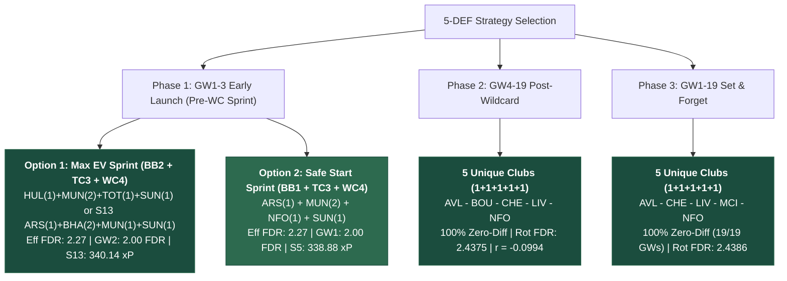
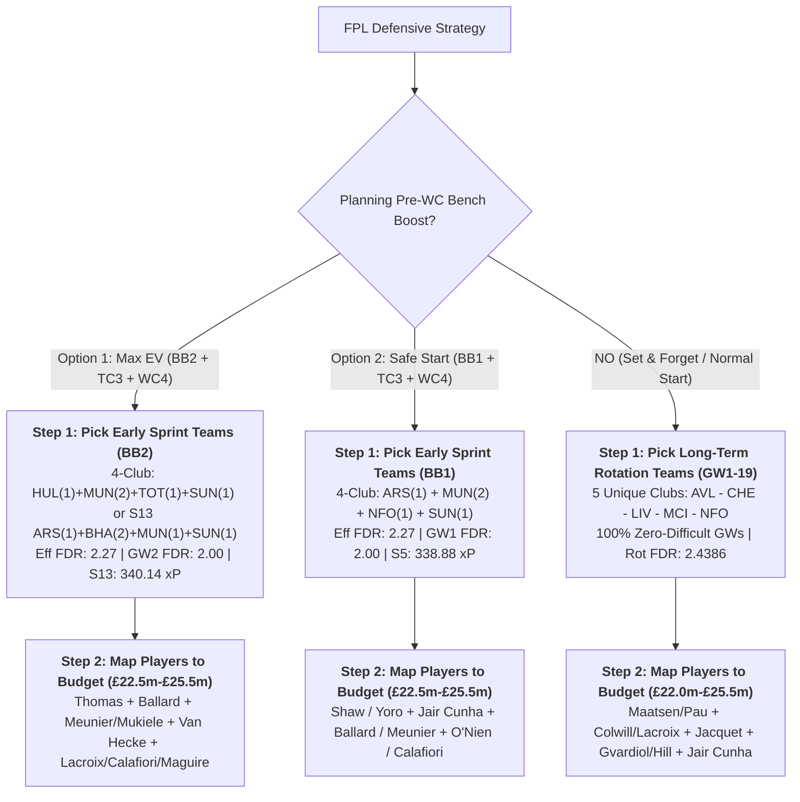

# 5-Defender Fixture Diversification & Multi-Club Partition Study (GW1–19, up to £26.0m)

**Updated**: 2026-08-14T19:00:00+07:00  
**Data stamp**: Stage 2 ADR-0014 rates 2026-08-14; GW4–19 ranking = correlation-first after min rot FDR + 100% zero-diff  
**Season**: 2026/27  
**Status**: Active  
**Purpose**: Determine optimal club and player combinations for 5-defender (5 DEF) units across **2, 3, 4, and 5 unique clubs** (at most £26.0m total budget). Focuses primarily on **team-level defensive strength, FDR schedules, and clean-sheet probability**, evaluating early sprint options (GW2 BB2 Max EV and GW1 BB1 Safe Start), post-Wildcard (GW4–19), and full first-half (GW1–19).  
**Related**: [First-Half Chip Strategy](../fpl-first-half-chip-strategy/fpl-first-half-chip-strategy.md) · [GKP rotation](../gkp-fixture-rotation/gkp-fixture-rotation.md) · [Expected Stats (Stage 2)](../gw1-6-preseason-pipeline/02-expected-stats-gw1-5/expected-stats-gw1-5.md)  
**Sources**: `data/processed/fixtures.parquet`, `data/processed/players.parquet`, `data/processed/clubs.parquet`, `data/research/gw1-6-preseason-pipeline/01-expected-role-gw1-5/expected-role-gw1-5.csv`, `data/research/gw1-6-preseason-pipeline/02-expected-stats-gw1-5/expected-stats-gw1-5.csv`  
**Artifacts**: `[def_club_5way_rotation_matrix.csv](../../../data/research/def-fixture-rotation/def_club_5way_rotation_matrix.csv)`, `[def_tier_player_rotations.csv](../../../data/research/def-fixture-rotation/def_tier_player_rotations.csv)`, `[def_bb1_wc4_club_matrix.csv](../../../data/research/def-fixture-rotation/def_bb1_wc4_club_matrix.csv)`, `[def_bb1_wc4_tier_lineups.csv](../../../data/research/def-fixture-rotation/def_bb1_wc4_tier_lineups.csv)`, `[def_bb2_wc4_club_matrix.csv](../../../data/research/def-fixture-rotation/def_bb2_wc4_club_matrix.csv)`, `[def_bb2_wc4_tier_lineups.csv](../../../data/research/def-fixture-rotation/def_bb2_wc4_tier_lineups.csv)`, `[def_performance_baseline.csv](../../../data/research/def-fixture-rotation/def_performance_baseline.csv)`  
**Script**: `[run_def_rotation_analysis.py](run_def_rotation_analysis.py)`  
**Downstream**: `uv run python docs/research/gw1-6-preseason-pipeline/refresh_downstream.py` (full parent + both WC4 bridges)

## Agent Prompt

```text
After Stage 2 rate / new-player change:
  uv run python docs/research/gw1-6-preseason-pipeline/refresh_downstream.py
This topic only (slow full combinatorics):
  uv run python docs/research/def-fixture-rotation/run_def_rotation_analysis.py
Bridges only: --bridges-only / --sun-bridge-only / --overall-bridge-only
Update parent §1.3/§1.4 player maps, GW4-19 dest (corr-first), and child bridge stamps from CSVs.
Ranking lenses: --print-ranks. More negative avg_fdr_corr wins after primary FDR keys.
```  

**Ranking lenses** (script constants; `--print-ranks` reprints Top-10s):

| Lens | Sort | Canonical #1 |
| --- | --- | --- |
| BB2 sprint | eff FDR → GW2 FDR → GW1+3 rot FDR → corr (asc) | `HUL-MUN-MUN-TOT-SUN` |
| BB1 sprint | eff FDR → GW1 FDR → GW2–3 rot FDR → corr (asc) | `ARS-MUN-MUN-NFO-SUN` |
| GW4–19 dest | rot FDR → zero-diff% → **corr (asc)** → easy% | `AVL-BOU-CHE-LIV-NFO` (r = −0.0994) |
| GW1–19 | same as GW4–19 on `gw1_19` | `AVL-CHE-LIV-MCI-NFO` |
| WC4 bridge | path FDR → GW1 → n_swaps → pre corr. Dest picker: zero-diff → path FDR → dest FDR → **dest corr** → easy% | Overall `LIV-MCI-MUN-MUN-NFO` |

More negative correlation is better: club FDR schedules diversify, so the three you start are less likely to hit FDR 4+ together.

---

## Executive Summary & Core Findings



1. **Why 5 Unique Clubs Dominates Long-Term Rotation (GW4–19 and GW1–19)**:
  - In any standard gameweek where you start 3 defenders and bench 2, selecting 5 defenders across **5 unique clubs** provides 5 distinct fixture schedules.
  - Achieves **1,024 combinations with 100% Zero-Difficult Gameweeks** (never starting a defender facing FDR $\ge 4$).
  - In contrast, **2-club setups (3+2)** and **3-club setups (3+1+1)** achieve **0.0% zero-difficult weeks** due to Pigeonhole clashes against top-6 opponents.
2. **Dual Pre-Wildcard Sprint Pathways (BB2 vs BB1)**:
  - **Option 1: GW2 Bench Boost (BB2 — Max EV Target)**:
    - In the full 16-scenario Stage 3 optimization matrix, **S13 (BB2 + TC3 + WC4) generates 340.14 xP (+1.26 xP over BB1)**.
    - Capitalizes on concentrated GW2 home and low-FDR fixtures: Coventry vs Hull (diff 2 vs diff 2), Manchester United vs Ipswich (diff 2), Sunderland vs Fulham (diff 2), Tottenham vs Newcastle (diff 2), Chelsea vs Brighton (diff 2).
    - Achieves **zero fixture clashes** in GW2 and **average GW2 FDR of 2.00** across all 5 active defenders while benching difficult GW1 matchups.
  - **Option 2: GW1 Bench Boost (BB1 — Safe Start)**:
    - Generates **338.88 xP** in S5.
    - Maximizes operational certainty by exploiting 100% preseason fitness before any match minutes or rotation risks emerge.
3. **Club Quota Limits (Attack Protection)**:
  - Stacking 3 defenders from Man City, Arsenal, Liverpool, or Chelsea locks out essential captaincy and premium attacking slots (Haaland, Saka, Salah, Palmer).
  - The model enforces a hard ceiling of **maximum 2 defenders from top-4 attack clubs**, and up to 3 for mid/budget clubs.
4. **Post-WC4 Migration**:
  - Pre-WC setups (e.g. S13 `ARS-BHA-BHA-MUN-SUN` or `HUL-MUN-MUN-TOT-SUN`) bridge directly at GW4 Wildcard to balanced units (`Gabriel + Tarkowski + Vuskovic + Wieffer + Thiaw` per S13) or pure long-term rotations (`AVL-BOU-CHE-LIV-NFO`).

---

## Part 1: Specialized Pre-Wildcard Early Sprint (GW1–3)

Pre-Wildcard defensive setups evaluate two distinct tactical pathways before a permanent GW4 Wildcard reset:
- **Option 1: GW2 Bench Boost (BB2)**: Top 3 start in GW1 (2 benched), all 5 start in GW2 on Bench Boost (0 clashes, max FDR $\le 3.0$), top 3 start in GW3 (2 benched). Total pre-WC starts = **11 player-matches**.
- **Option 2: GW1 Bench Boost (BB1)**: All 5 start in GW1 on Bench Boost (0 clashes, max FDR $\le 3.0$), top 3 start in GW2 & GW3 (2 benched). Total pre-WC starts = **11 player-matches**.

---

### 1.1 Strategy Comparison: BB2 (Option 1) vs BB1 (Option 2)

| Metric / Dimension | Option 1: GW2 Bench Boost (BB2) | Option 2: GW1 Bench Boost (BB1) | Tactical Edge |
| :--- | :--- | :--- | :--- |
| **Stage 3 MILP Score** | **340.14 xP (Scenario 13)** | **338.88 xP (Scenario 5)** | **+1.26 xP for BB2** |
| **Bench Boost Gameweek** | **GW2** (all 5 defenders start) | **GW1** (all 5 defenders start) | BB2 targets COV–HUL & MUN–IPS |
| **Best Effective FDR** | **2.2727** (11 starts) | **2.2727** (11 starts) | Tied |
| **BB GW Starting FDR** | **2.00** across all 5 active defs | **2.00** across all 5 active defs | Tied |
| **Rotated Starts FDR** | **2.50** (GW1 + GW3 rot) | **2.50** (GW2 + GW3 rot) | Tied |
| **Valid Combinations** | **5,464** valid non-clashing sets | **7,763** valid non-clashing sets | BB1 has larger valid space |
| **Key Advantage** | High-EV GW2 promoted targets | Maximum Day 1 lineup certainty | Manager risk preference |

---

### 1.2 Option 1: Overview by Allocation Pattern (GW1–3, BB2)

| Allocation Pattern | Unique Clubs | Valid Combinations | Best Effective FDR (11 starts) | Best GW2 Avg FDR (5 def) | Best GW1+3 Rot FDR (6 starts) | Top Recommended Team Set |
| :--- | :---: | :---: | :---: | :---: | :---: | :--- |
| **4 Clubs (2+1+1+1)** | **4** | **2,724** | **2.2727** | **2.00** | **2.50** | **HUL(1) - MUN(2) - TOT(1) - SUN(1)** |
| **4 Clubs (2+1+1+1)** | **4** | — | **2.2727** | **2.00** | **2.50** | **CHE(1) - HUL(1) - MUN(2) - SUN(1)** |
| **4 Clubs (2+1+1+1)** | **4** | — | **2.2727** | **2.00** | **2.50** | **COV(1) - MUN(2) - TOT(1) - SUN(1)** |
| **5 Unique Clubs (1x5)** | **5** | **1,002** | **2.3636** | **2.00** | **2.67** | **CHE - HUL - MUN - TOT - SUN** |
| **5 Unique Clubs (1x5)** | **5** | — | **2.3636** | **2.00** | **2.67** | **CHE - COV - MUN - TOT - SUN** |
| **3 Clubs (2+2+1)** | **3** | **912** | **2.2727** | **2.00** | **2.50** | **HUL(2) - MUN(2) - SUN(1)** |
| **3 Clubs (3+1+1)** | **3** | **693** | **2.2727** | **2.00** | **2.50** | **HUL(1) - MUN(3) - TOT(1)** |
| **2 Clubs (3+2)** | **2** | **133** | **2.2727** | **2.00** | **2.50** | **HUL(2) - MUN(3)** |

---

### 1.3 Option 1: Top 10 Team Combinations for GW1–3 (BB2)

#### Top 10 for 4 Unique Clubs (2+1+1+1, BB2)

| Rank | 4-Club Set | Pattern | Effective Avg FDR | GW2 Avg FDR (5 def) | GW1+3 Rot FDR (6 def) | Avg Pairwise Corr ($r$) |
| :--- | :--- | :---: | :---: | :---: | :---: | :---: |
| **1** | **HUL - MUN - MUN - TOT - SUN** | 2+1+1+1 | **2.2727** | **2.00** | 2.50 | +0.4366 |
| **2** | **HUL - MUN - TOT - SUN - SUN** | 2+1+1+1 | **2.2727** | **2.00** | 2.50 | +0.4366 |
| **3** | **CHE - HUL - MUN - MUN - SUN** | 2+1+1+1 | **2.2727** | **2.00** | 2.50 | +0.5162 |
| **4** | **CHE - HUL - MUN - SUN - SUN** | 2+1+1+1 | **2.2727** | **2.00** | 2.50 | +0.5162 |
| **5** | **COV - MUN - MUN - TOT - SUN** | 2+1+1+1 | **2.2727** | **2.00** | 2.50 | +0.6000 |
| **6** | **COV - MUN - TOT - SUN - SUN** | 2+1+1+1 | **2.2727** | **2.00** | 2.50 | +0.6000 |
| **7** | **CHE - COV - MUN - MUN - SUN** | 2+1+1+1 | **2.2727** | **2.00** | 2.50 | +0.7091 |
| **8** | **CHE - COV - MUN - SUN - SUN** | 2+1+1+1 | **2.2727** | **2.00** | 2.50 | +0.7091 |
| **9** | **CHE - MUN - MUN - TOT - SUN** | 2+1+1+1 | **2.2727** | **2.00** | 2.50 | +0.7091 |
| **10** | **CHE - MUN - TOT - SUN - SUN** | 2+1+1+1 | **2.2727** | **2.00** | 2.50 | +0.7091 |

#### Top 10 for 5 Unique Clubs (1+1+1+1+1, BB2)

| Rank | 5-Club Set | Pattern | Effective Avg FDR | GW2 Avg FDR (5 def) | GW1+3 Rot FDR (6 def) | Avg Pairwise Corr ($r$) |
| :--- | :--- | :---: | :---: | :---: | :---: | :---: |
| **1** | **CHE - HUL - MUN - TOT - SUN** | 1+1+1+1+1 | **2.3636** | **2.00** | 2.67 | +0.5839 |
| **2** | **CHE - COV - MUN - TOT - SUN** | 1+1+1+1+1 | **2.3636** | **2.00** | 2.67 | +0.7402 |
| **3** | **BRE - CHE - HUL - MUN - SUN** | 1+1+1+1+1 | **2.3636** | 2.20 | **2.50** | **+0.0272** |
| **4** | **CHE - HUL - LIV - MUN - SUN** | 1+1+1+1+1 | **2.3636** | 2.20 | **2.50** | **+0.0272** |
| **5** | **CHE - HUL - MCI - MUN - SUN** | 1+1+1+1+1 | **2.3636** | 2.20 | **2.50** | **+0.0272** |
| **6** | **BRE - HUL - MUN - TOT - SUN** | 1+1+1+1+1 | **2.3636** | 2.20 | **2.50** | +0.0366 |
| **7** | **HUL - LIV - MUN - TOT - SUN** | 1+1+1+1+1 | **2.3636** | 2.20 | **2.50** | +0.0366 |
| **8** | **HUL - MCI - MUN - TOT - SUN** | 1+1+1+1+1 | **2.3636** | 2.20 | **2.50** | +0.0366 |
| **9** | **BRE - COV - MUN - TOT - SUN** | 1+1+1+1+1 | **2.3636** | 2.20 | **2.50** | +0.1000 |
| **10** | **COV - LIV - MUN - TOT - SUN** | 1+1+1+1+1 | **2.3636** | 2.20 | **2.50** | +0.1000 |

---

### 1.4 Option 1: Representative Player Lineups for GW1–3 (BB2 + WC4)

| Budget Band | Spend | Representative Lineup | BB-RQI | OC-RQI | Effective 11-Start xP | GW2 xP (5 def) | Effective FDR |
| :--- | :---: | :--- | :---: | :---: | :---: | :---: | :---: |
| **Band 1: Budget (£20.5–22.5m)** | £22.5m | **Thomas** (COV £4.0m) + **O'Nien** (SUN £4.0m) + **Meunier** (SUN £4.5m) + **Ballard** (SUN £5.0m) + **Van Hecke** (TOT £5.0m) | **61.38** | **58.303** | **60.12 xP** | 28.35 xP | **2.364** |
| **Band 2: Mid-Value (£23.0–24.0m)** | £24.0m | **Thomas** (COV £4.0m) + **Gvardiol** (MCI £5.5m) + **Meunier** (SUN £4.5m) + **Ballard** (SUN £5.0m) + **Van Hecke** (TOT £5.0m) | **63.48** | **60.478** | **63.39 xP** | 28.99 xP | **2.364** |
| **Band 3: Single Anchor (£24.5–25.0m)** | £25.0m | **Thomas** (COV £4.0m) + **Gvardiol** (MCI £5.5m) + **O'Reilly** (MCI £6.5m) + **O'Nien** (SUN £4.0m) + **Ballard** (SUN £5.0m) | **61.42** | **61.109** | **64.75 xP** | 29.45 xP | **2.454** |
| **Band 4: Premium Anchor (£25.5–26.0m)** | £26.0m | **Thomas** (COV £4.0m) + **Gvardiol** (MCI £5.5m) + **O'Reilly** (MCI £6.5m) + **Ballard** (SUN £5.0m) + **Van Hecke** (TOT £5.0m) | **60.26** | **61.991** | **66.36 xP** | 27.69 xP | **2.454** |

---

### 1.5 Option 2: Overview by Allocation Pattern (GW1–3, BB1)

| Allocation Pattern | Unique Clubs | Valid Combinations | Best Effective FDR (11 starts) | Best GW1 Avg FDR (5 def) | Best GW2–3 Rot FDR (6 starts) | Top Recommended Team Set |
| :--- | :---: | :---: | :---: | :---: | :---: | :--- |
| **4 Clubs (2+1+1+1)** | **4** | **3,940** | **2.2727** | **2.00** | **2.50** | **ARS(1) - MUN(2) - NFO(1) - SUN(1)** |
| **4 Clubs (2+1+1+1)** | **4** | — | **2.2727** | **2.20** | **2.33** | **MCI(1) - MUN(2) - NFO(1) - SUN(1)** |
| **3 Clubs (2+2+1)** | **3** | **1,996** | **2.2727** | **2.00** | **2.50** | **ARS(2) - MUN(2) - SUN(1)** |
| **5 Unique Clubs (1x5)** | **5** | **1,683** | **2.3636** | **2.20** | **2.50** | **ARS - CHE - MUN - NFO - SUN** |
| **2 Clubs (3+2)** | **2** | **144** | **2.2727** | **2.00** | **2.50** | **ARS(2) - MUN(3)** |

---

### 1.6 Option 2: Top 10 Team Combinations for GW1–3 (BB1)

#### Top 10 for 4 Unique Clubs (2+1+1+1, BB1)

| Rank | 4-Club Set | Pattern | Effective Avg FDR | GW1 Avg FDR (5 def) | GW2–3 Rot FDR (6 def) | Avg Pairwise Corr ($r$) |
| :--- | :--- | :---: | :---: | :---: | :---: | :---: |
| **1** | **ARS - MUN - MUN - NFO - SUN** | 2+1+1+1 | **2.2727** | **2.00** | 2.50 | +0.4366 |
| **2** | **ARS - MUN - NFO - SUN - SUN** | 2+1+1+1 | **2.2727** | **2.00** | 2.50 | +0.4366 |
| **3** | **BRE - MUN - MUN - NFO - SUN** | 2+1+1+1 | **2.2727** | 2.20 | **2.33** | **-0.1000** |
| **4** | **BRE - MUN - NFO - SUN - SUN** | 2+1+1+1 | **2.2727** | 2.20 | **2.33** | **-0.1000** |
| **5** | **LIV - MUN - MUN - NFO - SUN** | 2+1+1+1 | **2.2727** | 2.20 | **2.33** | **-0.1000** |
| **6** | **LIV - MUN - NFO - SUN - SUN** | 2+1+1+1 | **2.2727** | 2.20 | **2.33** | **-0.1000** |
| **7** | **MCI - MUN - MUN - NFO - SUN** | 2+1+1+1 | **2.2727** | 2.20 | **2.33** | **-0.1000** |
| **8** | **MCI - MUN - NFO - SUN - SUN** | 2+1+1+1 | **2.2727** | 2.20 | **2.33** | **-0.1000** |
| **9** | **AVL - MUN - MUN - NFO - SUN** | 2+1+1+1 | **2.2727** | 2.20 | **2.33** | -0.0098 |
| **10** | **AVL - MUN - NFO - SUN - SUN** | 2+1+1+1 | **2.2727** | 2.20 | **2.33** | -0.0098 |

#### Top 10 for 5 Unique Clubs (1+1+1+1+1, BB1)

| Rank | 5-Club Set | Pattern | Effective Avg FDR | GW1 Avg FDR (5 def) | GW2–3 Rot FDR (6 def) | Avg Pairwise Corr ($r$) |
| :--- | :--- | :---: | :---: | :---: | :---: | :---: |
| **1** | **ARS - BRE - MUN - NFO - SUN** | 1+1+1+1+1 | **2.3636** | **2.20** | 2.50 | +0.0366 |
| **2** | **ARS - LIV - MUN - NFO - SUN** | 1+1+1+1+1 | **2.3636** | **2.20** | 2.50 | +0.0366 |
| **3** | **ARS - MCI - MUN - NFO - SUN** | 1+1+1+1+1 | **2.3636** | **2.20** | 2.50 | +0.0366 |
| **4** | **ARS - MUN - NFO - TOT - SUN** | 1+1+1+1+1 | **2.3636** | **2.20** | 2.50 | +0.2500 |
| **5** | **ARS - CHE - MUN - NFO - SUN** | 1+1+1+1+1 | **2.3636** | **2.20** | 2.50 | +0.4618 |
| **6** | **ARS - BRE - LIV - MUN - SUN** | 1+1+1+1+1 | **2.3636** | 2.40 | **2.33** | **-0.2000** |
| **7** | **ARS - BRE - MCI - MUN - SUN** | 1+1+1+1+1 | **2.3636** | 2.40 | **2.33** | **-0.2000** |
| **8** | **ARS - LIV - MCI - MUN - SUN** | 1+1+1+1+1 | **2.3636** | 2.40 | **2.33** | **-0.2000** |
| **9** | **BRE - LIV - MUN - NFO - SUN** | 1+1+1+1+1 | **2.3636** | 2.40 | **2.33** | **-0.2000** |
| **10** | **BRE - MCI - MUN - NFO - SUN** | 1+1+1+1+1 | **2.3636** | 2.40 | **2.33** | **-0.2000** |

---

### 1.7 Option 2: Representative Player Lineups for GW1–3 (BB1 + WC4)

| Budget Band | Spend | Representative Lineup | BB-RQI | OC-RQI | Effective 11-Start xP | GW1 xP (5 def) | Effective FDR |
| :--- | :---: | :--- | :---: | :---: | :---: | :---: | :---: |
| **Band 1: Budget (£20.5–22.5m)** | £22.5m | **Vuskovic** (BHA £5.0m) + **Shaw** (MUN £4.5m) + **Jair Cunha** (NFO £4.5m) + **O'Nien** (SUN £4.0m) + **Meunier** (SUN £4.5m) | **62.29** | **58.707** | **60.53 xP** | 27.11 xP | **2.454** |
| **Band 2: Mid-Value (£23.0–24.0m)** | £24.0m | **Calafiori** (ARS £5.5m) + **Vuskovic** (BHA £5.0m) + **O'Nien** (SUN £4.0m) + **Meunier** (SUN £4.5m) + **Ballard** (SUN £5.0m) | **65.58** | **65.719** | **68.63 xP** | 27.38 xP | **2.546** |
| **Band 3: Single Anchor (£24.5–25.0m)** | £25.0m | **Calafiori** (ARS £5.5m) + **Vuskovic** (BHA £5.0m) + **Gvardiol** (MCI £5.5m) + **O'Nien** (SUN £4.0m) + **Ballard** (SUN £5.0m) | **64.00** | **66.649** | **70.29 xP** | 29.75 xP | **2.636** |
| **Band 4: Premium Anchor (£25.5–26.0m)** | £25.5m | **Calafiori** (ARS £5.5m) + **Vuskovic** (BHA £5.0m) + **Gvardiol** (MCI £5.5m) + **Meunier** (SUN £4.5m) + **Ballard** (SUN £5.0m) | **65.58** | **67.256** | **71.26 xP** | 29.64 xP | **2.546** |

---

### 1.8 Post-Wildcard (WC4) Transition Paths

Pre-WC sprint setups migrate seamlessly to long-term foundations at the GW4 Wildcard reset:

- **S13/S5 MILP Pre-WC Defense**: `Calafiori (ARS £5.5m) + Vuskovic (BHA £5.0m) + Wieffer (BHA £5.0m) + Maguire (MUN £5.0m) + Ballard (SUN £5.0m)` (£25.5m). Bridges directly at WC4 to `Gabriel + Tarkowski + Vuskovic + Wieffer + Thiaw` or pure rotation `AVL-BOU-CHE-LIV-NFO` / `AVL-CHE-LIV-MCI-NFO`.
- **Top 5-Club GW4–19 Destination (corr-first)**: `AVL-BOU-CHE-LIV-NFO` (rot FDR 2.4375, $r = -0.0994$, 100% zero-difficult GWs).
- **Alternative Destination**: `AVL-CHE-LIV-MCI-NFO` (rot FDR 2.4375, $r = -0.0529$, 100% zero-difficult GWs) when retaining City defensive assets.

---


## Part 2: Long-Term Post-Wildcard Rotation (GW4–19)

For managers activating their Wildcard in GW4, this 16-gameweek block establishes a permanent defensive foundation that requires zero weekly transfer expenditure.

**Tie-break**: among 100% zero-diff sets at rot FDR 2.4375, rank by more negative pairwise FDR correlation. Table #1 is `AVL-BOU-CHE-LIV-NFO`, not `AVL-CHE-LIV-MCI-NFO`.

### 2.1 Overview by Allocation Pattern (GW4–19)


| Allocation Pattern       | Unique Clubs | Total Evaluated | Best Rotated FDR (Top 3) | 100% Zero-Diff Rate    | Top Recommended Club Set              | Avg Pairwise Corr ($r$) |
| ------------------------ | ------------ | --------------- | ------------------------ | ---------------------- | ------------------------------------- | ----------------------- |
| **5 Unique Clubs (1x5)** | **5**        | **15,504**      | **2.4375**               | **100.0% (16/16 GWs)** | **AVL - BOU - CHE - LIV - NFO**       | **-0.0994**             |
| **5 Unique Clubs (1x5)** | **5**        | —               | **2.4375**               | **100.0% (16/16 GWs)** | **BOU - CHE - EVE - LIV - NFO**       | **-0.0785**             |
| **5 Unique Clubs (1x5)** | **5**        | —               | **2.4375**               | **100.0% (16/16 GWs)** | **AVL - CHE - LIV - MCI - NFO**       | **-0.0529**             |
| **4 Clubs (2+1+1+1)**    | **4**        | **19,380**      | **2.4792**               | **100.0% (16/16 GWs)** | **AVL(2) - CHE(1) - COV(1) - LEE(1)** | **-0.1583**             |
| **4 Clubs (2+1+1+1)**    | **4**        | —               | **2.4792**               | **100.0% (16/16 GWs)** | **AVL(1) - COV(2) - FUL(1) - MCI(1)** | **-0.1297**             |
| **3 Clubs (2+2+1)**      | **3**        | **6,156**       | **2.4792**               | 93.8% (15/16 GWs)      | **BOU(2) - LIV(2) - NFO(1)**          | **-0.1381**             |
| **2 Clubs (3+2)**        | **2**        | **304**         | **2.5625**               | 75.0% (12/16 GWs)      | **BOU(3) - LIV(2)**                   | **-0.1545**             |


---


### 2.2 Top 10 Team Combinations for GW4–19 (Post-WC) — 4 Unique Clubs vs 5 Unique Clubs


#### Top 10 for 4 Unique Clubs (2+1+1+1)


| Rank   | 4-Club Set                      | Pattern | Rotated Avg FDR | Zero-Diff GWs (FDR ≤ 3) | All Easy GWs (FDR ≤ 2) | Avg Pairwise Corr ($r$) |
| ------ | ------------------------------- | ------- | --------------- | ----------------------- | ---------------------- | ----------------------- |
| **1**  | **AVL - AVL - CHE - COV - LEE** | 2+1+1+1 | **2.4792**      | **100.0% (16/16)**      | **31.2% (5/16)**       | **-0.1583**             |
| **2**  | **BOU - BHA - LIV - NFO - NFO** | 2+1+1+1 | **2.4792**      | **100.0% (16/16)**      | 25.0% (4/16)           | **-0.1470**             |
| **3**  | **BOU - CHE - NFO - NFO - TOT** | 2+1+1+1 | **2.4792**      | **100.0% (16/16)**      | 18.8% (3/16)           | **-0.1349**             |
| **4**  | **AVL - COV - COV - FUL - MCI** | 2+1+1+1 | **2.4792**      | **100.0% (16/16)**      | 25.0% (4/16)           | **-0.1297**             |
| **5**  | **COV - COV - EVE - FUL - MCI** | 2+1+1+1 | **2.4792**      | **100.0% (16/16)**      | 25.0% (4/16)           | **-0.1294**             |
| **6**  | **BOU - COV - COV - EVE - FUL** | 2+1+1+1 | **2.4792**      | **100.0% (16/16)**      | **31.2% (5/16)**       | -0.1169                 |
| **7**  | **BOU - BHA - CHE - NFO - NFO** | 2+1+1+1 | **2.4792**      | **100.0% (16/16)**      | 18.8% (3/16)           | -0.1158                 |
| **8**  | **AVL - BOU - COV - COV - FUL** | 2+1+1+1 | **2.4792**      | **100.0% (16/16)**      | 25.0% (4/16)           | -0.1130                 |
| **9**  | **BOU - CHE - LIV - NFO - NFO** | 2+1+1+1 | **2.4792**      | **100.0% (16/16)**      | 25.0% (4/16)           | -0.0743                 |
| **10** | **BOU - COV - COV - FUL - MCI** | 2+1+1+1 | **2.4792**      | **100.0% (16/16)**      | **31.2% (5/16)**       | -0.0364                 |


#### Top 10 for 5 Unique Clubs (1+1+1+1+1)


| Rank   | 5-Club Set                      | Pattern   | Rotated Avg FDR | Zero-Diff GWs (FDR ≤ 3) | All Easy GWs (FDR ≤ 2) | Avg Pairwise Corr ($r$) |
| ------ | ------------------------------- | --------- | --------------- | ----------------------- | ---------------------- | ----------------------- |
| **1**  | **AVL - BOU - CHE - LIV - NFO** | 1+1+1+1+1 | **2.4375**      | **100.0% (16/16)**      | 18.8% (3/16)           | **-0.0994**             |
| **2**  | **BOU - CHE - EVE - LIV - NFO** | 1+1+1+1+1 | **2.4375**      | **100.0% (16/16)**      | **25.0% (4/16)**       | **-0.0785**             |
| **3**  | **AVL - CHE - LIV - MCI - NFO** | 1+1+1+1+1 | **2.4375**      | **100.0% (16/16)**      | **25.0% (4/16)**       | -0.0529                 |
| **4**  | **AVL - COV - FUL - LEE - MCI** | 1+1+1+1+1 | **2.4583**      | **100.0% (16/16)**      | 6.2% (1/16)            | **-0.2010**             |
| **5**  | **AVL - BOU - CHE - LIV - NEW** | 1+1+1+1+1 | **2.4583**      | **100.0% (16/16)**      | 12.5% (2/16)           | **-0.1889**             |
| **6**  | **AVL - CHE - LIV - MCI - NEW** | 1+1+1+1+1 | **2.4583**      | **100.0% (16/16)**      | 18.8% (3/16)           | **-0.1744**             |
| **7**  | **BOU - CHE - LIV - NEW - NFO** | 1+1+1+1+1 | **2.4583**      | **100.0% (16/16)**      | 18.8% (3/16)           | -0.1619                 |
| **8**  | **BOU - CRY - EVE - LIV - NFO** | 1+1+1+1+1 | **2.4583**      | **100.0% (16/16)**      | 18.8% (3/16)           | -0.1615                 |
| **9**  | **AVL - BOU - LIV - NEW - NFO** | 1+1+1+1+1 | **2.4583**      | **100.0% (16/16)**      | 18.8% (3/16)           | -0.1563                 |
| **10** | **COV - EVE - FUL - LEE - MCI** | 1+1+1+1+1 | **2.4583**      | **100.0% (16/16)**      | 6.2% (1/16)            | -0.1523                 |


---


### 2.3 Representative Player Lineups for GW4–19 (Post-Wildcard)

| Budget Band | Spend | Representative Lineup | RQI | OC-RQI | 16-GW Rotated xP | Weekly Avg xP | Rotated FDR | Zero-Diff % |
| :--- | :---: | :--- | :---: | :---: | :---: | :---: | :---: | :---: |
| **Band 1: Budget (£20.5–22.5m)** | £22.5m | **Calafiori** (ARS £5.5m) + **Vuskovic** (BHA £5.0m) + **Thomas** (COV £4.0m) + **Ajayi** (HUL £4.0m) + **O'Nien** (SUN £4.0m) | **63.80** | **18.627** | **307.74 xP** | 19.23 xP/GW | 2.792 | 62.5% |
| **Band 2: Mid-Value (£23.0–24.0m)** | £24.0m | **Calafiori** (ARS £5.5m) + **Vuskovic** (BHA £5.0m) + **Hill** (BOU £5.5m) + **Thomas** (COV £4.0m) + **Ajayi** (HUL £4.0m) | **63.48** | **19.335** | **324.91 xP** | 20.31 xP/GW | 2.812 | 62.5% |
| **Band 3: Single Anchor (£24.5–25.0m)** | £25.0m | **Calafiori** (ARS £5.5m) + **Vuskovic** (BHA £5.0m) + **Hill** (BOU £5.5m) + **Thomas** (COV £4.0m) + **Muharemović** (LEE £5.0m) | **64.66** | **19.373** | **329.40 xP** | 20.59 xP/GW | 2.667 | 68.8% |
| **Band 4: Premium Anchor (£25.5–26.0m)** | £26.0m | **Calafiori** (ARS £5.5m) + **Vuskovic** (BHA £5.0m) + **Thomas** (COV £4.0m) + **Muharemović** (LEE £5.0m) + **O'Reilly** (MCI £6.5m) | **64.39** | **19.341** | **332.77 xP** | 20.80 xP/GW | 2.646 | 75.0% |


---


## Part 3: Full First-Half Set & Forget Rotation (GW1–19)

For managers executing a set-and-forget defensive strategy across the entire first half of the season (GW1–19).

### 3.1 Overview by Allocation Pattern (GW1–19)


| Club Allocation Pattern        | Unique Clubs | Total Combinations | Best Rotated FDR | Best Zero-Diff Rate    | Zero-Diff Combinations | Top Team Rotation Set                 |
| ------------------------------ | ------------ | ------------------ | ---------------- | ---------------------- | ---------------------- | ------------------------------------- |
| **5 Unique Clubs (1+1+1+1+1)** | **5**        | **15,504**         | **2.4386**       | **100.0% (19/19 GWs)** | **1,024 (6.60%)**      | **AVL - CHE - LIV - MCI - NFO**       |
| **4 Clubs (2+1+1+1)**          | **4**        | **19,380**         | **2.4737**       | **100.0% (19/19 GWs)** | **63 (0.33%)**         | **AVL(2) - CHE(1) - COV(1) - LEE(1)** |
| **3 Clubs (2+2+1)**            | **3**        | **3,420**          | **2.5088**       | 94.7% (18/19 GWs)      | 6 (0.18%)              | **AVL(2) - COV(2) - MCI(1)**          |
| **3 Clubs (3+1+1)**            | **3**        | **2,736**          | **2.5789**       | 73.7% (14/19 GWs)      | **0 (0.00%)**          | **BOU(1) - HUL(1) - LIV(3)**          |
| **2 Clubs (3+2)**              | **2**        | **304**            | **2.5965**       | 73.7% (14/19 GWs)      | **0 (0.00%)**          | **AVL(3) - COV(2)**                   |


---


### 3.2 Top 10 Team Combinations for GW1–19 (Full First Half) — 4 Unique Clubs vs 5 Unique Clubs


#### Top 10 for 4 Unique Clubs (2+1+1+1)


| Rank   | 4-Club Set                      | Pattern | Rotated Avg FDR | Zero-Diff GWs (FDR ≤ 3) | All Easy GWs (FDR ≤ 2) | Avg Pairwise Corr ($r$) |
| ------ | ------------------------------- | ------- | --------------- | ----------------------- | ---------------------- | ----------------------- |
| **1**  | **CHE - LIV - MCI - MCI - SUN** | 2+1+1+1 | **2.4737**      | 84.2% (16/19)           | **26.3% (5/19)**       | -0.1169                 |
| **2**  | **AVL - AVL - CHE - COV - LEE** | 2+1+1+1 | **2.4912**      | **100.0% (19/19)**      | **26.3% (5/19)**       | **-0.1791**             |
| **3**  | **BOU - CHE - NFO - NFO - TOT** | 2+1+1+1 | **2.4912**      | **100.0% (19/19)**      | 15.8% (3/19)           | **-0.1644**             |
| **4**  | **AVL - COV - COV - MCI - SUN** | 2+1+1+1 | **2.4912**      | **100.0% (19/19)**      | **26.3% (5/19)**       | **-0.1346**             |
| **5**  | **BOU - CHE - LIV - NFO - NFO** | 2+1+1+1 | **2.4912**      | **100.0% (19/19)**      | 21.1% (4/19)           | **-0.1150**             |
| **6**  | **CHE - MCI - TOT - SUN - SUN** | 2+1+1+1 | **2.4912**      | 94.7% (18/19)           | 21.1% (4/19)           | -0.1474                 |
| **7**  | **AVL - AVL - COV - LEE - LIV** | 2+1+1+1 | **2.4912**      | 94.7% (18/19)           | **31.6% (6/19)**       | -0.1437                 |
| **8**  | **AVL - CHE - CHE - MCI - SUN** | 2+1+1+1 | **2.4912**      | 94.7% (18/19)           | **26.3% (5/19)**       | -0.1408                 |
| **9**  | **COV - LIV - MCI - MCI - NEW** | 2+1+1+1 | **2.4912**      | 94.7% (18/19)           | 21.1% (4/19)           | -0.1374                 |
| **10** | **AVL - COV - COV - LIV - MCI** | 2+1+1+1 | **2.4912**      | 94.7% (18/19)           | **26.3% (5/19)**       | -0.1302                 |


#### Top 10 for 5 Unique Clubs (1+1+1+1+1)


| Rank   | 5-Club Set                      | Pattern   | Rotated Avg FDR | Zero-Diff GWs (FDR ≤ 3) | All Easy GWs (FDR ≤ 2) | Avg Pairwise Corr ($r$) |
| ------ | ------------------------------- | --------- | --------------- | ----------------------- | ---------------------- | ----------------------- |
| **1**  | **AVL - CHE - LIV - MCI - NFO** | 1+1+1+1+1 | **2.4386**      | **100.0% (19/19)**      | **26.3% (5/19)**       | **-0.0679**             |
| **2**  | **BHA - COV - LIV - MCI - SUN** | 1+1+1+1+1 | **2.4561**      | **100.0% (19/19)**      | **26.3% (5/19)**       | **-0.1487**             |
| **3**  | **AVL - BOU - CHE - LIV - NFO** | 1+1+1+1+1 | **2.4561**      | **100.0% (19/19)**      | 15.8% (3/19)           | **-0.1182**             |
| **4**  | **AVL - CHE - COV - MCI - NFO** | 1+1+1+1+1 | **2.4561**      | **100.0% (19/19)**      | 15.8% (3/19)           | **-0.0969**             |
| **5**  | **AVL - COV - LIV - MCI - NFO** | 1+1+1+1+1 | **2.4561**      | **100.0% (19/19)**      | 21.1% (4/19)           | **-0.0767**             |
| **6**  | **AVL - CHE - LIV - MCI - SUN** | 1+1+1+1+1 | **2.4561**      | 94.7% (18/19)           | **26.3% (5/19)**       | -0.0981                 |
| **7**  | **AVL - CHE - COV - LIV - MCI** | 1+1+1+1+1 | **2.4561**      | 94.7% (18/19)           | **31.6% (6/19)**       | -0.0965                 |
| **8**  | **CHE - COV - LIV - MCI - SUN** | 1+1+1+1+1 | **2.4561**      | 94.7% (18/19)           | **31.6% (6/19)**       | -0.0824                 |
| **9**  | **AVL - CHE - LIV - MCI - NEW** | 1+1+1+1+1 | **2.4737**      | **100.0% (19/19)**      | 21.1% (4/19)           | **-0.1733**             |
| **10** | **AVL - COV - LIV - MCI - MUN** | 1+1+1+1+1 | **2.4737**      | **100.0% (19/19)**      | 15.8% (3/19)           | **-0.1478**             |


---


### 3.3 Top Representative Player Lineups (GW1–19)

| Budget Band | Spend | Representative Lineup | RQI | OC-RQI | 19-GW Rotated xP | Weekly Avg xP | Rotated FDR | Zero-Diff % |
| :--- | :---: | :--- | :---: | :---: | :---: | :---: | :---: | :---: |
| **Band 1: Budget (£20.5–22.5m)** | £22.5m | **Calafiori** (ARS £5.5m) + **Vuskovic** (BHA £5.0m) + **Thomas** (COV £4.0m) + **Ajayi** (HUL £4.0m) + **O'Nien** (SUN £4.0m) | **63.46** | **18.599** | **364.92 xP** | 19.21 xP/GW | 2.772 | 57.9% |
| **Band 2: Mid-Value (£23.0–24.0m)** | £24.0m | **Calafiori** (ARS £5.5m) + **Vuskovic** (BHA £5.0m) + **Hill** (BOU £5.5m) + **Thomas** (COV £4.0m) + **O'Nien** (SUN £4.0m) | **62.59** | **19.241** | **384.04 xP** | 20.21 xP/GW | 2.807 | 57.9% |
| **Band 3: Single Anchor (£24.5–25.0m)** | £25.0m | **Calafiori** (ARS £5.5m) + **Vuskovic** (BHA £5.0m) + **Hill** (BOU £5.5m) + **Thomas** (COV £4.0m) + **Muharemović** (LEE £5.0m) | **63.01** | **19.273** | **389.26 xP** | 20.49 xP/GW | 2.702 | 63.2% |
| **Band 4: Premium Anchor (£25.5–26.0m)** | £26.0m | **Calafiori** (ARS £5.5m) + **Vuskovic** (BHA £5.0m) + **Thomas** (COV £4.0m) + **Muharemović** (LEE £5.0m) + **O'Reilly** (MCI £6.5m) | **63.12** | **19.325** | **394.86 xP** | 20.78 xP/GW | 2.667 | 68.4% |


---


## Part 4: Deep Dive — Trade-Off Matrix Across 2 to 5 Unique Clubs

```
+---------------------------------------------------------------------------------------------------+
|                            DEFENDER CLUB PARTITION TRADE-OFF MATRIX                               |
+----------------------+--------------------+---------------------+-------------------+-------------+
| Feature / Metric     | 5 Unique Clubs     | 4 Clubs (2+1+1+1)   | 3 Clubs (2+2+1)   | 2 Clubs     |
+----------------------+--------------------+---------------------+-------------------+-------------+
| Fixture Insulation   | ★★★★★ (100% Zero)  | ★★★★☆ (95-100%)     | ★★☆☆☆ (80-90%)    | ★☆☆☆☆ (<75%)|
| Rotated Avg FDR      | Lowest (2.438)     | Low (2.474)         | Medium (2.509)    | High (2.597)|
| Double Clean Sheet   | None (1 per team)  | 1 Match Double-Up   | 2 Match Double-Ups| Extreme Risk|
| Single-Match Wipeout | Minimum Risk       | Moderate Risk       | High Risk         | Severe Risk |
| Attack Quota Impact  | Zero Cannibalize   | Low Cannibalize     | Blocks Key Attack | Locks Slots |
| Ideal Application    | GW4-19 / GW1-19    | GW1-3 Bench Boost   | Specialized Punt  | Not Viable  |
+----------------------+--------------------+---------------------+-------------------+-------------+
```


### Detailed Evaluation of the 5 Trade-Off Dimensions

1. **Fixture Insulation & Diversification**:
  - Starting 3 defenders requires at least 3 distinct schedules to rotate effectively.
  - In a 2-club setup (`3+2`), there are only 2 schedules. When both teams face tough fixtures, you are **forced to start at least 1 defender in a difficult game**.
  - 5 unique clubs gives 5 independent fixtures, allowing seamless dodging of all FDR 4/5 matches.
2. **Double Clean Sheet Upside**:
  - In 4-club setups with 1 elite double-up (e.g. Man City or Arsenal), when that team plays a promoted side at home (FDR 2), starting both defenders can yield 12–15 points from a single clean sheet.
3. **Clean Sheet Correlation & Single-Match Wipeout Risk**:
  - When doubling up on defense, a single deflected 90th-minute goal wipes out clean sheet points for **both** defenders simultaneously. 5 unique clubs diversifies risk across 3 completely independent matches.
4. **Squad Quota Cannibalization (3-per-club rule)**:
  - Each FPL squad is limited to 3 players per club. Holding 2 or 3 defenders from Arsenal or Man City directly blocks Haaland, Saka, Foden, or Odegaard. 5 unique clubs preserves attacking flexibility.
5. **Bench Deadweight**:
  - If you hold 2 premium defenders from the same club and they play a top-4 rival, benching both means £10.0m–£12.0m of squad budget sits inactive on your bench.

---


## Part 5: Actionable Recommendations & Implementation Blueprint



### Summary of Best Team Combinations

1. **For Early Sprint (GW1–3 Bench Boost + GW4 Wildcard)**:
  - **Option 1: Max EV Target (GW2 Bench Boost, S13)**:
    - **Recommended Teams**: `Hull City (1) + Manchester United (2) + Tottenham (1) + Sunderland (1)` or S13 Draft `Arsenal (1) + Brighton (2) + Manchester United (1) + Sunderland (1)`.
    - **Why**: Captures peak GW2 matchups (COV vs HUL, MUN vs IPS, SUN vs FUL, TOT vs NEW) with **GW2 FDR 2.00** and **340.14 xP (+1.26 xP over BB1)** in S13.
    - **WC4 Bridge Destination**: Bridges at WC4 to `Gabriel + Tarkowski + Vuskovic + Wieffer + Thiaw` or pure rotation `AVL-BOU-CHE-LIV-NFO` / `AVL-CHE-LIV-MCI-NFO`.
  - **Option 2: Safe Start Target (GW1 Bench Boost, S5)**:
    - **Recommended Teams**: `Arsenal (1) + Manchester United (2) + Nottingham Forest (1) + Sunderland (1)` or `LIV(1) + MCI(1) + MUN(2) + NFO(1)`.
    - **Why**: Best GW1 FDR (2.00) at shared 2.2727 11-start eff FDR. Eliminates Day 1 bench point waste before any match minutes are played.
    - **WC4 Reset**: Wipes pre-season structure cleanly at GW4 to deploy long-term rotation or premium anchor defenses.
2. **For Post-Wildcard (GW4–19)**:
  - **Recommended Teams**: `Aston Villa (1) + Bournemouth (1) + Chelsea (1) + Liverpool (1) + Nottingham Forest (1)`
  - **Why**: Tied lowest rotated FDR (2.4375) and 100% zero-diff; **best correlation** (r = −0.0994) in that tier. `AVL-CHE-LIV-MCI-NFO` is rank 3 (r = −0.0529) — keep it when the WC4 dump must retain City.
3. **For Set & Forget (GW1–19)**:
  - **Recommended Teams**: `Aston Villa (1) + Chelsea (1) + Liverpool (1) + Manchester City (1) + Nottingham Forest (1)`
  - **Why**: Unique #1 on the 19-GW horizon (rot FDR 2.4386, 100% zero-diff). `AVL-BOU-CHE-LIV-NFO` is rank 3 here (2.4561).


