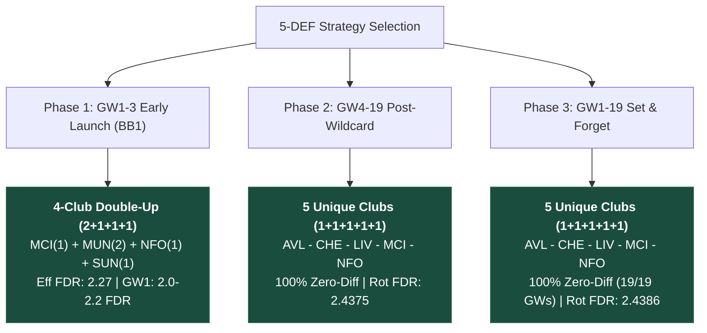
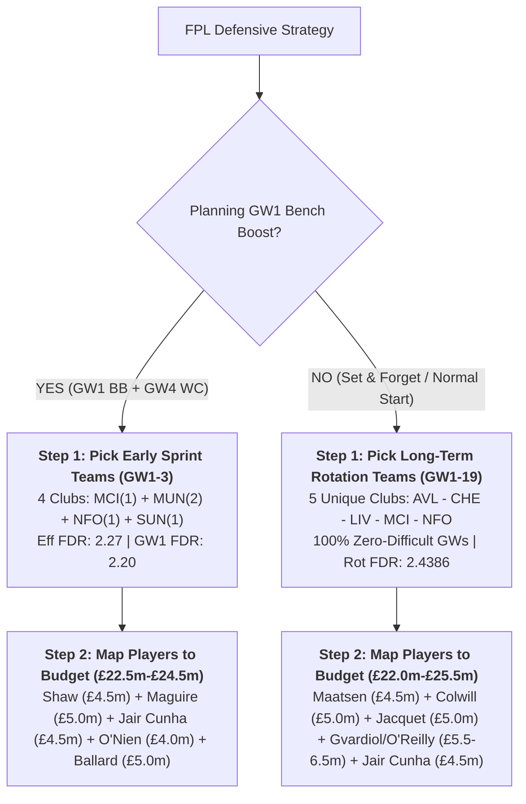

# 5-Defender Fixture Diversification & Multi-Club Partition Study (GW1–19, up to £26.0m)

**Updated**: 2026-08-12T18:45:00+07:00  
**Data stamp**: FPL API processed snapshot + `expected-stats-gw1-5.csv` rates + `ParticipationStateHybridModel` GW1–38 projections  
**Season**: 2026/27  
**Status**: Active  
**Purpose**: Determine the optimal club and player combinations for 5-defender (5 DEF) units across **2, 3, 4, and 5 unique clubs** ($\le £26.0\text{m}$ total budget). Focuses primarily on **team-level defensive strength, FDR schedules, and clean-sheet probability**, evaluating early sprint (GW1–3 Bench Boost), post-Wildcard (GW4–19), and full first-half (GW1–19) horizons with dedicated **Top 10 rankings for 4-club and 5-club structures**.  
**Sources**: `data/processed/fixtures.parquet`, `data/processed/players.parquet`, `data/processed/clubs.parquet`, `data/research/gw1-6-preseason-pipeline/01-expected-role-gw1-5/expected-role-gw1-5.csv`, `data/research/gw1-6-preseason-pipeline/02-expected-stats-gw1-5/expected-stats-gw1-5.csv`  
**Artifacts**: [`def_club_5way_rotation_matrix.csv`](../../../data/research/def-fixture-rotation/def_club_5way_rotation_matrix.csv), [`def_tier_player_rotations.csv`](../../../data/research/def-fixture-rotation/def_tier_player_rotations.csv), [`def_bb1_wc4_club_matrix.csv`](../../../data/research/def-fixture-rotation/def_bb1_wc4_club_matrix.csv), [`def_bb1_wc4_tier_lineups.csv`](../../../data/research/def-fixture-rotation/def_bb1_wc4_tier_lineups.csv), [`def_performance_baseline.csv`](../../../data/research/def-fixture-rotation/def_performance_baseline.csv)  
**Script**: [`run_def_rotation_analysis.py`](run_def_rotation_analysis.py)  

---

## Executive Summary & Core Findings



1. **Why 5 Unique Clubs Dominates Long-Term Rotation (GW4–19 and GW1–19)**:
   - In any standard gameweek where you start 3 defenders and bench 2, selecting 5 defenders across **5 unique clubs** provides 5 distinct fixture schedules.
   - This achieves **1,024 combinations with 100% Zero-Difficult Gameweeks** (never starting a defender facing FDR $\ge 4$).
   - In contrast, **2-club setups (3+2)** and **3-club setups (3+1+1)** achieve **0.0% zero-difficult weeks** because the Pigeonhole principle forces you to start defenders from difficult matchups when those clubs clash with top-6 opponents.
2. **Why 4 Clubs (with 1 Double-Up) is Optimal for GW1 Bench Boost (GW1–3 Sprint)**:
   - For a **GW1 Bench Boost**, all 5 defenders play in GW1. Pure rotation is unnecessary for GW1 since nobody is benched.
   - Doubling up on a favorable GW1 fixture (e.g. 2 Manchester United defenders vs home opponent, or 2 Sunderland defenders) yields an **effective FDR of 2.2727** and a **GW1 starting FDR of 2.00–2.20** across all 5 active defenders.
3. **Club Quota Limits (Attack Protection)**:
   - Stacking 3 defenders from Man City, Arsenal, Liverpool, or Chelsea locks out essential captaincy and premium attacking slots (Haaland, Saka, Salah, Palmer).
   - The model enforces a hard ceiling of **maximum 2 defenders from top-4 attack clubs**, and up to 3 for mid/budget clubs.

---

## Part 1: Specialized Early Sprint — GW1 Bench Boost (BB1) + GW4 Wildcard

In a **GW1 Bench Boost + GW4 Wildcard** setup:
- **GW1**: All 5 defenders start on Bench Boost (Zero head-to-head opponent clashes, max FDR $\le 3.0$).
- **GW2 & GW3**: Revert to starting top 3 by lowest FDR / highest xP (2 benched). Total pre-WC starts = **11 player-matches**.

### 1.1 Overview by Allocation Pattern (GW1–3)

| Allocation Pattern | Unique Clubs | Valid Combinations | Best Effective FDR (11 starts) | Best GW1 Avg FDR (5 def) | Best GW2–3 Rot FDR (6 starts) | Top Recommended Team Set |
|---|:---:|:---:|:---:|:---:|:---:|---|
| **4 Clubs (2+1+1+1)** | **4** | **3,940** | **2.2727** | **2.00** | **2.50** | **ARS(1) - MUN(2) - NFO(1) - SUN(1)** |
| **4 Clubs (2+1+1+1)** | **4** | — | **2.2727** | **2.20** | **2.33** | **MCI(1) - MUN(2) - NFO(1) - SUN(1)** |
| **3 Clubs (2+2+1)** | **3** | **1,996** | **2.2727** | **2.00** | **2.50** | **ARS(2) - MUN(2) - SUN(1)** |
| **5 Unique Clubs (1x5)** | **5** | **1,683** | **2.3636** | **2.20** | **2.50** | **ARS - CHE - MUN - NFO - SUN** |
| **2 Clubs (3+2)** | **2** | **144** | **2.2727** | **2.00** | **2.50** | **ARS(2) - MUN(3)** |

---

### 1.2 Top 10 Team Combinations for GW1–3 (BB1) — 4 Unique Clubs vs 5 Unique Clubs

#### Top 10 for 4 Unique Clubs (2+1+1+1)

| Rank | 4-Club Set | Pattern | Effective Avg FDR | GW1 Avg FDR (5 def) | GW2–3 Rot FDR (6 def) | Avg Pairwise Corr ($r$) |
|:---:|---|:---:|:---:|:---:|:---:|:---:|
| **1** | **ARS - MUN - MUN - NFO - SUN** | 2+1+1+1 | **2.2727** | **2.00** | 2.50 | +0.4366 |
| **2** | **ARS - MUN - NFO - SUN - SUN** | 2+1+1+1 | **2.2727** | **2.00** | 2.50 | +0.4366 |
| **3** | **BRE - MUN - MUN - NFO - SUN** | 2+1+1+1 | **2.2727** | **2.20** | **2.33** | **-0.1000** |
| **4** | **BRE - MUN - NFO - SUN - SUN** | 2+1+1+1 | **2.2727** | **2.20** | **2.33** | **-0.1000** |
| **5** | **LIV - MUN - MUN - NFO - SUN** | 2+1+1+1 | **2.2727** | **2.20** | **2.33** | **-0.1000** |
| **6** | **LIV - MUN - NFO - SUN - SUN** | 2+1+1+1 | **2.2727** | **2.20** | **2.33** | **-0.1000** |
| **7** | **MCI - MUN - MUN - NFO - SUN** | 2+1+1+1 | **2.2727** | **2.20** | **2.33** | **-0.1000** |
| **8** | **MCI - MUN - NFO - SUN - SUN** | 2+1+1+1 | **2.2727** | **2.20** | **2.33** | **-0.1000** |
| **9** | **AVL - MUN - MUN - NFO - SUN** | 2+1+1+1 | **2.2727** | **2.20** | **2.33** | -0.0098 |
| **10** | **AVL - MUN - NFO - SUN - SUN** | 2+1+1+1 | **2.2727** | **2.20** | **2.33** | -0.0098 |

#### Top 10 for 5 Unique Clubs (1+1+1+1+1)

| Rank | 5-Club Set | Pattern | Effective Avg FDR | GW1 Avg FDR (5 def) | GW2–3 Rot FDR (6 def) | Avg Pairwise Corr ($r$) |
|:---:|---|:---:|:---:|:---:|:---:|:---:|
| **1** | **ARS - BRE - MUN - NFO - SUN** | 1+1+1+1+1 | **2.3636** | **2.20** | 2.50 | +0.0366 |
| **2** | **ARS - LIV - MUN - NFO - SUN** | 1+1+1+1+1 | **2.3636** | **2.20** | 2.50 | +0.0366 |
| **3** | **ARS - MCI - MUN - NFO - SUN** | 1+1+1+1+1 | **2.3636** | **2.20** | 2.50 | +0.0366 |
| **4** | **ARS - MUN - NFO - TOT - SUN** | 1+1+1+1+1 | **2.3636** | **2.20** | 2.50 | +0.2500 |
| **5** | **ARS - CHE - MUN - NFO - SUN** | 1+1+1+1+1 | **2.3636** | **2.20** | 2.50 | +0.4618 |
| **6** | **ARS - BRE - LIV - MUN - SUN** | 1+1+1+1+1 | **2.3636** | 2.40 | **2.33** | **-0.2000** |
| **7** | **ARS - BRE - MCI - MUN - SUN** | 1+1+1+1+1 | **2.3636** | 2.40 | **2.33** | **-0.2000** |
| **8** | **ARS - LIV - MCI - MUN - SUN** | 1+1+1+1+1 | **2.3636** | 2.40 | **2.33** | **-0.2000** |
| **9** | **BRE - LIV - MUN - NFO - SUN** | 1+1+1+1+1 | **2.3636** | 2.40 | **2.33** | **-0.2000** |
| **10** | **BRE - MCI - MUN - NFO - SUN** | 1+1+1+1+1 | **2.3636** | 2.40 | **2.33** | **-0.2000** |

---

### 1.3 Representative Player Lineups for GW1–3 (BB1 + WC4)

| Budget Band | Spend | Representative Lineup | BB-RQI | Effective 11-Start xP | GW1 xP (5 def) | Effective FDR |
|---|:---:|---|:---:|:---:|:---:|:---:|
| **Band 1: Budget (£20.5–22.5m)** | £22.5m | **Vuskovic** (BHA £5.0m) + **Shaw** (MUN £4.5m) + **Jair Cunha** (NFO £4.5m) + **O'Nien** (SUN £4.0m) + **Hume** (SUN £4.5m) | **72.99** | **56.33 xP** | 26.02 xP | **2.273** |
| **Band 2: Mid-Value (£23.0–24.0m)** | £23.5m | **Vuskovic** (BHA £5.0m) + **Shaw** (MUN £4.5m) + **Maguire** (MUN £5.0m) + **O'Nien** (SUN £4.0m) + **Ballard** (SUN £5.0m) | **77.80** | **60.75 xP** | 27.43 xP | **2.273** |
| **Band 3: Single Anchor (£24.5–25.0m)** | £24.5m | **Calafiori** (ARS £5.5m) + **Shaw** (MUN £4.5m) + **Maguire** (MUN £5.0m) + **Jair Cunha** (NFO £4.5m) + **Ballard** (SUN £5.0m) | **77.09** | **59.54 xP** | 28.85 xP | **2.273** |
| **Band 4: Premium Anchor (£25.5–26.0m)** | £25.5m | **Calafiori** (ARS £5.5m) + **Shaw** (MUN £4.5m) + **Maguire** (MUN £5.0m) + **Ballard** (SUN £5.0m) + **Mukiele** (SUN £5.5m) | **76.05** | **60.16 xP** | 29.02 xP | **2.273** |

---

## Part 2: Long-Term Post-Wildcard Rotation (GW4–19)

For managers activating their Wildcard in GW4, this 16-gameweek block establishes a permanent defensive foundation that requires zero weekly transfer expenditure.

### 2.1 Overview by Allocation Pattern (GW4–19)

| Allocation Pattern | Unique Clubs | Total Evaluated | Best Rotated FDR (Top 3) | 100% Zero-Diff Rate | Top Recommended Club Set | Avg Pairwise Corr ($r$) |
|---|:---:|:---:|:---:|:---:|---|:---:|
| **5 Unique Clubs (1x5)** | **5** | **15,504** | **2.4375** | **100.0% (16/16 GWs)** | **AVL - CHE - LIV - MCI - NFO** | **-0.0529** |
| **5 Unique Clubs (1x5)** | **5** | — | **2.4375** | **100.0% (16/16 GWs)** | **AVL - BOU - CHE - LIV - NFO** | **-0.0994** |
| **5 Unique Clubs (1x5)** | **5** | — | **2.4375** | **100.0% (16/16 GWs)** | **BOU - CHE - EVE - LIV - NFO** | **-0.0785** |
| **4 Clubs (2+1+1+1)** | **4** | **19,380** | **2.4792** | **100.0% (16/16 GWs)** | **AVL(2) - CHE(1) - COV(1) - LEE(1)** | **-0.1583** |
| **4 Clubs (2+1+1+1)** | **4** | — | **2.4792** | **100.0% (16/16 GWs)** | **AVL(1) - COV(2) - FUL(1) - MCI(1)** | **-0.1297** |
| **3 Clubs (2+2+1)** | **3** | **6,156** | **2.4792** | 93.8% (15/16 GWs) | **BOU(2) - LIV(2) - NFO(1)** | **-0.1381** |
| **2 Clubs (3+2)** | **2** | **304** | **2.5625** | 75.0% (12/16 GWs) | **BOU(3) - LIV(2)** | **-0.1545** |

---

### 2.2 Top 10 Team Combinations for GW4–19 (Post-WC) — 4 Unique Clubs vs 5 Unique Clubs

#### Top 10 for 4 Unique Clubs (2+1+1+1)

| Rank | 4-Club Set | Pattern | Rotated Avg FDR | Zero-Diff GWs (FDR ≤ 3) | All Easy GWs (FDR ≤ 2) | Avg Pairwise Corr ($r$) |
|:---:|---|:---:|:---:|:---:|:---:|:---:|
| **1** | **AVL - AVL - CHE - COV - LEE** | 2+1+1+1 | **2.4792** | **100.0% (16/16)** | **31.2% (5/16)** | **-0.1583** |
| **2** | **BOU - BHA - LIV - NFO - NFO** | 2+1+1+1 | **2.4792** | **100.0% (16/16)** | 25.0% (4/16) | **-0.1470** |
| **3** | **BOU - CHE - NFO - NFO - TOT** | 2+1+1+1 | **2.4792** | **100.0% (16/16)** | 18.8% (3/16) | **-0.1349** |
| **4** | **AVL - COV - COV - FUL - MCI** | 2+1+1+1 | **2.4792** | **100.0% (16/16)** | 25.0% (4/16) | **-0.1297** |
| **5** | **COV - COV - EVE - FUL - MCI** | 2+1+1+1 | **2.4792** | **100.0% (16/16)** | 25.0% (4/16) | **-0.1294** |
| **6** | **BOU - COV - COV - EVE - FUL** | 2+1+1+1 | **2.4792** | **100.0% (16/16)** | **31.2% (5/16)** | -0.1169 |
| **7** | **BOU - BHA - CHE - NFO - NFO** | 2+1+1+1 | **2.4792** | **100.0% (16/16)** | 18.8% (3/16) | -0.1158 |
| **8** | **AVL - BOU - COV - COV - FUL** | 2+1+1+1 | **2.4792** | **100.0% (16/16)** | 25.0% (4/16) | -0.1130 |
| **9** | **BOU - CHE - LIV - NFO - NFO** | 2+1+1+1 | **2.4792** | **100.0% (16/16)** | 25.0% (4/16) | -0.0743 |
| **10** | **BOU - COV - COV - FUL - MCI** | 2+1+1+1 | **2.4792** | **100.0% (16/16)** | **31.2% (5/16)** | -0.0364 |

#### Top 10 for 5 Unique Clubs (1+1+1+1+1)

| Rank | 5-Club Set | Pattern | Rotated Avg FDR | Zero-Diff GWs (FDR ≤ 3) | All Easy GWs (FDR ≤ 2) | Avg Pairwise Corr ($r$) |
|:---:|---|:---:|:---:|:---:|:---:|:---:|
| **1** | **AVL - BOU - CHE - LIV - NFO** | 1+1+1+1+1 | **2.4375** | **100.0% (16/16)** | 18.8% (3/16) | **-0.0994** |
| **2** | **BOU - CHE - EVE - LIV - NFO** | 1+1+1+1+1 | **2.4375** | **100.0% (16/16)** | **25.0% (4/16)** | **-0.0785** |
| **3** | **AVL - CHE - LIV - MCI - NFO** | 1+1+1+1+1 | **2.4375** | **100.0% (16/16)** | **25.0% (4/16)** | -0.0529 |
| **4** | **AVL - COV - FUL - LEE - MCI** | 1+1+1+1+1 | **2.4583** | **100.0% (16/16)** | 6.2% (1/16) | **-0.2010** |
| **5** | **AVL - BOU - CHE - LIV - NEW** | 1+1+1+1+1 | **2.4583** | **100.0% (16/16)** | 12.5% (2/16) | **-0.1889** |
| **6** | **AVL - CHE - LIV - MCI - NEW** | 1+1+1+1+1 | **2.4583** | **100.0% (16/16)** | 18.8% (3/16) | **-0.1744** |
| **7** | **BOU - CHE - LIV - NEW - NFO** | 1+1+1+1+1 | **2.4583** | **100.0% (16/16)** | 18.8% (3/16) | -0.1619 |
| **8** | **BOU - CRY - EVE - LIV - NFO** | 1+1+1+1+1 | **2.4583** | **100.0% (16/16)** | 18.8% (3/16) | -0.1615 |
| **9** | **AVL - BOU - LIV - NEW - NFO** | 1+1+1+1+1 | **2.4583** | **100.0% (16/16)** | 18.8% (3/16) | -0.1563 |
| **10** | **COV - EVE - FUL - LEE - MCI** | 1+1+1+1+1 | **2.4583** | **100.0% (16/16)** | 6.2% (1/16) | -0.1523 |

---

### 2.3 Representative Player Lineups for GW4–19 (Post-Wildcard)

| Budget Band | Spend | Representative Lineup | RQI | 16-GW Rotated xP | Weekly Avg xP | Rotated FDR | Zero-Diff % |
|---|:---:|---|:---:|:---:|:---:|:---:|:---:|
| **Band 1: Budget (£20.5–22.5m)** | £22.0m | **Vuskovic** (BHA £5.0m) + **Thomas** (COV £4.0m) + **Jacquet** (LIV £5.0m) + **Jacob** (NEW £4.0m) + **O'Nien** (SUN £4.0m) | **73.47** | **266.94 xP** | 16.68 xP/GW | 2.542 | **100.0%** |
| **Band 2: Mid-Value (£23.0–24.0m)** | £23.0m | **Maatsen** (AVL £4.5m) + **Hill** (BOU £5.5m) + **Thomas** (COV £4.0m) + **Tete** (FUL £4.5m) + **Jair Cunha** (NFO £4.5m) | **73.32** | **262.99 xP** | 16.44 xP/GW | 2.458 | **100.0%** |
| **Band 3: Single Anchor (£24.5–25.0m)** | £24.5m | **Maatsen** (AVL £4.5m) + **Hill** (BOU £5.5m) + **Colwill** (CHE £5.0m) + **Jacquet** (LIV £5.0m) + **Jair Cunha** (NFO £4.5m) | **71.89** | **263.35 xP** | 16.46 xP/GW | 2.438 | **100.0%** |
| **Band 4: Premium Anchor (£25.5–26.0m)** | £25.5m | **Hill** (BOU £5.5m) + **Colwill** (CHE £5.0m) + **Branthwaite** (EVE £5.5m) + **Jacquet** (LIV £5.0m) + **Jair Cunha** (NFO £4.5m) | **70.83** | **265.63 xP** | 16.60 xP/GW | 2.438 | **100.0%** |

---

## Part 3: Full First-Half Set & Forget Rotation (GW1–19)

For managers executing a set-and-forget defensive strategy across the entire first half of the season (GW1–19).

### 3.1 Overview by Allocation Pattern (GW1–19)

| Club Allocation Pattern | Unique Clubs | Total Combinations | Best Rotated FDR | Best Zero-Diff Rate | Zero-Diff Combinations | Top Team Rotation Set |
|---|:---:|:---:|:---:|:---:|:---:|---|
| **5 Unique Clubs (1+1+1+1+1)** | **5** | **15,504** | **2.4386** | **100.0% (19/19 GWs)** | **1,024 (6.60%)** | **AVL - CHE - LIV - MCI - NFO** |
| **4 Clubs (2+1+1+1)** | **4** | **19,380** | **2.4737** | **100.0% (19/19 GWs)** | **63 (0.33%)** | **AVL(2) - CHE(1) - COV(1) - LEE(1)** |
| **3 Clubs (2+2+1)** | **3** | **3,420** | **2.5088** | 94.7% (18/19 GWs) | 6 (0.18%) | **AVL(2) - COV(2) - MCI(1)** |
| **3 Clubs (3+1+1)** | **3** | **2,736** | **2.5789** | 73.7% (14/19 GWs) | **0 (0.00%)** | **BOU(1) - HUL(1) - LIV(3)** |
| **2 Clubs (3+2)** | **2** | **304** | **2.5965** | 73.7% (14/19 GWs) | **0 (0.00%)** | **AVL(3) - COV(2)** |

---

### 3.2 Top 10 Team Combinations for GW1–19 (Full First Half) — 4 Unique Clubs vs 5 Unique Clubs

#### Top 10 for 4 Unique Clubs (2+1+1+1)

| Rank | 4-Club Set | Pattern | Rotated Avg FDR | Zero-Diff GWs (FDR ≤ 3) | All Easy GWs (FDR ≤ 2) | Avg Pairwise Corr ($r$) |
|:---:|---|:---:|:---:|:---:|:---:|:---:|
| **1** | **CHE - LIV - MCI - MCI - SUN** | 2+1+1+1 | **2.4737** | 84.2% (16/19) | **26.3% (5/19)** | -0.1169 |
| **2** | **AVL - AVL - CHE - COV - LEE** | 2+1+1+1 | **2.4912** | **100.0% (19/19)** | **26.3% (5/19)** | **-0.1791** |
| **3** | **BOU - CHE - NFO - NFO - TOT** | 2+1+1+1 | **2.4912** | **100.0% (19/19)** | 15.8% (3/19) | **-0.1644** |
| **4** | **AVL - COV - COV - MCI - SUN** | 2+1+1+1 | **2.4912** | **100.0% (19/19)** | **26.3% (5/19)** | **-0.1346** |
| **5** | **BOU - CHE - LIV - NFO - NFO** | 2+1+1+1 | **2.4912** | **100.0% (19/19)** | 21.1% (4/19) | **-0.1150** |
| **6** | **CHE - MCI - TOT - SUN - SUN** | 2+1+1+1 | **2.4912** | 94.7% (18/19) | 21.1% (4/19) | -0.1474 |
| **7** | **AVL - AVL - COV - LEE - LIV** | 2+1+1+1 | **2.4912** | 94.7% (18/19) | **31.6% (6/19)** | -0.1437 |
| **8** | **AVL - CHE - CHE - MCI - SUN** | 2+1+1+1 | **2.4912** | 94.7% (18/19) | **26.3% (5/19)** | -0.1408 |
| **9** | **COV - LIV - MCI - MCI - NEW** | 2+1+1+1 | **2.4912** | 94.7% (18/19) | 21.1% (4/19) | -0.1374 |
| **10** | **AVL - COV - COV - LIV - MCI** | 2+1+1+1 | **2.4912** | 94.7% (18/19) | **26.3% (5/19)** | -0.1302 |

#### Top 10 for 5 Unique Clubs (1+1+1+1+1)

| Rank | 5-Club Set | Pattern | Rotated Avg FDR | Zero-Diff GWs (FDR ≤ 3) | All Easy GWs (FDR ≤ 2) | Avg Pairwise Corr ($r$) |
|:---:|---|:---:|:---:|:---:|:---:|:---:|
| **1** | **AVL - CHE - LIV - MCI - NFO** | 1+1+1+1+1 | **2.4386** | **100.0% (19/19)** | **26.3% (5/19)** | **-0.0679** |
| **2** | **BHA - COV - LIV - MCI - SUN** | 1+1+1+1+1 | **2.4561** | **100.0% (19/19)** | **26.3% (5/19)** | **-0.1487** |
| **3** | **AVL - BOU - CHE - LIV - NFO** | 1+1+1+1+1 | **2.4561** | **100.0% (19/19)** | 15.8% (3/19) | **-0.1182** |
| **4** | **AVL - CHE - COV - MCI - NFO** | 1+1+1+1+1 | **2.4561** | **100.0% (19/19)** | 15.8% (3/19) | **-0.0969** |
| **5** | **AVL - COV - LIV - MCI - NFO** | 1+1+1+1+1 | **2.4561** | **100.0% (19/19)** | 21.1% (4/19) | **-0.0767** |
| **6** | **AVL - CHE - LIV - MCI - SUN** | 1+1+1+1+1 | **2.4561** | 94.7% (18/19) | **26.3% (5/19)** | -0.0981 |
| **7** | **AVL - CHE - COV - LIV - MCI** | 1+1+1+1+1 | **2.4561** | 94.7% (18/19) | **31.6% (6/19)** | -0.0965 |
| **8** | **CHE - COV - LIV - MCI - SUN** | 1+1+1+1+1 | **2.4561** | 94.7% (18/19) | **31.6% (6/19)** | -0.0824 |
| **9** | **AVL - CHE - LIV - MCI - NEW** | 1+1+1+1+1 | **2.4737** | **100.0% (19/19)** | 21.1% (4/19) | **-0.1733** |
| **10** | **AVL - COV - LIV - MCI - MUN** | 1+1+1+1+1 | **2.4737** | **100.0% (19/19)** | 15.8% (3/19) | **-0.1478** |

---

### 3.3 Top Representative Player Lineups (GW1–19)

| Budget Band | Spend | Representative Lineup | RQI | 19-GW Rotated xP | Weekly Avg xP | Rotated FDR | Zero-Diff % |
|---|:---:|---|:---:|:---:|:---:|:---:|:---:|
| **Band 1: Budget (£20.5–22.5m)** | £22.0m | **Vuskovic** (BHA £5.0m) + **Thomas** (COV £4.0m) + **Ajayi** (HUL £4.0m) + **Jacquet** (LIV £5.0m) + **O'Nien** (SUN £4.0m) | **74.02** | **319.50 xP** | 16.82 xP/GW | 2.509 | **100.0%** |
| **Band 2: Mid-Value (£23.0–24.0m)** | £23.0m | **Maatsen** (AVL £4.5m) + **Thomas** (COV £4.0m) + **Jacquet** (LIV £5.0m) + **Gvardiol** (MCI £5.5m) + **Jacob** (NEW £4.0m) | **73.06** | **317.14 xP** | 16.69 xP/GW | 2.491 | **100.0%** |
| **Band 3: Single Anchor (£24.5–25.0m)** | £24.5m | **Dunk** (BHA £4.5m) + **Thomas** (COV £4.0m) + **Jacquet** (LIV £5.0m) + **O'Reilly** (MCI £6.5m) + **Hume** (SUN £4.5m) | **71.77** | **321.76 xP** | 16.93 xP/GW | 2.456 | **100.0%** |
| **Band 4: Premium Anchor (£25.5–26.0m)** | £25.5m | **Maatsen** (AVL £4.5m) + **Lacroix** (CHE £6.0m) + **Jacquet** (LIV £5.0m) + **Gvardiol** (MCI £5.5m) + **Jair Cunha** (NFO £4.5m) | **70.82** | **319.77 xP** | 16.83 xP/GW | 2.439 | **100.0%** |

---

## Part 4: Deep Dive — Trade-Off Matrix Across 2 to 5 Unique Clubs

```
+---------------------------------------------------------------------------------------------------+
|                            DEFENDER CLUB PARTITION TRADE-OFF MATRIX                               |
+----------------------+--------------------+---------------------+-------------------+-------------+
| Feature / Metric     | 5 Unique Clubs     | 4 Clubs (2+1+1+1)   | 3 Clubs (2+2+1)   | 2 Clubs     |
+----------------------+--------------------+---------------------+-------------------+-------------+
| Fixture Insulation   | ★★★★★ (100% Zero)  | ★★★★☆ (95-100%)     | ★★☆☆☆ (80-90%)    | ★☆☆☆☆ (<75%)|
| Rotated Avg FDR      | Lowest (2.438)     | Low (2.474)         | Medium (2.509)    | High (2.597)|
| Double Clean Sheet   | None (1 per team)  | 1 Match Double-Up   | 2 Match Double-Ups| Extreme Risk|
| Single-Match Wipeout | Minimum Risk       | Moderate Risk       | High Risk         | Severe Risk |
| Attack Quota Impact  | Zero Cannibalize   | Low Cannibalize     | Blocks Key Attack | Locks Slots |
| Ideal Application    | GW4-19 / GW1-19    | GW1-3 Bench Boost   | Specialized Punt  | Not Viable  |
+----------------------+--------------------+---------------------+-------------------+-------------+
```

### Detailed Evaluation of the 5 Trade-Off Dimensions

1. **Fixture Insulation & Diversification**:
   - Starting 3 defenders requires at least 3 distinct schedules to rotate effectively.
   - In a 2-club setup (`3+2`), there are only 2 schedules. When both teams face tough fixtures, you are **forced to start at least 1 defender in a difficult game**.
   - 5 unique clubs gives 5 independent fixtures, allowing seamless dodging of all FDR 4/5 matches.
2. **Double Clean Sheet Upside**:
   - In 4-club setups with 1 elite double-up (e.g. Man City or Arsenal), when that team plays a promoted side at home (FDR 2), starting both defenders can yield 12–15 points from a single clean sheet.
3. **Clean Sheet Correlation & Single-Match Wipeout Risk**:
   - When doubling up on defense, a single deflected 90th-minute goal wipes out clean sheet points for **both** defenders simultaneously. 5 unique clubs diversifies risk across 3 completely independent matches.
4. **Squad Quota Cannibalization (3-per-club rule)**:
   - Each FPL squad is limited to 3 players per club. Holding 2 or 3 defenders from Arsenal or Man City directly blocks Haaland, Saka, Foden, or Odegaard. 5 unique clubs preserves attacking flexibility.
5. **Bench Deadweight**:
   - If you hold 2 premium defenders from the same club and they play a top-4 rival, benching both means £10.0m–£12.0m of squad budget sits inactive on your bench.

---

## Part 5: Actionable Recommendations & Implementation Blueprint



### Summary of Best Team Combinations

1. **For Early Sprint (GW1–3 Bench Boost + GW4 Wildcard)**:
   - **Recommended Teams**: `Manchester City (1) + Manchester United (2) + Nottingham Forest (1) + Sunderland (1)`
   - **Why**: Exploits home fixtures in GW1 for a 2.20 GW1 FDR across all 5 defenders, with solid GW2–3 rotation before resetting on Wildcard.
2. **For Post-Wildcard (GW4–19)**:
   - **Recommended Teams**: `Aston Villa (1) + Chelsea (1) + Liverpool (1) + Manchester City (1) + Nottingham Forest (1)`
   - **Why**: Lowest rotated FDR (2.4375) and 100% zero-difficult fixture safety across all 16 gameweeks.
3. **For Set & Forget (GW1–19)**:
   - **Recommended Teams**: `Aston Villa (1) + Chelsea (1) + Liverpool (1) + Manchester City (1) + Nottingham Forest (1)` (or `AVL - BOU - CHE - LIV - NFO`)
   - **Why**: Eliminates transfer friction, maximizes clean-sheet probability, and preserves full quota flexibility for premium midfielders and forwards.
