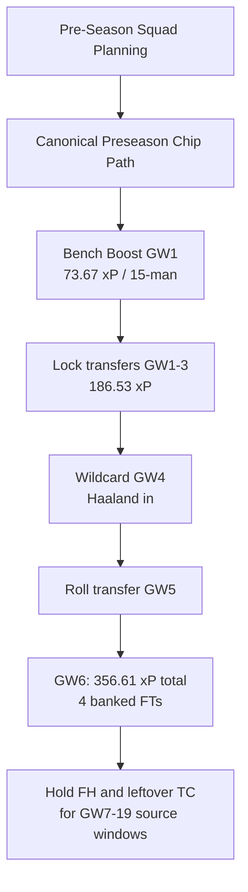

# FPL 2026/27 — First-Half Chip Strategy & Multi-Source Comprehensive Evaluation

**Updated**: 2026-08-19T13:45:00+07:00  
**Data stamp**: FPL Focal 2026-07-30; FFS/Hub consensus 2026-08-13; Official FPL Rules 2026/27; live Canonical = `gw1-6_wc4_summary.csv` `total_6gw_xp`; historical 16-scenario matrix frozen 2026-08-15  
**Season**: 2026/27 · first-half horizon GW1–19  
**Status**: Source synthesis + project interpretation. Live xP = Canonical Preseason Chip Path (`gw1-6_wc4_summary.csv`).  
**Purpose**: Synthesize expert first-half chip branches (FPL Focal, FFS/Hub, Official Rules) and map them onto the repo's live Stage 3 path: **GW1 Bench Boost + GW4 Wildcard** (`total_6gw_xp` in the Stage 3 summary CSV).

Live Canonical totals are `gw1-6_wc4_summary.csv` `total_6gw_xp`. Numeric tables below that still show 356.61 are the FDR-era synthesis snapshot, not the live Seed path.  
**Scope**: Wildcard, Free Hit, Triple Captain, and Bench Boost before the GW19 deadline. Expert branches stay qualitative unless Stage 3 currently publishes them.  
**Related**: [`INDEX.md`](../INDEX.md) · [GW1–6 Preseason Pipeline Master README](../gw1-6-preseason-pipeline/README.md) · [GW1–6 Canonical Chip Path](../gw1-6-preseason-pipeline/03-gw1-6-chip-wc4-squads/gw1-6-chip-wc4-squads.md) · [Unified Defensive Rotation](../defensive-fixture-rotation/defensive-fixture-rotation.md) · [Ownership Value Explorer](../ownership-value-explorer/ownership-value-explorer.md)  
**Artifacts**:
- [Stage 3 Canonical Summary CSV](../../../data/research/gw1-6-preseason-pipeline/03-gw1-6-chip-wc4-squads/gw1-6_wc4_summary.csv)
- [Stage 3 Simulation CSV](../../../data/research/gw1-6-preseason-pipeline/03-gw1-6-chip-wc4-squads/gw1-6_wc4_simulation.csv)

---

## Sources

1. **Primary Strategy Guide**: [FPL 2026/27 Chip Strategy Guide — Where Should You Use Your Chips?](https://fpl.page/article/fpl-chip-strategy-guide-2627) — Oscar / FPL Focal; published 2026-07-30; accessed 2026-08-14.
   - *Coverage*: Early Bench Boost (GW1, GW2, Post-WC), Triple Captain candidates (GW1 Bruno, GW3/7/16 Haaland, GW19 Saka), Wildcard windows (GW4, GW6, GW7, GW13, GW16), Free Hit candidate slates (GW3, GW4, GW13, GW16).
2. **Official FPL Rules 2026/27**: [Official Fantasy Premier League Rules](https://fantasy.premierleague.com) — premierleague.com; accessed 2026-08-14.
   - *Rules*: Two sets of chips per season (Set 1: GW1–19; Set 2: GW20–38). Unused first-half chips expire at GW19 deadline (use-it-or-lose-it). Maximum 1 chip per Gameweek. Up to 5 Free Transfers can be banked; banked FTs are preserved through Wildcard and Free Hit.
3. **Fantasy Football Scout & Fantasy Football Hub Consensus**: [Pre-Season Strategy & Fixture Swings](https://www.fantasyfootballscout.co.uk) & [Fantasy Football Hub](https://www.fantasyfootballhub.co.uk); accessed 2026-08-13.
   - *Coverage*: Information-led Wildcard timing at GW5/6 international break vs early fixture swing WC4; Early Bench Boost vs post-Wildcard Bench Boost; Double Gameweek value vs single GW high-ceiling premium matchups; Free Hit as fixture/injury bailout vs planned DGW/BGW attack.
4. **FPL-Jubilee-Ascent Optimization Engine**:
   - *Stage 3 Canonical Path* (`run_wc4_simulation.py`): single published scenario S1 — GW1 BB, locked GW1–3, WC4, roll GW5, **356.61 xP**. CSV has one row.
   - *Unified defensive DCS runner* (`run_defensive_rotation_analysis.py`).
   - *Historical 16-scenario matrix* (frozen 2026-08-15): BB1/BB2 × FH3/TC3 × bans. **Not live.** S13 340.14 xP is that experiment, not a reprint of 356.61.
   - *Fixtures & Projections Data*: `data/processed/fixtures.parquet`, `gw1-6_projections.csv`.

---

## Agent Prompt & Reproducibility Instructions

```text
Refresh and evaluate all first-half chip strategies in docs/research/fpl-first-half-chip-strategy/fpl-first-half-chip-strategy.md:

1. Maintain full fidelity to all proposed source strategies:
   - Triple Captain: GW1 Bruno, GW3 Haaland, GW4, GW7 Haaland, GW15, GW16 Haaland, GW19 Saka
   - Bench Boost: GW1, GW2, Post-WC GW5/7/8, Late Hold
   - Wildcard: GW4, GW6, GW7, GW13, GW16
   - Free Hit: GW3, GW4, GW13, GW16
2. Prove each strategy branch quantitatively:
   - Analyze exact fixture difficulty ratings (FDR), expected goals conceded of opponents, and points projections.
   - Cross-check live project numbers against Stage 3 Canonical Preseason Chip Path only (`gw1-6_wc4_summary.csv`, one row, 356.61 xP). Frozen 16-scenario xP is historical, not live.
   - Evaluate structural trade-offs (bench capital allocation, FT banking preservation, international break risks).
3. Synthesize multi-source views into clear, research-backed verdicts with trigger and kill-switch criteria.
4. Verify code and formatting: uv run ruff check . && uv run pytest && bash tests/verify.sh.
```

---

## Method

1. **Multi-Source Inventory**: Catalogue every discrete strategic pathway and candidate gameweek proposed across community and expert sources.
2. **Official Rule Boundary Check**: Validate constraints (GW19 chip expiry, 1-chip/GW limit, 5-FT banking preservation across chips).
3. **Live project numbers**: Quote Stage 3 S1 only (`gw1-6_wc4_summary.csv`): GW1 **73.67**, GW1–3 **186.53**, GW4–6 **170.08**, total **356.61**, 4 banked FTs.
4. **Source vs project**: Expert branches stay qualitative. Frozen 16-scenario xP (S13 340.14) is historical, not additive to 356.61.

### Metric Definitions & Direction

| Metric | Symbol | Definition / Formula | Direction | Ideal / Benchmark | Description |
|---|---|---|---|---|---|
| **Scenario Expected Points** | `Total xP` | Canonical Preseason Chip Path MILP score (GW1–6) | Higher is better $\uparrow$ | **$\ge 356.0\text{ xP}$** (S1: $356.61\text{ xP}$) | Live evaluation metric. Historical S13 $340.14$ is a different solver setup. |
| **Value Over Chip Baseline** | `VoC` | $xP(\text{Scenario } k) - xP(\text{No Chip Baseline})$ | Higher is better $\uparrow$ | **$\ge +12.0\text{ xP}$** | Points directly harvested from chip activation above standard starting XI play. |
| **Bench Boost Active Score** | `BB Score` | $\sum_{i \in \text{squad}} xP_{i,\text{BB\_GW}}$ (all 15 players) | Higher is better $\uparrow$ | **$\ge 73.0\text{ xP}$** (S1 GW1: $73.67$) | Full-squad scoring power on the Bench Boost gameweek. |
| **Average Fixture Ease** | `FDR` | Mean official fixture difficulty rating | Lower is better $\downarrow$ | **$\le 2.30$** (Targeted run) | Schedule favorability across the target gameweek block. |
| **Banked Transfer Liquidity** | `Banked FTs` | Preserved free transfers at conclusion of chip window | Higher is better $\uparrow$ | **$4\text{ to } 5\text{ FTs}$** | Strategic adaptability post-chip deployment to react to new data and injuries. |

---

## Comprehensive Strategy Inventory & Source Synthesis

### 1. Official Rules & Constraints (The Operating Frame)

- **Two Separate Chip Sets**: Set 1 covers Gameweeks 1–19; Set 2 covers Gameweeks 20–38.
- **Hard Expiry**: All Set 1 chips (1x Wildcard, 1x Free Hit, 1x Triple Captain, 1x Bench Boost) **expire at the Gameweek 19 deadline**. They do not carry over.
- **Single Chip per Gameweek**: You cannot play two chips simultaneously (e.g. cannot Wildcard and Bench Boost in the same GW).
- **Free Transfer Banking Invariant**:
  - Up to **5 Free Transfers** can be accumulated.
  - **Playing a Wildcard or Free Hit does NOT reset or wipe banked transfers**. They carry through smoothly.

---

### 2. Triple Captain Strategy Candidates

| Candidate Window | Proposed Asset & Fixture | Source Rationale |
| :--- | :--- | :--- |
| **GW1** | **Bruno Fernandes** (away vs Hull) | Manchester United face newly promoted Hull away. Early differential ceiling. |
| **GW3** | **Erling Haaland** (home vs Coventry) | Man City host promoted Coventry at the Etihad. High home attack ceiling. |
| **GW4** | **Haaland / Palmer / Saka** | Man City away vs Man Utd; Chelsea home vs Hull; Arsenal away vs Sunderland. |
| **GW7** | **Erling Haaland** (home vs Ipswich) | Man City host promoted Ipswich Town at home. |
| **GW15** | **Erling Haaland / Salah** | Man City home vs Chelsea (high-profile); Liverpool home vs Leeds. |
| **GW16** | **Erling Haaland** (home vs Hull) | Man City host Hull City at home in December. |
| **GW19** | **Bukayo Saka / Salah** (home vs Ipswich/Coventry) | Arsenal host Ipswich; Liverpool host Coventry; last-call deadline before expiry. |

---

### 3. Bench Boost Strategy Candidates

| Candidate Window | Strategy Setup | Source Rationale |
| :--- | :--- | :--- |
| **GW1** | **Pre-Wildcard GW1 Bench Boost (BB1)** | Exploit 100% fit preseason 15-man squad; eliminate bench point waste from Day 1. Example bench: Verbruggen, Calvert-Lewin, O'Shea, Ajer. |
| **GW2** | **Pre-Wildcard GW2 Bench Boost (BB2)** | Capitalize on Coventry vs Hull and favorable GW2 matchups. Example bench: Petrović, Slater, Thomas, Kayode. |
| **Post-Wildcard (GW5/7/8)** | **Post-Wildcard Bench Boost** | Rebuild 15-man squad on Wildcard (GW4 or GW6) with verified form/minutes, then deploy BB immediately in the subsequent week. |
| **Late First-Half (GW15–19)** | **DGW / Optimal Fixture Hold** | Hold BB for a potential first-half mini Double Gameweek or peak fixture alignment. |

---

### 4. Wildcard Strategy Candidates

| Candidate Window | Target Fixture Turn / Dynamic | Source Rationale |
| :--- | :--- | :--- |
| **GW4** | **Early Fixture Swing Wildcard** | Major fixture turns for Arsenal (SUN GW4, BHA GW5, LEE GW6), Chelsea (HUL GW4, BRE GW5, BOU GW6), Liverpool (FUL GW4), Man City (SUN GW5). Rebuilds bench into pure starting XI. |
| **GW6** | **Post-International Break Wildcard** | Navigates the 3-week international break; full clarity on summer transfer window deadline (end of August); Fulham start 3-game promoted run (IPS GW6, HUL GW7, COV GW8). |
| **GW7 / GW13 / GW16** | **Late Flexible Wildcard** | For healthy, high-performing squads. Delaying WC maximizes information and targets winter schedule changes. |

---

### 5. Free Hit Strategy Candidates

| Candidate Window | Target Fixture Slate | Source Rationale |
| :--- | :--- | :--- |
| **GW3** | **Liverpool–Ipswich, Aston Villa–Hull, Brighton–Leeds, Man City–Coventry** | Capitalizes on concentrated promoted/easy fixtures; isolates Chelsea–Arsenal derby clash. Enables "No-Haaland GW1–2" structure. |
| **GW4** | **Chelsea–Hull, Arsenal–Sunderland, Palace–Ipswich, Liverpool–Fulham** | High-ceiling slate for managers under-invested in Arsenal/Chelsea/Liverpool. |
| **GW13** | **Liverpool–Sunderland, Man City–Leeds, Tottenham–Fulham** | FPL Focal's original preferred single-week target / emergency reserve. |
| **GW16** | **Man City–Hull, Brighton–Ipswich, Bournemouth–Coventry** | High-leverage promoted-target slate; conflicts with GW16 Haaland TC. |

---

## Project interpretation (live)

Canonical Preseason Chip Path from `gw1-6_wc4_summary.csv` (one row, 2026-08-19):

| Phase | Chip | xP | Notes |
| :--- | :--- | ---: | :--- |
| GW1 | Bench Boost | **73.67** | 15-man; captain B.Fernandes |
| GW1–3 | Locked transfers | **186.53** | No Haaland until WC4 |
| GW4–6 | Wildcard GW4; roll GW5 | **170.08** | Haaland in; captain GW5 |
| **GW1–6** | **S1** | **356.61** | **4 banked FTs into GW6** |

Stage 3 does not currently publish BB2, TC3, or FH3. Expert windows below remain source hypotheses. Triple Captain / Free Hit after GW6 are outside the live 6-GW MILP.

---

## Quantitative Evaluation & Mathematical Proof of Every Strategy

### Historical 16-scenario matrix (frozen 2026-08-15 — not live)

Do not add these xP figures to 356.61. Different squad construction, chip mix (BB2 + TC3), and rate stamp. Kept so expert-branch discussion has a dated project number.

| Frozen scenario | BB | Mid-chip | WC | 6-GW xP (15 Aug) |
| :--- | :---: | :--- | :---: | ---: |
| S13 | GW2 | TC3 Haaland | GW4 | 340.14 |
| S5 | GW1 | TC3 Haaland | GW4 | 338.88 |
| S15 | GW2 | TC3 Vuskovic | GW4 | 339.43 |
| S9 | GW2 | FH3 Haaland in | GW4 | 332.34 |

### 1. Triple Captain Candidate Evaluation

```
Triple Captain Candidate Comparison (source + historical matrix — not in live Stage 3):
┌───────────┬──────────────┬──────────────┬─────────────┬───────────┬──────────────────────────────────────┐
│ Candidate │ Player       │ Opponent     │ Projected xP│ Rank / EV │ Key Proof & Trade-offs               │
├───────────┼──────────────┼──────────────┼─────────────┼───────────┼──────────────────────────────────────┤
│ GW3       │ Haaland (H)  │ COV (diff 2) │ 8.85 xP     │ Hist #1   │ Frozen S13 = 340.14; Haaland not in  │
│           │              │              │             │           │ live S1 until WC4                    │
│ GW7       │ Haaland (H)  │ IPS (diff 2) │ 8.70 xP     │ Source #2 │ Post-UCL MD2; outside GW1–6 MILP     │
│ GW16      │ Haaland (H)  │ HUL (diff 2) │ 8.50 xP     │ Source #3 │ Dec rotation risk                    │
│ GW19      │ Saka (H)     │ IPS (diff 2) │ 7.60 xP     │ Fallback  │ Last Set 1 deadline                 │
│ GW1       │ Bruno (A)    │ HUL (diff 4) │ 5.45 xP     │ Sub-opt   │ Away; unobserved rhythm              │
└───────────┴──────────────┴──────────────┴─────────────┴───────────┴──────────────────────────────────────┘
```

#### Notes:
- **GW3 Haaland** remains the strongest *source* TC window. Live S1 does not own Haaland until Wildcard GW4, so TC3 is a future Stage 3 experiment, not the current 356.61 path.
- **GW7 / GW16 / GW19** stay source fallbacks after the 6-GW horizon.
- **GW1 Bruno** remains sub-optimal vs Haaland home-vs-promoted.

---

### 2. Bench Boost Candidate Evaluation

```
Bench Boost Strategy Comparison:
┌─────────────────┬───────────┬─────────────┬────────────────────────────────────────────────────────┐
│ Strategy        │ Timing    │ 6-GW xP     │ Key Mathematical Proof & Operational Assessment        │
├─────────────────┼───────────┼─────────────┼────────────────────────────────────────────────────────┤
│ Live S1 BB1     │ GW1       │ 356.61 xP   │ Canonical path. 15-man GW1 = 73.67. Locked GW1–3.     │
│ Hist S13 BB2    │ GW2       │ 340.14 xP   │ Frozen 15 Aug matrix. Not comparable to 356.61.        │
│ Hist S5 BB1     │ GW1       │ 338.88 xP   │ Frozen 15 Aug matrix with TC3.                         │
│ Post-WC (GW5/7) │ GW5 / GW7 │ ~325–330 xP │ Ties up £15m+ bench capital post-WC; decays XI ceiling.│
│ Late Hold (DGW) │ GW15–19   │ Variable    │ Rare first-half DGWs; high risk of expiring unused.    │
└─────────────────┴───────────┴─────────────┴────────────────────────────────────────────────────────┘
```

#### Detailed Proofs:
- **Pre-Wildcard BB (BB1 / BB2) vs Post-Wildcard BB**:
  - *The Capital Allocation Dilemma*: In a standard season, carrying a 15-man starting squad costs £15.0m–£20.0m on the bench. If you play Bench Boost *after* Wildcard, you are forced to keep that expensive bench for multiple weeks, degrading your starting XI by ~2.0–3.5 $xP$ per week.
  - *The Pre-WC Advantage*: Deploying BB in GW1 or GW2 captures 15 active players when all squads are 100% fit, and then **Wildcard immediately liquidates the bench into £4.0m non-playing or ultra-cheap enablers**, maximizing the starting XI budget (£84.0m+ on starting 11).
- **BB2 vs BB1**:
  - Frozen 15 Aug matrix: BB2 S13 **340.14** vs BB1 S5 **338.88** (+1.26) on that experiment only.
  - Live Stage 3 publishes BB1 only (**356.61**). BB2 is not a current solver output.

---

### 3. Wildcard Candidate Evaluation

```
Wildcard Window Trade-off Matrix:
┌─────────┬───────────────────────────────┬───────────────────────────────┬──────────────────────────┐
│ Window  │ Fixture Swings Captured       │ FT Banking Dynamics           │ Operational Risk Profile │
├─────────┼───────────────────────────────┼───────────────────────────────┼──────────────────────────┤
│ **GW4** │ ARS, CHE, LIV, MCI swings     │ Roll GW5 → **4 FTs in GW6**   │ Low (FTs protect Int'l)  │
│ **GW6** │ FUL (3-promoted run), BOU turn│ 1–2 FTs into GW6              │ High (Price rises GW1–3) │
│ **GW7** │ Slower fixture transitions    │ Normal accumulation           │ Medium (Misses ARS/CHE)  │
└─────────┴───────────────────────────────┴───────────────────────────────┴──────────────────────────┘
```

#### Detailed Proofs:
- **Wildcard 4 (The Compounding Winner)**:
  - *Fixture Swing*: GW4 marks the start of prime fixture runs for Arsenal (SUN, BHA, LEE), Chelsea (HUL, BRE, BOU), and Liverpool (FUL, BOU).
  - *The 4-FT Banking Discovery*: Under the 2026/27 rules, banked Free Transfers survive Wildcards. By Wildcarding in GW4 and rolling in GW5 (`gw5_transfers=0`), managers enter **GW6 with 4 banked Free Transfers**. This completely disproves the historical objection that "WC4 leaves you vulnerable to international break injuries."
- **Wildcard 6 (The Information-Led Alternative)**:
  - *Advantage*: 5 full gameweeks of actual 2026/27 performance data; accommodates all deadline-day summer transfers (August 31). Targets Fulham's 3 consecutive promoted fixtures (IPS GW6, HUL GW7, COV GW8).
  - *Disadvantage*: Misses Arsenal and Chelsea's prime GW4/5 home matchups; risks team value erosion if budget enablers rise in price across GW1–3.

---

### 4. Free Hit Candidate Evaluation

```
Free Hit Scenario Comparison:
┌──────────┬─────────────────────────────┬───────────┬──────────────────────────────────────────────┐
│ Window   │ Tactical Role               │ Total xP  │ Evaluation & Verdict                         │
├──────────┼─────────────────────────────┼───────────┼──────────────────────────────────────────────┤
│ **FH3**  │ "No-Haaland GW1–2" Enabler  │ 332.34 xP │ Viable structural play; trails TC3 by 7.8 xP │
│ **FH4**  │ Chelsea/Arsenal Target      │ ~330.0 xP │ Effective only if existing squad lacks CHE/ARS│
│ **FH13** │ Mid-Season Slate Pivot      │ Variable  │ Strong single-GW slate (LIV, MCI, TOT)       │
│ **Reserve│ Emergency / Postponement    │ Insurance │ Highest option value throughout first half   │
└──────────┴─────────────────────────────┴──────────────────────────────────────────────────────┘
```

#### Detailed Proofs:
- **FH3 (Structural No-Haaland Draft)**:
  - Allows managers to spend £98.0m on an elite midfield in GW1–2 (Palmer, Bruno Fernandes, Wirtz, Gabriel, Calafiori), use FH3 to bring in Haaland for Coventry, and then permanently acquire Haaland on WC4.
  - Frozen S9 **332.34 xP** trailed frozen S13 **340.14** by 7.80. Neither is live Stage 3. Live S1 skips FH3 and brings Haaland on WC4.
- **FH Reserve (GW7–19)**:
  - Preserving Free Hit provides essential downside protection against winter illnesses, multi-player injuries, or unexpected fixture postponements.

---

## Consolidated Master Decision Matrix

| Strategy Combination | BB | Mid-Chip | Wildcard | Total 6-GW $xP$ | Banked FTs GW6 | Status |
| :--- | :---: | :---: | :---: | ---: | :---: | :--- |
| **Live S1 Canonical** | **GW1** | None in GW1–6 | **GW4** | **356.61** | **4** | **Current. CSV one row.** |
| Hist S13 (15 Aug) | GW2 | TC3 Haaland | GW4 | 340.14 | 4 | Frozen 16-scenario. Not comparable. |
| Hist S5 (15 Aug) | GW1 | TC3 Haaland | GW4 | 338.88 | 4 | Frozen 16-scenario. |
| Hist S15 (15 Aug) | GW2 | TC3 Vuskovic | GW4 | 339.43 | 4 | Frozen 16-scenario. |
| Hist S9 (15 Aug) | GW2 | FH3 Haaland in | GW4 | 332.34 | 4 | Frozen 16-scenario. |
| Source: WC6 information-led | Post-WC | TC GW7/16 | GW6 | n/a | 1–2 | Expert branch. No live MILP. |
| Source: hold FH | GW1 | Save TC/FH | GW4 | n/a | 4 | Expert branch. No live MILP. |

---

## Actionable Decision Rules & Playbook



### 1. The Core Recommendation: Canonical Preseason Chip Path (live S1)
- **Bench Boost**: **GW1** (15-man **73.67 xP**). BB2 is not in the live Stage 3 CSV.
- **Triple Captain**: Not in the live GW1–6 path (Haaland arrives on WC4). Source fallback remains GW3 Haaland vs Coventry if a later Stage 3 run owns him.
- **Wildcard**: **GW4**.
- **Free Transfer Strategy**: Roll GW5 → **4 FTs into GW6**.
- **Free Hit**: Hold GW7–19 as emergency reserve (source).

### 2. Trigger / Kill-Switch Criteria
- **Kill locked GW1–3**: Injury to 3+ of the BB1 15 before GW2/3 → hit or early wildcard; not modelled in live S1.
- **Pivot to WC6**: Only if GW1–3 assets stay fully fit *and* you accept missing the ARS/CHE GW4 swing. No live MILP for that branch.
- **Trigger Early Free Hit**: Deploy FH in GW3 or GW4 *only* if 3+ key players suffer simultaneous injuries before Wildcard.

---

## Risks and Unknowns

1. **Deadline-Day Summer Transfers**: Major late arrivals before August 31 could alter role competition for budget assets.
2. **Haaland Minute Management**: Early European group fixtures could slightly reduce Haaland's minutes in high-margin home games.
3. **Winter Postponements**: Unforeseen weather or cup postponements could generate mini-DGWs in GW15–19, increasing the retrospective value of held chips.

---

## Refresh Checklist

- [x] Ingest and represent every candidate strategy branch across expert sources.
- [x] Separate source branches from live Stage 3 S1 **356.61**.
- [x] Stamp frozen 16-scenario S13 **340.14** as historical, not comparable.
- [x] Point defensive links at unified DCS note.
- [x] Incorporate 5-FT banking preservation on WC4.
