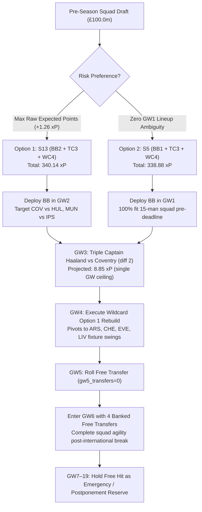

# GW1–6 Chip Exploration Matrix (BB × FH3|TC3 × Haaland × Bruno × WC4 Opt1)

**Updated**: 2026-08-14T18:50:00+07:00  
**Data stamp**: Stage 2 ADR-0014 rates 2026-08-14; projections horizon 6 + availability overlays; FPL API pricing 2026-07-29  
**Season**: 2026/27 · horizon GW1–6  
**Status**: Active Research Model  
**Purpose**: Explore 16 chip/structure paths: (BB1|BB2) × WC4 Opt1 × (FH3|TC3) × (Allow|Ban Haaland in pre squad) × (Allow|Ban B.Fernandes in pre squad). Establish **S13 (BB2 + TC3 Haaland + WC4 Opt1, 340.14 xP)** as canonical #1 Max EV Strategy and **S5 (BB1 + TC3 Haaland + WC4 Opt1, 338.88 xP)** as #2 Safe Start Strategy.  
**Scope**: 15-player MILP drafts, Free Hit / Triple Captain GW3, GW4 Wildcard Opt1, reproducible user_picks comparison, FT banking with GW5 roll enforced (4 banked FTs into GW6).  
**Related**: [Preseason Pipeline Master README](../README.md) · [Expected Role](../01-expected-role-gw1-5/expected-role-gw1-5.md) · [Expected Stats](../02-expected-stats-gw1-5/expected-stats-gw1-5.md) · [FPL First-Half Chip Strategy](../../fpl-first-half-chip-strategy/fpl-first-half-chip-strategy.md) · [Ownership Explorer](../../ownership-value-explorer/ownership-value-explorer.md) · [Downstream refresh](../refresh_downstream.py) · [Runner](run_wc4_simulation.py)  
**Artifacts**:
- [Summary CSV](../../../../data/research/gw1-6-preseason-pipeline/03-gw1-6-chip-wc4-squads/gw1-6_wc4_summary.csv)
- [Simulation CSV](../../../../data/research/gw1-6-preseason-pipeline/03-gw1-6-chip-wc4-squads/gw1-6_wc4_simulation.csv)
- [User comparison CSV](../../../../data/research/gw1-6-preseason-pipeline/03-gw1-6-chip-wc4-squads/gw1-6_user_squad_comparison.csv)
- [Projections CSV](../../../../data/research/gw1-6-preseason-pipeline/03-gw1-6-chip-wc4-squads/gw1-6_projections.csv)

---

## Sources

- Projections: Stage 3 `gw1-6_projections.csv` (Stage 2 ADR-0014 rates; `availability_priors.py`).
- Pricing: `data/processed/players.parquet`, `clubs.parquet`.
- User squad: `data/processed/user_picks.parquet` (0 xP stubs if outside XI Contention).
- Chip Strategy Authority: `docs/research/fpl-first-half-chip-strategy/fpl-first-half-chip-strategy.md`.

---

## Agent Prompt & Reproducibility Instructions

```text
Run parameterized GW1-6 Chip Exploration Matrix & Wildcard Optimization (Stage 3):

1. Prerequisite: Stage 2 CSVs on current rates. After a new Draft career package
   or Stage 2 rebuild, prefer:
   uv run python docs/research/gw1-6-preseason-pipeline/refresh_downstream.py
   (also refreshes GKP / DEF / ownership). Stage 3 only:
   uv run python docs/research/gw1-6-preseason-pipeline/03-gw1-6-chip-wc4-squads/run_wc4_simulation.py
   - Generates 6-GW projections (gw1-6_projections.csv) via ParticipationStateHybridModel.
   - Solves 16-scenario exploration matrix via SciPy MILP:
     * BB Timing: GW1 vs GW2 Bench Boost
     * Mid Chip: GW3 Free Hit (FH3) vs GW3 Triple Captain (TC3)
     * Structural Bans: Allow vs Ban Haaland in GW1-3 pre-chip squad; Allow vs Ban Bruno Fernandes
     * Wildcard: GW4 Wildcard Option 1 (maximize GW4-6 XI xP <= £100.0m)
   - Enforces transfer rules: rolls GW2/GW3/GW5, banks 4 Free Transfers into GW6 post-international break.
   - Compares with current user_picks.parquet.
   - Exports summary, simulation, and user comparison CSVs.
2. Update Findings and summary tables in gw1-6-chip-wc4-squads.md and master README table.
3. Verification: uv run pytest, uv run ruff check .
```

---

## Method

1. **Pre-chip draft**: MILP ≤£100.0m, min 1 LIV; optional Haaland / B.Fernandes bans.
2. **WC4 Opt1**: Maximize GW4–6 XI xP ≤£100.0m; ≤3/club.
3. **FT banking**: rolls GW2/GW3/GW5; `gw5_transfers=0`; `banked_fts_gw6` computed (4). Banked FTs survive Wildcard in 2026/27.
4. **User comparison**: `user_picks` vs allow/allow peer.

---

## Findings

### 1. Master Summary Table (All 16 Scenarios) — ADR-0014 rates

| Rank | ID | Strategy Class | BB | Mid | Ban H | Ban Bruno | TC Pick | GW1–3 | GW4–6 | Total xP | Banked FTs GW6 |
| :---: | :--- | :--- | :---: | :---: | :---: | :---: | :---: | ---: | ---: | ---: | :---: |
| **#1** | **S13** | **Max EV Target (Canonical #1)** | **GW2** | **TC3** | allow | allow | Haaland | **184.77** | **155.37** | **340.14** | **4** |
| #2 | S15 | Ban Haaland Pre-Squad | GW2 | TC3 | ban | allow | Vuskovic | 184.06 | 155.37 | 339.43 | 4 |
| #3 | S14 | Ban Bruno Pre-Squad | GW2 | TC3 | allow | ban | Haaland | 183.71 | 155.37 | 339.08 | 4 |
| **#4** | **S5** | **Safe Start Target (Canonical #2)**| **GW1** | **TC3** | allow | allow | Haaland | **183.51** | **155.37** | **338.88** | **4** |
| #5 | S6 | Ban Bruno Pre-Squad | GW1 | TC3 | allow | ban | Haaland | 183.38 | 155.37 | 338.75 | 4 |
| #5 | S7 | Ban Haaland Pre-Squad | GW1 | TC3 | ban | allow | Vuskovic | 183.38 | 155.37 | 338.75 | 4 |
| #7 | S8 | Ban Both Pre-Squad | GW1 | TC3 | ban | ban | Vuskovic | 180.55 | 155.37 | 335.92 | 4 |
| #8 | S16 | Ban Both Pre-Squad | GW2 | TC3 | ban | ban | Vuskovic | 180.33 | 155.37 | 335.70 | 4 |
| **#9** | **S9** | **Top FH3 Path** | **GW2** | **FH3** | allow | allow | — | **176.97** | **155.37** | **332.34** | **4** |
| #9 | S11 | Ban Haaland FH3 Path | GW2 | FH3 | ban | allow | — | 176.97 | 155.37 | 332.34 | 4 |
| #11 | S1 | BB1 FH3 Allow All | GW1 | FH3 | allow | allow | — | 176.79 | 155.37 | 332.16 | 4 |
| #11 | S3 | BB1 FH3 Ban Haaland | GW1 | FH3 | ban | allow | — | 176.79 | 155.37 | 332.16 | 4 |
| #13 | S10 | BB2 FH3 Ban Bruno | GW2 | FH3 | allow | ban | — | 175.27 | 155.37 | 330.64 | 4 |
| #14 | S2 | BB1 FH3 Ban Bruno | GW1 | FH3 | allow | ban | — | 174.77 | 155.37 | 330.14 | 4 |
| #15 | S4 | BB1 FH3 Ban Both | GW1 | FH3 | ban | ban | — | 173.96 | 155.37 | 329.33 | 4 |
| #16 | S12 | BB2 FH3 Ban Both | GW2 | FH3 | ban | ban | — | 173.93 | 155.37 | 329.30 | 4 |

**Structural Takeaways**:
- **TC3 Haaland dominates**: S13 (340.14 xP) beats top FH3 path S9 (332.34 xP) by **+7.80 xP**.
- **BB2 vs BB1**: S13 (+1.26 xP over S5) targets Coventry vs Hull in GW2. S5 offers zero lineup ambiguity prior to GW1 kickoff.
- **Bruno ban is binding**: -0.63 to -3.81 xP penalty across all scenarios.
- **Haaland ban on FH3 non-binding**: S1=S3 (332.16 xP) and S9=S11 (332.34 xP) because FH3 pre-squad naturally allocates budget to 5-midfield stack.
- **GW4–6 Wildcard Opt1 identical across all 16 scenarios**: **155.37 xP**.

---

### 2. Strategy #1: Canonical Max EV Target (S13 — 340.14 xP)

**GW1–3 Pre-WC Squad (£100.0m, BB2 active, TC3 Haaland active)**:
- **GKP**: Donnarumma (MCI, £5.5m), Roefs (SUN, £5.0m)
- **DEF**: Calafiori (ARS, £5.5m), Vuskovic (BHA, £5.0m), Wieffer (BHA, £5.0m), Maguire (MUN, £5.0m), Ballard (SUN, £5.0m)
- **MID**: B.Fernandes (MUN, £12.0m), Wirtz (LIV, £7.5m), O.Dango (BRE, £6.5m), Schade (BRE, £6.0m), E.Le Fée (SUN, £6.0m)
- **FWD**: Haaland (MCI, £15.5m — C GW1/GW2, TC GW3), Wright (COV, £5.5m), Thomas-Asante (COV, £5.0m)
- **Points Profile**: GW1: 52.39 xP · GW2: 65.66 xP (BB2) · GW3: 66.72 xP (TC3 Haaland) · **GW1–3 Total: 184.77 xP**.

**GW4–6 Post-WC Option 1 Rebuild (£97.5m spend, £2.5m ITB)**:
- **GKP**: Raya (ARS, £6.0m), Kinsky (TOT, £4.5m)
- **DEF**: Gabriel (ARS, £8.0m), Tarkowski (EVE, £6.0m), Vuskovic (BHA, £5.0m), Wieffer (BHA, £5.0m), Thiaw (NEW, £5.0m)
- **MID**: Palmer (CHE, £9.5m), Tzolis (ARS, £6.5m), Sarr (CRY, £6.5m), Ndiaye (EVE, £6.0m), Slater (HUL, £4.5m)
- **FWD**: Haaland (MCI, £15.5m), Thomas-Asante (COV, £5.0m), Walle Egeli (IPS, £4.5m)
- **Points Profile**: GW4: 52.07 xP · GW5: 50.80 xP · GW6: 52.50 xP · **GW4–6 Total: 155.37 xP**.
- **FT Progression**: Roll GW5 (`gw5_transfers=0`) → **4 banked Free Transfers into GW6**.

---

### 3. Strategy #2: Safe Start Target (S5 — 338.88 xP)

**GW1–3 Pre-WC Squad (£100.0m, BB1 active, TC3 Haaland active)**:
- **GKP**: Donnarumma (MCI, £5.5m), Sels (NFO, £5.0m)
- **DEF**: Calafiori (ARS, £5.5m), Vuskovic (BHA, £5.0m), Wieffer (BHA, £5.0m), Maguire (MUN, £5.0m), Ballard (SUN, £5.0m)
- **MID**: B.Fernandes (MUN, £12.0m), Wirtz (LIV, £7.5m), Schade (BRE, £6.0m), Maeda (IPS, £5.5m), Núñez (IPS, £5.0m)
- **FWD**: Haaland (MCI, £15.5m — C GW2, TC GW3), Thiago (BRE, £8.0m), Walle Egeli (IPS, £4.5m)
- **Points Profile**: GW1: 67.93 xP (BB1) · GW2: 48.68 xP · GW3: 66.90 xP (TC3 Haaland) · **GW1–3 Total: 183.51 xP**.
- **GW4–6 Post-WC Squad**: Identical to S13 Option 1 (**155.37 xP**, 4 banked FTs into GW6).

---

### 4. Strategy #3: Top Free Hit Alternative (S9 — 332.34 xP)

**GW1–2 Pre-FH Squad (£98.0m, BB2 active, no Haaland)**:
- **GKP**: Lammens, Roefs · **DEF**: Gabriel, Calafiori, Vuskovic, Maguire, Ballard · **MID**: B.Fernandes, Palmer, Wirtz, Tzolis, E.Le Fée · **FWD**: João Pedro, Wright, Thomas-Asante.

**GW3 Free Hit Squad (£97.5m, Haaland drafted for COV fixture)**:
- **GKP**: Donnarumma, Scherpen · **DEF**: Virgil, O'Reilly, Vuskovic, Wieffer, Davis · **MID**: Wirtz, O.Dango, Schade, Crooks, Slater · **FWD**: Haaland (C), Thiago, Watkins.

**GW4–6 Post-WC Squad**: Identical Option 1 (**155.37 xP**).

---

### 5. User Squad Comparison

| Strategy Path | GW1–3 xP | GW4–6 xP | Total 6-GW xP | Peer MILP Total | Lag vs Peer | Pre-WC Opp Loss | Banked FTs GW6 | User Spend |
|---|---|---|---|---|---|---|---|---|
| User + BB1 + FH3 + WC4 Opt1 | 157.86 | 155.37 | 313.23 | 332.16 | -18.93 | -18.93 | 4 | £100.0m |
| User + BB1 + TC3 + WC4 Opt1 | 158.57 | 155.37 | 313.94 | 338.88 | -24.94 | -24.94 | 4 | £100.0m |
| User + BB2 + FH3 + WC4 Opt1 | 157.27 | 155.37 | 312.64 | 332.34 | -19.70 | -19.70 | 4 | £100.0m |
| User + BB2 + TC3 + WC4 Opt1 | 157.98 | 155.37 | 313.35 | 340.14 | -26.79 | -26.79 | 4 | £100.0m |

---

## Decision & Execution Playbook



### Trigger & Kill-Switch Rules

1. **Kill TC3 Haaland**: If Haaland sustains a knock, minutes restriction, or European rotation signal before GW3 deadline, pivot Triple Captain to **GW7 (home vs Ipswich, 8.70 xP)** or **GW16 (home vs Hull, 8.50 xP)**.
2. **Pivot to WC6**: If the starting 15 suffers 0 injuries across GW1–3 and bench assets consistently produce, postpone Wildcard to **GW6** to attack Fulham's 3-game promoted fixture run (IPS GW6, HUL GW7, COV GW8).
3. **Trigger Emergency Free Hit**: Deploy FH in GW3 or GW4 only if 3+ key players suffer simultaneous multi-week injuries prior to the planned Wildcard window.

---

## Verification & Delivery

- Runner exports summary, simulation, and user comparison CSVs under `data/research/gw1-6-preseason-pipeline/03-gw1-6-chip-wc4-squads/`.
- Full pipeline downstream refresh: `uv run python docs/research/gw1-6-preseason-pipeline/refresh_downstream.py`.
